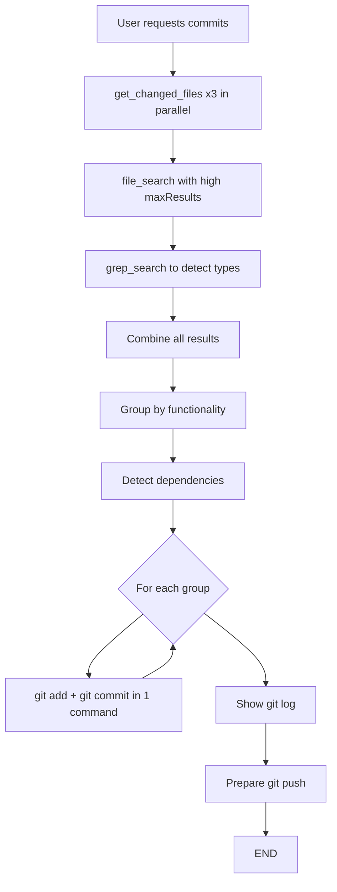

# Prompt: Conventional Commits for AI Bootstrap

**Purpose:** Analyze changes and generate commits automatically following Conventional Commits and AI Bootstrap practices. No menus or intermediate prompts.

---

## 📋 INSTRUCTIONS FOR THE ASSISTANT

When the user requests to create commits, execute the following process **automatically without confirmations**:

### 🔍 STEP 1: EXHAUSTIVE ANALYSIS (Automatic - NO confirmation)

Execute **all** these tools **automatically** to get a complete list of changes:

```typescript
// 1. Get all changes (automatic, multiple calls in parallel)
await get_changed_files({ sourceControlState: ["unstaged"] });
await get_changed_files({ sourceControlState: ["staged"] });
await get_changed_files({}); // No parameters to see all

// 2. Search by file patterns (automatic)
await file_search({ query: "**/*.ts", maxResults: 100 });
await file_search({ query: "**/*.md", maxResults: 50 });
await file_search({ query: "**/*.json", maxResults: 50 });

// 3. Search by keywords in recent changes (automatic)
await grep_search({
  query: "export class|export interface|export const",
  isRegexp: true,
  maxResults: 100,
});
```

**⚠️ IMPORTANT:** This step executes WITHOUT asking the user for confirmation. The current branch is obtained from the repository context.

### ⚡ STEP 2: INTELLIGENT GROUPING (Automatic)

Align file grouping with AI Bootstrap structure:

**Grouping Criteria:**

1. **Complete Feature** = Changes in `src/cli.ts`, related templates, prompts and slash-commands, plus tests and docs if applicable.

   - Example: `src/cli.ts`, `templates/AGENT.template.md`, `prompts/backend.md`, `slash-commands/copilot/bootstrap-phase1.md`, `README.md`
   - → 1 commit: `feat(cli): add phase 0 context detection with docs and prompts`

2. **Refactoring** = helpers, utilities, scripts and files using them.

   - Example: `src/utils/`, `scripts/init.sh`, changes in helpers used in CLI or templates.
   - → 1 commit: `refactor(cli): extract prompt loader utility`

3. **Configuration** = configuration files, scripts and automation.

   - Example: `package.json`, `tsconfig.json`, `scripts/init.sh`, `.ai-bootstrap/core/config.json`
   - → 1 commit: `chore(config): update npm scripts and bootstrap config`

4. **Documentation** = changes in `README.md`, `templates/AGENT.template.md`, independent docs.

   - If related to feature: include in feature commit.
   - If independent: separate commit `docs(readme): update usage instructions`

5. **Prompts and Templates** = changes in `prompts/`, `templates/`, `slash-commands/`.
   - If linked to a feature/code: include in feature commit.
   - If independent: separate commit `docs(prompts): update backend master prompt`

**Detect Dependencies:**

- If `src/cli.ts` changed, search for related templates, prompts and slash-commands.
- If templates changed, check if they're referenced in CLI or prompts.
- If scripts changed, group under `chore(config)`.
- If docs changed, verify if they document a feature in the same change group.

### ✅ STEP 3: GENERATE COMMITS (Requires confirmation)

For each detected group, **show the command** and wait for user confirmation:

```bash
git add [file1] [file2] [file3] && git commit -m "[message]"
```

**⚠️ IMPORTANT:** Show ALL proposed `git commit` commands to the user with `run_in_terminal` and wait for them to press "Allow" for each one.

**Message Format according to Conventional Commits:**

```
<type>(<scope>): <description>

Valid types:
- feat: New functionality
- fix: Bug fix
- docs: Changes to documentation, prompts, templates, slash-commands
- style: Format changes (don't affect code)
- refactor: Refactoring (doesn't add features or fix bugs)
- perf: Performance improvements
- test: Add or fix tests
- chore: Changes to build, config, dependencies, scripts
- ci: Changes to CI/CD
- revert: Revert a previous commit

Scope: Module or folder affected (`cli`, `templates`, `prompts`, `slash-commands`, `scripts`, `docs`, `config`, `copilot`, `claude`, `cursor`, `gemini`)

Description: Clear description in English, imperative mood, no period
```

**Examples of Correct Messages:**

```bash
# CLI feature with docs and prompts
git add src/cli.ts templates/AGENT.template.md prompts/backend.md slash-commands/copilot/bootstrap-phase1.md README.md && git commit -m "feat(cli): add phase 0 context detection with docs and prompts"

# Utility refactoring
git add src/utils/prompt-loader.ts scripts/init.sh && git commit -m "refactor(cli): extract prompt loader utility"

# Configuration and scripts
git add package.json tsconfig.json scripts/init.sh && git commit -m "chore(config): update npm scripts and bootstrap config"

# Independent documentation
git add README.md templates/AGENT.template.md && git commit -m "docs(readme): update usage instructions"

# Independent prompts
git add prompts/backend.md && git commit -m "docs(prompts): update backend master prompt"

# Independent slash-commands
git add slash-commands/copilot/bootstrap-phase1.md && git commit -m "docs(slash-commands): update bootstrap-phase1 for Copilot"

# Fix
git add src/cli.ts && git commit -m "fix(cli): resolve error in phase 0 detection"
```

### 🚀 STEP 4: FINALIZATION (Requires confirmation)

After creating all commits:

```bash
# 1. Show summary of created commits (automatic, NO confirmation)
git log --oneline -n [number_of_commits_created]

# 2. Prepare push command (SHOW and WAIT for confirmation)
git push origin [branch-name]
```

**⚠️ IMPORTANT:**

- `git log` executes automatically WITHOUT confirmation
- `git push` is SHOWN with `run_in_terminal` and requires user to press "Allow"

---

## 🎯 STRICT RULES

**NEVER DO:**

- ❌ Ask user which files to group
- ❌ Show menu options
- ❌ Ask for confirmation between commits
- ❌ Create generic commits like "update files" or "changes"
- ❌ Use "any" or "multiple" in scope
- ❌ Mix types (feat + fix in same commit)
- ❌ Commits with period in description
- ❌ Descriptions in Spanish

**ALWAYS DO:**

- ✅ Analyze all changes automatically **WITHOUT asking for confirmation** (get_changed_files, file_search, grep_search)
- ✅ Group intelligently by functionality
- ✅ Generate descriptive commits in English
- ✅ Use specific scope (not generic)
- ✅ Include related docs in feature commit
- ✅ Show **ALL** proposed `git commit` commands and wait for confirmation
- ✅ Show `git push` command and wait for confirmation
- ✅ Execute `git log` automatically WITHOUT confirmation

---

## 📊 COMPLETE FLOW



---

## 🔍 PATTERN DETECTION

**If you detect these files together, group them:**

| Pattern Detected  | Typical Files                                                                                     | Type       | Scope                                                 | Base Description                   |
| ----------------- | ------------------------------------------------------------------------------------------------- | ---------- | ----------------------------------------------------- | ---------------------------------- |
| CLI/Feature       | `src/cli.ts`, `templates/*.md`, `prompts/*.md`, `slash-commands/**`, `README.md`                  | `feat`     | `cli`                                                 | `implement [feature]`              |
| Refactoring       | `src/utils/*.ts`, `scripts/*.sh`, helpers used in CLI/templates                                   | `refactor` | `cli`/`config`                                        | `extract [helper] utility`         |
| Configuration     | `package.json`, `tsconfig.json`, `.env.example`, `scripts/*.sh`, `.ai-bootstrap/core/config.json` | `chore`    | `config`                                              | `update [config-purpose]`          |
| Prompts/Templates | `prompts/*.md`, `templates/*.md`                                                                  | `docs`     | `prompts`/`templates`                                 | `update [prompt/template-purpose]` |
| Slash-commands    | `slash-commands/**`, `.github/copilot-instructions.md`, `.claude/`, `.cursor/`, `.gemini/`        | `docs`     | `slash-commands`/`copilot`/`claude`/`cursor`/`gemini` | `update [command-purpose]`         |
| Documentation     | `README.md`, `templates/AGENT.template.md`, independent docs                                      | `docs`     | `readme`/`agent`                                      | `update [doc-purpose]`             |

**If you detect files without obvious grouping:**

- Read first lines of each file with `read_file`
- Search imports/exports to detect relationships
- Group by common purpose

---

## 💡 EXAMPLES OF COMPLEX CASES

### Case 1: CLI feature with docs and prompts

**Detected changes:**

```
src/cli.ts
templates/AGENT.template.md
prompts/backend.md
slash-commands/copilot/bootstrap-phase1.md
README.md
```

**Generated command:**

```bash
git add src/cli.ts templates/AGENT.template.md prompts/backend.md slash-commands/copilot/bootstrap-phase1.md README.md && git commit -m "feat(cli): add phase 0 context detection with docs and prompts"
```

### Case 2: Utility and script refactoring

**Detected changes:**

```
src/utils/prompt-loader.ts
scripts/init.sh
```

**Generated command:**

```bash
git add src/utils/prompt-loader.ts scripts/init.sh && git commit -m "refactor(cli): extract prompt loader utility"
```

### Case 3: Changes in slash-commands and AI tool configs

**Detected changes:**

```
slash-commands/copilot/bootstrap-phase1.md
.github/copilot-instructions.md
```

**Generated command:**

```bash
git add slash-commands/copilot/bootstrap-phase1.md .github/copilot-instructions.md && git commit -m "docs(slash-commands): update bootstrap-phase1 for Copilot"
```

---

## ✅ MESSAGE VALIDATION

Before executing commit, verify that the message complies:

- ✅ Starts with valid type: `feat|fix|docs|style|refactor|perf|test|chore|ci|revert`
- ✅ Includes scope in parentheses: `(cli)`, `(templates)`, `(prompts)`, `(slash-commands)`, `(scripts)`, `(docs)`, `(config)`, `(copilot)`, `(claude)`, `(cursor)`, `(gemini)`
- ✅ Uses colon and space: `: `
- ✅ Description in imperative mood: "add", "implement", "update" (not "added", "implemented")
- ✅ Description in English
- ✅ No period at end
- ✅ Maximum 72 characters on first line

**Validation regex:**

```regex
^(feat|fix|docs|style|refactor|perf|test|chore|ci|revert)(\([a-z-]+\))?:\s[a-z].{1,68}[^.]$
```

---

## 🚀 FINAL COMMAND

After all commits:

```bash
# 1. Show summary of what was created (AUTOMATIC, no confirmation)
git log --oneline -n [number_of_commits] --graph --decorate

# 2. Push command (REQUIRES confirmation with "Allow")
git push origin [branch-name]
```

**Message to user:**

```
✅ [N] commits created following Conventional Commits

📋 Summary:
[show git log automatically]

🚀 Push command prepared:
[show command with run_in_terminal waiting for "Allow"]
```

---

## 📅 Final Notes

- This prompt is based on **docs/contributing.md** section 5.2 "PR Title" and Conventional Commits conventions
- Commits must be **atomic** but **complete** (include related tests + docs)
- **Automatic analysis WITHOUT confirmation:** `get_changed_files`, `file_search`, `grep_search`, `git log`
- **Require confirmation (Allow button):** `git commit`, `git push`
- Use `run_in_terminal` with `isBackground: false` for all git commands
- Show ALL proposed commands before executing

---

**📅 Last Updated:** November 26, 2025
