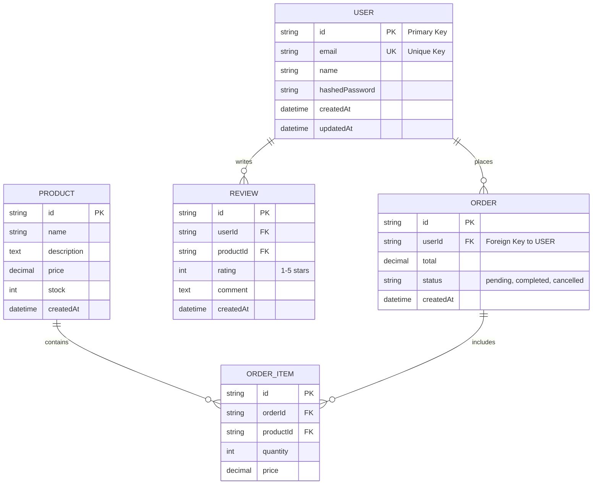

## PHASE 2: Data Architecture (15-20 min)

> **Order for this phase:** 2.1 → 2.2 → 2.3 → 2.4 → 2.5 → 2.6 → 2.7

> **📌 Note:** If Phase 0 detected database/entities from code, those will be pre-filled. Review and confirm.

### Objective

Design the database model, entities, and relationships.

**2.1 Database Type**

```
[If detected from Phase 0, show:]
✅ Database Detected: [PostgreSQL/MySQL/MongoDB/etc.]
✅ Version: [version if found]
✅ ORM/Client: [Prisma/TypeORM/Sequelize/SQLAlchemy/etc.]

Is this correct? (Y/N)
If no, please provide correct database type.

[If NOT detected, ask:]
What type of database will you use? (Can select multiple)

A) ⭐ PostgreSQL - Recommended for most backends (ACID, relational, JSON support)
B) 🔥 MySQL/MariaDB - Popular, proven, wide ecosystem
C) ⚡ MongoDB - Modern, NoSQL, flexible schema
D) 🏆 Multi-database - PostgreSQL + Redis + S3, etc.
E) Other: [specify]

Why this choice?
```

**2.2 Core Data Entities**

```
[If detected from Phase 0, show:]
✅ Entities Detected from Code:
- [User] - [description if inferred from code]
- [Product] - [description]
- [Order] - [description]
- [etc.]

Are these correct? (Y/N)
Do you need to add more entities? (Y/N)

[If NOT detected OR user wants to add more, show:]
Based on your system type (from Phase 1, question 1.5), here are common entities:

🛒 E-commerce typical entities:
□ User - System users with authentication
□ Product - Items available for purchase
□ Category - Product categorization
□ Cart - Shopping cart items
□ Order - Customer orders
□ OrderItem - Individual items in an order
□ Payment - Payment transactions
□ Address - Shipping/billing addresses
□ Review - Product reviews and ratings
□ Inventory - Stock tracking

📱 SaaS typical entities:
□ User - System users
□ Organization - Tenant/workspace
□ Team - Groups within organizations
□ Role - Access control roles
□ Permission - Granular permissions
□ Subscription - Billing plans
□ Invoice - Payment records
□ ApiKey - API access credentials
□ AuditLog - Activity tracking

📊 CRM typical entities:
□ User - System users
□ Contact - Customers/leads
□ Company - Organizations
□ Deal - Sales opportunities
□ Activity - Calls, emails, meetings
□ Task - To-do items
□ Note - Free-form notes
□ Document - Attachments

🎮 Social typical entities:
□ User - Platform users
□ Profile - User profiles
□ Post - Content/publications
□ Comment - Post comments
□ Like/Reaction - Engagement
□ Follow - User connections
□ Notification - User alerts
□ Message - Direct messages
□ Group - Communities

---

Select relevant entities from above OR list your custom entities:

1.
2.
3.
4.
5.
...

(Include brief description for custom entities)
```

**2.3 Relationships**

```
Common relationship patterns (select what applies to your entities):

⭐ One-to-Many (most common):
□ User → Order (one user has many orders)
□ User → Post (one user creates many posts)
□ Organization → User (one org has many users)
□ Category → Product (one category contains many products)
□ Order → OrderItem (one order has many line items)
□ Post → Comment (one post has many comments)
□ Other: __

⭐ Many-to-Many (via join table):
□ Order ↔ Product (via OrderItem)
□ User ↔ Role (via UserRole)
□ Post ↔ Tag (via PostTag)
□ User ↔ User (Follow/Friend via UserFollow)
□ Course ↔ Student (via Enrollment)
□ Other: __

⭐ One-to-One (less common):
□ User → Profile (one user has one profile)
□ User → UserSettings (one user has one settings record)
□ Order → Payment (one order has one payment)
□ Other: __

⭐ Polymorphic (one entity relates to multiple types):
□ Comment → (Post | Photo | Video) - comments on different content types
□ Attachment → (Task | Email | Note) - files attached to different entities
□ Activity → (User | Organization | Deal) - activities linked to various objects
□ Other: __

---

Your specific relationships (list main ones):
-
-
-

(Format: EntityA → EntityB: Relationship type - description)
```

**2.4 Data Volume Estimates**

```
Estimated data volume (Year 1):

- Total records: [Low (<10k) / Medium (10k-1M) / High (>1M)]
- Growth rate: [Slow / Moderate / Fast]

Data Complexity (Record Size):
A) 📄 Low - Mostly text data (JSON, strings)
B) 🖼️ Medium - Some images/documents (blobs, small files)
C) 🎥 High - Heavy media/large files (video, audio, raw data)

⭐ Standard for MVP:
- Records: Low (<10k)
- Growth: Moderate
- Complexity: Low (mostly text)

🏆 Standard for Production/Scale:
- Records: High (>1M)
- Growth: Fast
- Complexity: Medium/High (includes media/files)
```

**2.5 Data Retention**

```
Data retention policies:

A) ♾️ Keep forever - Never delete data
B) 🗓️ Regulatory compliance - Specific retention period (e.g., 7 years)
C) 🔄 Archival strategy - Archive old data after __ months
D) 🗑️ Auto-deletion - Delete after __ days/months

For each entity that has special retention needs, specify:
```

**2.6 Data Migration**

```
Is this a new system or replacing an existing one?

A) 🆕 New system - No legacy data
B) 🔄 Replacing existing - Need to migrate from [system name]
C) 🔌 Integration - Syncing with existing system

If migration needed:
- Source system: __
- Data volume to migrate: __
- Migration strategy: [Big bang / Phased / Parallel run]
```

**2.7 Critical Data Patterns**

```
Select data patterns that apply:

A) 🔐 Soft deletes - Keep deleted records with deleted_at flag
B) 📝 Audit trail - Track who changed what and when
C) 🕐 Temporal data - Track historical versions
D) 🌍 Multi-tenancy - Data isolation per customer/organization
E) 🎭 Polymorphic relationships - One entity relates to multiple types
F) 🔗 Graph relationships - Complex many-to-many networks
G) 📊 Aggregations/Materialized views - Pre-computed summaries
H) 🗂️ Partitioning - Split large tables by date/region/etc.

For each selected, provide brief detail:
```

**2.8 Database Indexes**

```
What indexes will you need for performance optimization?

Indexes are critical for query performance. Based on your entities and relationships, consider:

Common indexes needed:
□ Foreign keys (automatically indexed by most ORMs)
□ Frequently queried columns (email, username, status)
□ Columns used in WHERE clauses
□ Columns used in JOIN conditions
□ Columns used in ORDER BY clauses
□ Composite indexes for multi-column queries

Do you have specific query patterns that need optimization?

Example:
- User lookup by email: Index on users.email
- Order search by date range: Index on orders.created_at
- Product search by category and status: Composite index on (category_id, status)

Your specific indexes:
1.
2.
3.
```

**2.9 Transaction Management**

```
What transaction isolation level will you use?

A) ⭐ READ COMMITTED - Recommended default (PostgreSQL, MySQL default)
   - Prevents dirty reads
   - Allows non-repeatable reads and phantom reads
   - Good balance of consistency and performance

B) READ UNCOMMITTED - Lowest isolation (rarely used)
   - Allows dirty reads
   - Fastest but least safe

C) REPEATABLE READ - Higher isolation
   - Prevents dirty reads and non-repeatable reads
   - May have phantom reads
   - Better consistency, slightly slower

D) 🏆 SERIALIZABLE - Highest isolation (Enterprise)
   - Prevents all concurrency issues
   - Slowest but safest
   - Use only when absolutely necessary

Your choice: __

Consistency model:
A) ⭐ Strong consistency - All reads see latest writes (most backends)
B) Eventual consistency - Acceptable delay for better performance (distributed systems)

If eventual consistency:
- Acceptable delay: __ seconds/minutes
- Conflict resolution strategy: __
```

**2.10 Schema Migrations**

```
What migration tool will you use?

A) ⭐ Prisma Migrate (if using Prisma)
B) TypeORM Migrations (if using TypeORM)
C) Alembic (Python/SQLAlchemy)
D) Flyway (Java/Universal)
E) Liquibase (Java/Universal)
F) Django Migrations (Django)
G) Laravel Migrations (Laravel)
H) Rails Migrations (Ruby on Rails)
I) Other: __

Migration strategy:
A) ⭐ Versioned migrations - Each change creates a new migration file
B) Auto-migrations - Tool generates migrations automatically
C) Manual SQL scripts - Write migrations manually

Zero-downtime migrations:
A) ⭐ Yes - Plan for zero-downtime migrations (Production-Ready/Enterprise)
B) No - Accept maintenance windows (MVP)

If zero-downtime:
- Strategy: [Expand/Contract, Blue-Green, etc.]
- Rollback plan: __
```

### Phase 2 Output

```
📋 PHASE 2 SUMMARY:

Database: [type(s)]
Core Entities: [list with descriptions]
Relationships: [key relationships]
Data Volume: [estimates]
Retention: [policies]
Migration: [strategy if applicable]
Data Patterns: [selected patterns with brief details]
Database Indexes: [list of indexes needed]
Transaction Isolation: [level + consistency model]
Schema Migrations: [tool + strategy + zero-downtime approach]

Is this correct? (Yes/No)
```

---

### 📄 Generate Phase 2 Documents

**Before starting generation:**

```
📖 Loading context from previous phases...
✅ Re-reading project-brief.md
```

Once confirmed, generate:

**1. `docs/data-model.md`**

- Use template: `.ai-flow/templates/docs/data-model.template.md`
- Fill with all Phase 2 entity and relationship information
- Include entity catalog, relationships, data patterns
- Generate entity-relationship diagram (ER diagram) in mermaid format showing all entities and their relationships

---

#### 🎨 MERMAID ER DIAGRAM FORMAT - CRITICAL

**Use this exact format** (lowercase `mermaid`, no spaces, three backticks):

````markdown

````

**Relationship Notation:**
- `||--o{` = One-to-Many (one to zero or more)
- `||--||` = One-to-One (one to exactly one)
- `}o--o{` = Many-to-Many (requires junction table)
- `||--|{` = One-to-Many (one to one or more)

**Field Notation:**
- `PK` = Primary Key
- `FK` = Foreign Key
- `UK` = Unique Key
- Add descriptions in quotes after field type for clarity

**Common Mistakes to Avoid:**
- ❌ `​```Mermaid` (capital M - will not render)
- ❌ `​``` mermaid` (extra space - will not render)
- ❌ Indenting the entire diagram with spaces/tabs
- ❌ Missing closing ` ``` ` fence
- ❌ Invalid entity/relationship syntax

**Validation:** Preview your diagram at https://mermaid.live/ or in VS Code markdown preview

---

```
✅ Generated: docs/data-model.md

📝 Please review this document. Do you need to make any corrections?

A) ✅ Looks perfect, continue to Phase 3
B) 📝 I'll edit it now (I'll wait)
C) 🔄 Regenerate with changes (tell me what to modify)
```

**If user selects B:**

```
Perfect. Please edit docs/data-model.md and type "ready" when you're done.
I'll re-read the file to update my context before continuing.
```

Then execute: `read_file('docs/data-model.md')` to refresh context.

---

**Proceed to Phase 3 only after document is validated.**

---

## PHASE 3: System Architecture (15-20 min)
