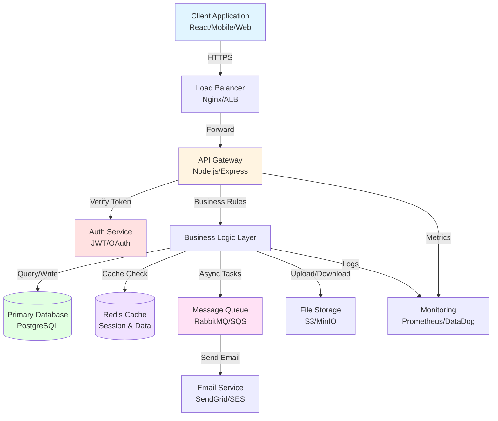
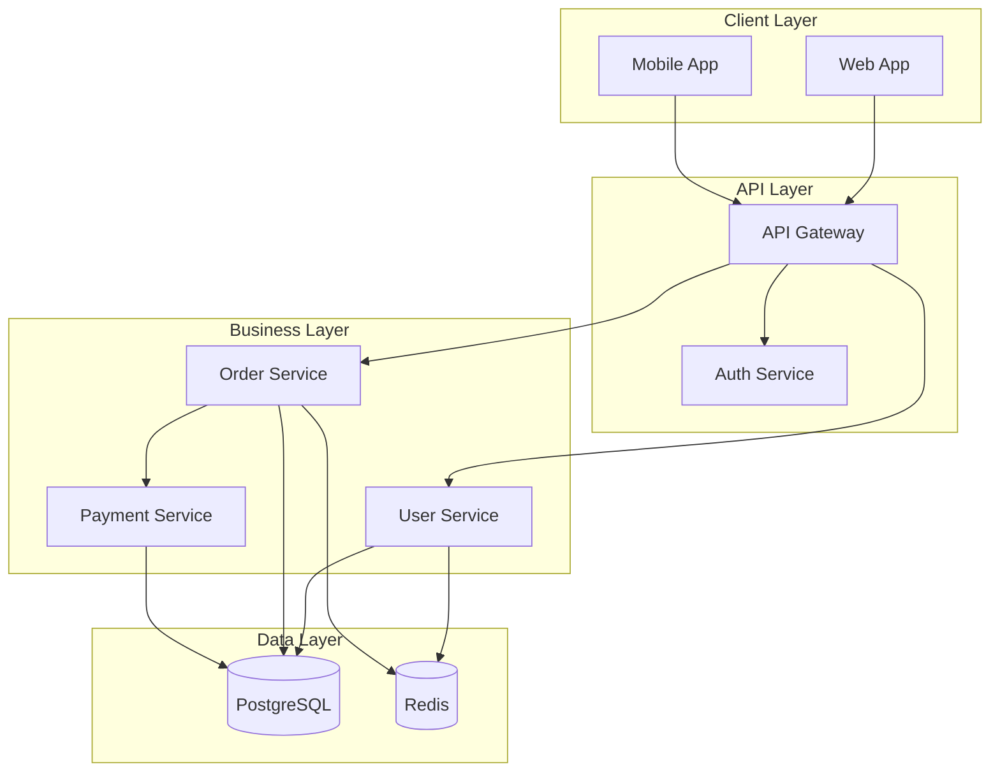

## PHASE 3: System Architecture (15-20 min)

> **Order for this phase:** 3.1 → 3.2 → 3.3 → 3.4 → 3.5 → 3.6 → 3.7 → 3.8 → 3.9 → 3.10 → 3.11 → 3.12

> **📌 Scope-based behavior:**
>
> - **MVP:** Ask 3.1-3.6 (tech stack essentials) and 3.12 (API structure), skip 3.7-3.11 (advanced features), mark as "TBD"
> - **Production-Ready:** Ask all questions 3.1-3.12
> - **Enterprise:** Ask all questions 3.1-3.12 with emphasis on scalability and integrations

> **📌 Note:** If Phase 0 detected framework/language/dependencies, those will be pre-filled. Review and confirm.

### Objective

Define the technical stack, architecture patterns, and system design.

> **Note:** At the end of this phase, the AI will automatically generate a system architecture diagram in mermaid format, based on your answers. This diagram will be included in the docs/architecture.md document.

---

#### 🎨 MERMAID ARCHITECTURE DIAGRAM FORMAT - CRITICAL

**Use this exact format** for system architecture diagrams:

````markdown

````

**Diagram Types:**

- `graph TD` = Top-Down flow (recommended for most architectures)
- `graph LR` = Left-Right flow (good for linear pipelines)
- `graph BT` = Bottom-Top (less common)
- `graph RL` = Right-Left (less common)

**Node Shapes:**

- `[Square Brackets]` = Services, applications, components
- `[(Cylinder)]` = Databases, persistent storage
- `([Rounded])` = Start/End points
- `{Diamond}` = Decision points
- `[[Double Square]]` = Subroutines
- `[/Parallelogram/]` = Input/Output

**Styling:**

- Use `<br/>` for line breaks in node labels
- Apply styles with: `style NodeName fill:#colorcode`
- Label connections: `A -->|Label Text| B`
- Use consistent colors for component types

**Common Architecture Patterns:**



**Best Practices:**

- Group related components using `subgraph`
- Show external services (Email, SMS, Payment gateways)
- Include monitoring and logging components
- Label protocols on connections (HTTPS, gRPC, WebSocket)
- Use consistent naming conventions

**Validation:** Preview at https://mermaid.live/ before committing

---

**3.1 Backend Framework**

```
[If detected from Phase 0, show:]
✅ Framework Detected: [NestJS/FastAPI/Spring Boot/etc.]
✅ Language: [TypeScript 5.3/Python 3.11/Java 21/etc.]
✅ Runtime: [Node 20/Python 3.11/JVM 21/etc.]

Is this correct? (Y/N)
If no, please specify the correct framework and language.

[If NOT detected, ask:]
Which backend framework will you use?

Node.js (JavaScript):
A) 🔥 Express.js - Popular (minimal, flexible, lightweight)
B) Hapi.js - Enterprise (configuration-driven)

TypeScript (Node.js):
C) ⭐ NestJS - Recommended (structured, enterprise-ready, decorators)
D) ⚡ Fastify - Modern (high performance, schema validation)

Python:
E) ⭐ FastAPI - Recommended (modern, fast, auto-docs)
F) 🔥 Django - Popular (batteries included, admin panel)
G) Flask - Minimal (micro-framework, flexible)

Java:
H) 🏆 Spring Boot - Enterprise standard
I) Quarkus - Modern (cloud-native, fast startup)

Go:
J) ⚡ Gin - Popular (fast, minimalist)
K) Echo - Feature-rich (middleware, routing)
L) Fiber - Express-like (high performance)

Rust:
M) ⚡ Actix-web - High performance (async, type-safe)
N) Rocket - Developer-friendly (macros, type-safe)
O) Axum - Modern (tokio-based, ergonomic)

Kotlin:
P) Ktor - Native Kotlin (coroutines, DSL)
Q) Spring Boot - Java interop (Kotlin support)

Other:
R) Ruby (Rails)
S) PHP (Laravel)
T) C# (.NET Core)

Your choice: __
Why?
```

**3.2 Language & Version**

```
Primary programming language and version:

Language: **
Version: ** (e.g., Node 20, Python 3.11, Java 21)

Type system:
A) ⭐ Strongly typed - TypeScript, Java, Go (Recommended for large projects)
B) Dynamically typed - JavaScript, Python, Ruby
C) Gradually typed - Python with type hints

Package Manager:
A) ⭐ npm - Standard, comes with Node
B) 🔥 pnpm - Fast, disk efficient
C) ⚡ yarn - Popular alternative
D) 🚀 bun - Ultra fast (if using Bun runtime)
E) 🐍 pip/poetry (Python)
F) ☕ Maven/Gradle (Java)
```

**3.3 Architecture Pattern**

```
What architecture pattern will you follow?

A) ⭐ Layered Architecture (Recommended for most projects)
   - Presentation → Business Logic → Data Access
   - Easy to understand and maintain

B) 🏆 Hexagonal/Clean Architecture (Enterprise)
   - Core domain isolated from infrastructure
   - Highly testable and flexible

C) 🔥 MVC (Popular, traditional)
   - Model-View-Controller separation
   - Good for traditional web apps

D) 📦 Modular Monolith (Modern, scalable)
   - Single deployment with independent modules
   - Easier than microservices, more structured than monolith
   - Good middle ground for growing applications

E) ⚡ Microservices (Modern, complex)
   - Multiple independent services
   - Best for large-scale distributed systems

F) Other: __

Your choice: __
Why this pattern?
```

**3.4 API Style**

```
What API style will you expose?

A) ⭐ REST API - Recommended (HTTP/JSON, standard, well-understood)
B) 🔥 GraphQL - Popular (flexible queries, single endpoint)
C) ⚡ gRPC - Modern (high performance, protobuf, microservices)
D) Mixed - REST + GraphQL or REST + gRPC

Your choice: __

API versioning strategy:
A) URL versioning (/v1/users, /v2/users)
B) Header versioning (Accept: application/vnd.api.v1+json)
C) No versioning yet (will add when needed)
```

**3.5 API Reference (Automated)**

````
The AI will automatically generate standard CRUD endpoints for each entity defined in Phase 2.

Please answer the following questions to define the global API conventions (these will apply to all endpoints unless otherwise specified):

**A) Authentication and Access Control**
1. Do all CRUD endpoints require authentication?
  A) ⭐ Yes, all endpoints require authentication (recommended)
  B) Only some (specify which ones)
  C) No authentication required

2. Which roles can access each CRUD operation?
  - GET (list): [admin, manager, user]
  - GET (detail): [admin, manager, user]
  - POST (create): [admin, manager, user]
  - PUT (update): [admin, manager]
  - DELETE (delete): [admin]
  (Standard example: admin, manager, user. Adjust as needed.)

**B) Listing and Filter Conventions**
3. Which pagination scheme do you prefer?
  A) ⭐ offset/limit (recommended)
  B) cursor-based
  C) No pagination

4. Which filter and sorting fields will be supported by default?
  - Filters: [id, name, date, etc.]
  - Sorting: [field, asc/desc]

5. How will filters be passed for GET list endpoints?
  A) ⭐ Query parameters (recommended for simple filters)
     Example: GET /users?name=John&status=active&page=1&limit=10

  B) POST /search endpoint with body (for complex filters)
     Example: POST /users/search
     Body: { "filters": { "name": "John", "status": "active" }, "page": 1, "limit": 10 }

  C) Both (query params for simple, POST /search for complex)

6. For POST/PUT/PATCH endpoints, will you use DTOs for request validation?
  A) ⭐ Yes, strict DTOs with validation (recommended)
  B) Accept raw JSON without strict schema

  If yes, validation library: [from Phase 3.6 - class-validator, Zod, Pydantic, Joi]

**C) Error and Response Structure**
7. What error response format will be used?
  A) Standard JSON:
  ```json
  {
   "error": "Descriptive message",
   "code": 400,
   "details": {}
  }
  ```

  B) Other (specify)

8. Which fields will be included in the default successful response?
  - data, meta (pagination), links, etc.

**D) Relationships and Expansions**
9. Allow expanding relationships (include/expand)?
  A) ⭐ Yes, support `include` parameter (recommended)
  B) No, flat data only

**E) Custom Endpoint Example**
10. If you want to customize an endpoint (e.g., add special logic, validations, or unique parameters), describe the case here:

- [Brief description, example endpoint, parameters, special logic]

---

The AI will use these conventions to automatically document all CRUD endpoints for each entity in api.md. If you need additional or custom endpoints, you can add them manually later.
````

**3.6 Key Dependencies**

```
What major libraries/tools will you use?

ORM/Database:
A) TypeORM (Node.js)
B) Prisma (Node.js) ⭐
C) Sequelize (Node.js)
D) SQLAlchemy (Python)
E) Hibernate (Java)
F) Other: __

Validation:
A) class-validator + class-transformer (NestJS) ⭐
B) Joi (Node.js)
C) Zod (TypeScript)
D) Pydantic (Python) ⭐
E) Yup (JavaScript)

Authentication:
A) Passport.js (Node.js) 🔥
B) JWT libraries
C) Auth0/Clerk/Supabase Auth (External service)
D) Framework built-in

Other critical libraries:
-
```

**3.7 Caching Strategy**

```
Will you use caching?

A) ⭐ Redis - Recommended (in-memory, fast, pub/sub)
B) Memcached - Simple key-value cache
C) Application-level - In-process caching (node-cache, etc.)
D) Database query cache
E) No caching (simple projects)

If using cache:
- What will be cached? (sessions, query results, computed data)
- Cache invalidation strategy? (TTL, manual, event-driven)
```

**3.8 Background Jobs**

```
Do you need background/async jobs?

A) ⭐ Yes - Using queue system (Bull, BullMQ, Celery, Sidekiq)
B) Yes - Using cron jobs
C) Yes - Using serverless functions (Lambda, Cloud Functions)
D) No - All operations are synchronous

If yes, common job types:
- Email sending
- Report generation
- Data processing
- External API calls
- Cleanup tasks
- Other: __
```

**3.9 File Storage**

```
How will you handle file uploads?

A) ⭐ Cloud storage - S3, Google Cloud Storage, Azure Blob ⭐
B) Local filesystem - Storing on server disk
C) Database - Storing binary data in DB (not recommended for large files)
D) CDN - Cloudflare, CloudFront, etc.
E) Not needed

If storing files:
- File types: [images, PDFs, videos, documents, etc.]
- Max file size: __ MB
- Storage quota estimate: __ GB
```

**3.10 API Gateway**

```
Will you use an API Gateway?

A) ⭐ Yes - Using API Gateway (Kong, AWS API Gateway, Azure API Management, etc.)
B) No - Direct API access

If yes:
- Gateway: __
- Purpose: [Rate limiting, Authentication, Request routing, Load balancing, etc.]
- Routes: __
```

**3.11 Real-time Communication**

```
Do you need real-time communication?

A) ⭐ WebSockets - Bidirectional communication (chat, notifications, live updates)
B) Server-Sent Events (SSE) - Server-to-client streaming (live feeds, updates)
C) Both - Different use cases
D) No - Standard HTTP requests only

If WebSockets or SSE:
- Use cases: __
- Library: __
- Authentication: __
```

**3.12 Message Broker Details** (if using background jobs from 3.8)

```
What message broker will you use?

A) ⭐ RabbitMQ - Popular, reliable, feature-rich
B) 🔥 Apache Kafka - High throughput, event streaming
C) ⚡ AWS SQS - Managed, serverless
D) Google Pub/Sub - Managed, scalable
E) Redis Streams - Simple, fast
F) Other: __

Message patterns:
A) ⭐ Queue - Point-to-point messaging
B) Pub/Sub - Publish-subscribe pattern
C) Both - Different use cases

Delivery guarantees:
A) ⭐ At-least-once - Messages delivered at least once (may have duplicates)
B) Exactly-once - Messages delivered exactly once (more complex)
C) At-most-once - Messages may be lost (rarely used)

Dead letter queue:
A) ⭐ Yes - Handle failed messages
B) No
```

**3.13 API Documentation**

```
How will you document your API?

A) ⭐ Swagger/OpenAPI - Auto-generated from code (code-first)
   - Tool: [@nestjs/swagger, FastAPI docs, Swagger UI, etc.]
   - Endpoint: /api-docs or /swagger

B) 📝 OpenAPI Spec - Write spec first, generate code (design-first)
   - File: openapi.yaml
   - Tool: [OpenAPI Generator, etc.]

C) Manual - Markdown documentation
   - Not recommended (hard to keep in sync)

Your choice: __
```

**3.14 Service Mesh** (if microservices architecture)

```
Will you use a Service Mesh?

A) ⭐ Yes - Using Service Mesh (Istio, Linkerd, Consul Connect)
B) No - Not needed (monolith or simple microservices)

If yes:
- Mesh: __
- Features: [Service discovery, Load balancing, mTLS, Observability]
```

**3.15 External Integrations**

```
Will you integrate with external services?

Select all that apply:

💳 Payment Providers:
A) Stripe - Credit cards, subscriptions ⭐
B) PayPal - Popular payment method
C) Square - POS and online payments
D) Mercado Pago - Latin America
E) Other: __

→ Your selection (e.g., A): __

📧 Email Services:
A) AWS SES - Cost-effective, scalable ⭐
B) SendGrid - Feature-rich, analytics
C) Mailgun - Developer-friendly
D) Postmark - Transactional focus
E) Resend - Modern, simple API ⚡
F) Other: __

→ Your selection (e.g., A, B): __

📱 SMS/Messaging:
C) MessageBird - Multi-channel
D) Other: __

→ Your selection (e.g., A): __

☁️ Cloud Storage:

D) Cloudflare R2 - S3-compatible, no egress fees ⚡
E) Other: __

→ Your selection (e.g., A): __

📊 Analytics: Storage
D) Cloudflare R2 - S3-compatible, no egress fees ⚡
E) Other: __

📊 Analytics:
E) Amplitude - Behavioral analytics
F) Other: __

→ Your selection (e.g., B, C): __

🔍 Monitoring/Error Tracking:ytics ⚡
E) Amplitude - Behavioral analytics
D) LogRocket - Session replay
E) Other: __

→ Your selection (e.g., A): __

🗺️ Maps/Location:tracking ⭐
B) Datadog - Full observability 🏆
C) New Relic - APM
C) OpenStreetMap
D) Other: __

→ Your selection (e.g., A): __

🔐 Authentication:
A) Google Maps API
D) Firebase Auth - Google ecosystem
E) Other: __

→ Your selection (e.g., A, B): __

🤖 AI/ML Services:
🔐 Authentication:
D) AWS Bedrock - Managed AI
E) Other: __

→ Your selection (e.g., A): __

📞 Communication:- Google ecosystem
E) Other: __

C) Webhooks - Custom integrations
D) Other: __

→ Your selection (e.g., A, B): __

🔄 Other Integrations:timodal AI
D) AWS Bedrock - Managed AI
D) Accounting (QuickBooks, Xero)
E) Other: __

→ Your selection (e.g., A, B, C): __

---

For each selected, briefly describe the use case:
D) Other: __

🔄 Other Integrations:
A) GitHub/GitLab API
B) Calendar (Google/Outlook)
C) CRM (Salesforce, HubSpot)
D) Accounting (QuickBooks, Xero)
E) Other: __

---

For each selected, briefly describe the use case:

Example:
- Stripe: Process credit card payments for subscriptions
- AWS SES: Send transactional emails (order confirmations, password resets)
- Sentry: Track and alert on production errors
```

### Phase 3 Output

```
📋 PHASE 3 SUMMARY:

Framework: [name + version]
Language: [name + version]
Architecture: [pattern]
API Style: [REST/GraphQL/gRPC]
API Versioning: [strategy]
API Conventions: [auth, pagination, error format, expansions]
API Gateway: [yes/no + tool + purpose]
Real-time Communication: [WebSockets/SSE/none + use cases]
Message Broker: [tool + patterns + delivery guarantees]
API Documentation: [Swagger/OpenAPI/manual + strategy]
Service Mesh: [yes/no + tool if applicable]
Database: [from Phase 2]
ORM: [name]
Validation: [library]
Auth: [method]
Caching: [strategy]
Background Jobs: [yes/no + method]
File Storage: [strategy]
External Services: [list with use cases]

Is this correct? (Yes/No)
```

---

### 📄 Generate Phase 3 Documents

**Before starting generation:**

```
📖 Loading context from previous phases...
✅ Re-reading project-brief.md
✅ Re-reading docs/data-model.md
```

**Generate documents automatically:**

**1. `docs/architecture.md`**

- Use template: `.ai-flow/templates/docs/architecture.template.md`
- Fill with system architecture, patterns, tech stack
- Include architecture diagram (mermaid format)
- Write to: `docs/architecture.md`

**2. `ai-instructions.md`**

- Use template: `.ai-flow/templates/ai-instructions.template.md`
- Fill with tech stack, framework, language, key dependencies
- Include NEVER/ALWAYS rules specific to chosen stack
- Generate idiomatic code examples for Controller, Service, Repository, DTO and Module placeholders, strictly following the selected Architecture Pattern (e.g., if Hexagonal, show Ports & Adapters)
- Write to: `ai-instructions.md`

```
✅ Generated: docs/architecture.md
✅ Generated: ai-instructions.md

Documents have been created with all Phase 3 information.

📝 Would you like to make any corrections before continuing?

→ If yes: Edit the files and type "ready" when done. I'll re-read them.
→ If no: Type "continue" to proceed to Phase 4.
```

**If user edits files:**
Execute `read_file()` for both documents to refresh context before continuing.

---

**Proceed to Phase 4 only after documents are validated.**

> ⚠️ **CRITICAL:** DO NOT generate README.md in this phase. README.md is ONLY generated in Phase 8 (step 8.5) after framework initialization.

---

## PHASE 4: Security & Authentication (15-20 min)
