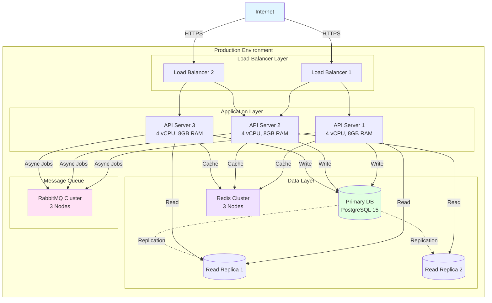
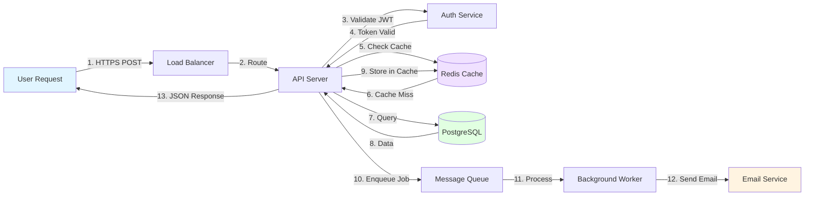
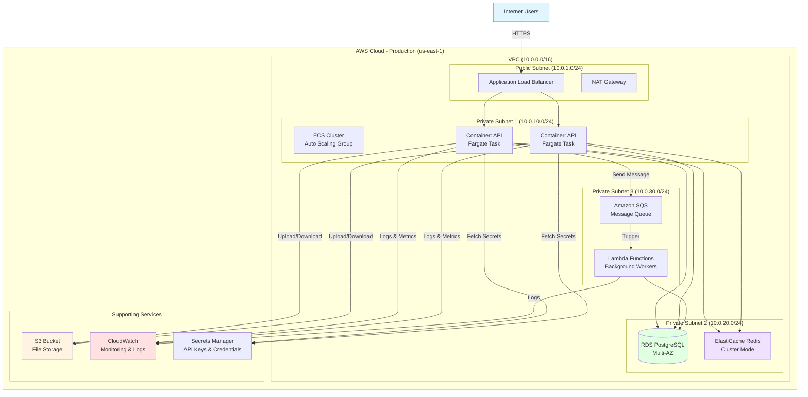
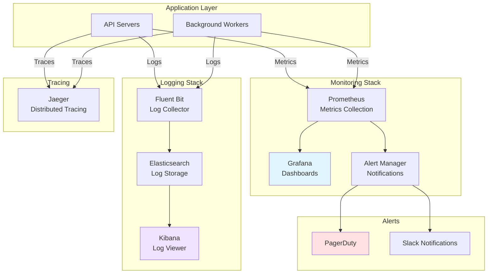

## PHASE 7: Operations & Deployment (10 min)

> **Order for this phase:** 7.1 → 7.2 → 7.3 → 7.4 → 7.5 → 7.6 → 7.7 → 7.8 → 7.9 → 7.10 → 7.11

> **📌 Scope-based behavior:**
>
> - **MVP:** Ask 7.1-7.4 only (deployment basics), skip 7.5-7.11 (monitoring, scaling, backups), mark as "TBD"
> - **Production-Ready:** Ask 7.1-7.8, simplify 7.9-7.11 (advanced monitoring and scaling)
> - **Enterprise:** Ask all questions 7.1-7.11 with emphasis on reliability and disaster recovery

### Objective

Define deployment, monitoring, and operational practices.

**7.1 Deployment Environment**

```

Where will you deploy?

A) ⭐ Cloud Platform

- AWS (ECS, Fargate, Lambda, EC2)
- Google Cloud (Cloud Run, GKE, Compute Engine)
- Azure (App Service, AKS, VMs)

B) 🔥 Platform-as-a-Service (PaaS)

- Heroku
- Railway
- Render
- Fly.io
- Vercel (for APIs)

C) 🏢 On-Premises

- Company servers
- Private cloud

D) 🐳 Container Orchestration

- Kubernetes (GKE, EKS, AKS)
- Docker Swarm
- Nomad

Your choice: \_\_
Why?

```

**7.2 Containerization**

````

Will you use Docker?

A) ⭐ Yes - Dockerize application

- Multi-stage build
- Optimized image size
- Docker Compose for local dev

B) No - Deploy directly

If yes:
Base image: **
Estimated image size: ** MB

Example stack (local development):

```yaml
services:
  app:
    build: .
    ports: [3000:3000]
  db:
    image: postgres:15
  redis:
    image: redis:7
```

````

**7.3 Environment Strategy**

```

How many environments will you have?

A) ⭐ Three environments

- Development (local)
- Staging (pre-production, QA)
- Production (live)

B) 🏆 Four+ environments

- Development
- Testing (automated tests)
- Staging
- Production

C) 🚀 Two environments

- Development
- Production

Your choice: \_\_

Environment configuration:
A) ✅ Environment variables (.env files)
B) ✅ Config service (AWS Secrets Manager, Vault)
C) ✅ Feature flags (LaunchDarkly, Unleash)

```

**7.4 CI/CD Pipeline**

```

CI/CD platform:

A) ⭐ GitHub Actions - If using GitHub
B) 🔥 GitLab CI - If using GitLab
C) Jenkins - Self-hosted
D) CircleCI
E) Travis CI
F) AWS CodePipeline
G) Azure DevOps

Your choice: \_\_

Pipeline stages:

1. ✅ Checkout code
2. ✅ Install dependencies
3. ✅ Lint
4. ✅ Test (with coverage)
5. ✅ Build
6. ✅ Security scan (optional)
7. ✅ Deploy to staging
8. ⏸️ Manual approval (optional)
9. ✅ Deploy to production

Auto-deploy strategy:
A) ⭐ Auto-deploy to staging, manual approval for production
B) 🚀 Auto-deploy to production (main branch)
C) Manual deploy for all environments

```

**7.4.1 Deployment Strategy**

```
What deployment strategy will you use?

A) ⭐ Standard deployment - Stop old, deploy new (downtime)
B) 🏆 Blue-Green deployment - Zero-downtime, instant rollback
C) ⚡ Canary deployment - Gradual rollout, A/B testing
D) Rolling deployment - Gradual replacement (Kubernetes)

If Blue-Green:
- Traffic switching: [Load balancer, DNS, etc.]
- Rollback: [Instant switch back to blue]
- Database migrations: [Strategy for zero-downtime]

If Canary:
- Initial traffic: __%
- Gradual increase: __% per __ minutes
- Success criteria: __
- Rollback trigger: __
```

**7.5 Monitoring & Logging**

````

Monitoring tools:

Application Performance Monitoring (APM):
A) ⭐ Datadog - Full-featured, expensive
B) 🔥 New Relic - Popular
C) Sentry - Error tracking focus
D) ⚡ OpenTelemetry + Grafana - Open source
E) AWS CloudWatch
F) None yet

Your choice: \_\_

Logging:
A) ⭐ Centralized logging

- Winston/Pino (Node.js) → CloudWatch/Datadog
- Python logging → ELK Stack

B) Basic console logs

C) Structured JSON logging ⭐

```json
{
  "level": "info",
  "timestamp": "2024-01-15T10:30:00Z",
  "userId": "123",
  "action": "user.login",
  "ip": "192.168.1.1",
  "message": "User logged in successfully"
}
```

Your logging strategy: \_\_

Metrics to track:

- ✅ Request rate (requests/sec)
- ✅ Error rate (% of failed requests)
- ✅ Response time (p50, p95, p99)
- ✅ Database query time
- ✅ Cache hit rate
- ✅ CPU/Memory usage
- Custom business metrics: \_\_

````

**7.6 Alerts**

```

When should you be alerted?

A) ✅ Error rate > **% (e.g., 1%)
B) ✅ Response time > **ms (e.g., 1000ms)
C) ✅ 5xx errors (server errors)
D) ✅ Service down (health check failure)
E) ✅ Database connection failures
F) ✅ Disk space > 80%
G) ✅ Memory usage > 85%

Alert channels:
A) ⭐ Email
B) 🔥 Slack/Discord
C) ⚡ PagerDuty/Opsgenie (on-call)
D) SMS (critical only)

Your preferences: \_\_

On-call rotation:
A) Yes - Using [PagerDuty/Opsgenie]
B) No - Monitor during business hours

```

**7.7 Backup & Disaster Recovery**

```

Backup strategy:

Database backups:
A) ⭐ Automated daily backups

- Retention: 30 days
- Point-in-time recovery

B) 🏆 Continuous backups

- Every hour
- 90 days retention

C) Manual backups weekly

Your strategy: **
Retention period: ** days

Disaster recovery:

- Recovery Time Objective (RTO): \_\_ (how fast to restore)
- Recovery Point Objective (RPO): \_\_ (acceptable data loss)

Example:

- RTO: 1 hour (service restored within 1 hour)
- RPO: 15 minutes (lose max 15 min of data)

```

**7.7.1 Database Migrations in Production**

```
How will you handle database migrations in production?

Zero-downtime migrations:
A) ⭐ Yes - Plan for zero-downtime migrations (Production-Ready/Enterprise)
B) No - Accept maintenance windows (MVP)

If zero-downtime:
- Strategy: [Expand/Contract, Blue-Green migrations, etc.]
- Rollback plan: __
- Testing: [Tested on staging, Dry-run process]

Migration windows (if not zero-downtime):
- Preferred time: __
- Duration: __ minutes
- Notification: __
```

**7.7.2 Database Connection Pooling**

```
Database connection pooling configuration:

Pool tool: [ORM built-in, pgBouncer, HikariCP, etc.]

Settings:
- Min connections: __
- Max connections: __
- Connection timeout: __ ms
- Idle timeout: __ ms
- Max lifetime: __ ms

Monitoring:
- Track active/idle connections: [Yes/No]
- Alert on pool exhaustion: [Yes/No]
```

**7.8 Scaling Strategy**

```

How will you handle growth?

A) ⭐ Horizontal scaling - Add more instances

- Load balancer distributes traffic
- Stateless application design

B) Vertical scaling - Bigger instances

- Increase CPU/RAM
- Simpler but limited

C) ⚡ Auto-scaling - Automatic based on load

- Scale up during high traffic
- Scale down to save costs
- Metrics: CPU > 70%, requests > threshold

Your strategy: \_\_

Expected load:

- Initial: \_\_ requests/minute
- Year 1: \_\_ requests/minute
- Peak traffic: \_\_x normal load

Database scaling:
A) Read replicas - Scale reads
B) Sharding - Split data across DBs
C) Vertical scaling - Bigger DB instance
D) Not needed yet

```

**7.9 Health Checks**

````

Health check endpoints:

A) ✅ /health - Basic liveness

- Returns 200 OK if app is running

B) ✅ /health/ready - Readiness check

- Returns 200 OK if app can handle traffic
- Checks: DB connected, Redis connected, etc.

C) ✅ /health/live - Liveness check

- Returns 200 OK if app is alive
- Load balancer uses this

Example response:

```json
{
  "status": "healthy",
  "timestamp": "2024-01-15T10:30:00Z",
  "checks": {
    "database": "ok",
    "redis": "ok",
    "disk_space": "ok"
  },
  "version": "1.2.3"
}
```

Your health check endpoints: \_\_

````

**7.9.1 Graceful Shutdown**

```
Will you implement graceful shutdown?

A) ⭐ Yes - Handle shutdown gracefully (Production-Ready/Enterprise)
B) No - Standard shutdown

If yes:
Shutdown sequence:
1. Stop accepting new requests (timeout: __s)
2. Finish processing current requests (timeout: __s)
3. Close database connections (timeout: __s)
4. Close other connections (Redis, message queues, etc.)
5. Exit process

Total shutdown timeout: __s

Implementation:
- Signal handling: [SIGTERM, SIGINT]
- Health check grace period: __s
- Connection drain timeout: __s
```

**7.9.2 Circuit Breakers & Resilience**

```
Will you implement circuit breakers?

A) ⭐ Yes - Protect against cascading failures (Production-Ready/Enterprise)
B) No - Direct service calls

If yes:
Circuit breaker tool: [Resilience4j, Hystrix, Polly, etc.]

Configuration:
- Failure threshold: __% (open circuit after X% failures)
- Success threshold: __% (close circuit after X% successes)
- Timeout: __ms
- Half-open retries: __
- Reset timeout: __s

Fallback strategy:
A) ⭐ Return cached data
B) Return default/empty response
C) Call alternative service
D) Return error gracefully

Services to protect:
{{#EACH SERVICE_TO_PROTECT}}
- **{{SERVICE_NAME}}**: {{FAILURE_THRESHOLD}}% threshold, fallback: {{FALLBACK_STRATEGY}}
{{/EACH}}
```

**7.10 Documentation & Runbooks**

```

Operational documentation:

A) ✅ Deployment guide - How to deploy
B) ✅ Runbooks - How to handle incidents

- Database connection failure → steps to diagnose/fix
- High CPU usage → steps to investigate
- Service down → recovery procedure

C) ✅ Architecture diagrams (Mermaid format)

- System architecture diagram (mermaid)
- Data flow diagram (mermaid)
- Infrastructure diagram (mermaid)

D) ✅ API documentation

- Swagger/OpenAPI
- Auto-generated from code

Will you create these?
A) Yes - All of them ⭐
B) Yes - Critical ones only (deployment, runbooks)
C) Later - Start without docs

API documentation strategy:
A) ⭐ Code-First (Recommended)

- Generate docs from code (Swagger/OpenAPI decorators)
- Always in sync with code
- Tools: @nestjs/swagger, FastAPI docs

B) 📝 Design-First

- Write openapi.yaml manually first
- Generate code from spec
- Better for large teams/contracts

C) 📄 Manual

- Write Markdown/Notion docs
- Hard to keep in sync (Not recommended)

```

---

#### 🎨 MERMAID OPERATIONS DIAGRAM FORMATS - CRITICAL

**Use these exact formats** for operational and infrastructure diagrams mentioned in question 7.10:

---

##### 1️⃣ System Architecture Diagram (Deployment View)

Use `graph TD` to show deployed system components with scaling and redundancy:

````markdown

````

**Use for:** Showing deployed infrastructure, scaling configuration, redundancy, high availability

---

##### 2️⃣ Data Flow Diagram (Request Flow)

Use `flowchart LR` to show how data moves through the system step-by-step:

````markdown

````

**Use for:** Documenting request/response cycles, async processing flows, numbered execution steps

---

##### 3️⃣ Infrastructure Diagram (Cloud Resources)

Use `graph TB` with subgraphs to show cloud infrastructure and network topology:

````markdown

````

**Use for:** Documenting cloud architecture, network topology, AWS/GCP/Azure resources, VPC design

---

##### 4️⃣ Monitoring & Observability Diagram (Optional)

Use `graph TD` to show monitoring, logging, and alerting stack:

````markdown

````

**Use for:** Documenting observability strategy, monitoring infrastructure, alerting workflows

---

**Best Practices for Operations Diagrams:**

1. **Include Resource Specs:** Add CPU/RAM/disk info to nodes (e.g., `[API Server<br/>4 vCPU, 8GB RAM]`)
2. **Show Redundancy:** Display load balancers, replicas, multi-AZ deployments, failover paths
3. **Label Network Boundaries:** Use subgraphs for VPCs, subnets, availability zones, regions
4. **Document Protocols:** Label connections with HTTPS, gRPC, TCP, WebSocket, etc.
5. **Add IP Ranges:** Include CIDR blocks for network subnets (e.g., `10.0.1.0/24`)
6. **Show Auto-Scaling:** Indicate which components scale horizontally/vertically
7. **Include External Services:** SaaS tools, third-party APIs, CDNs, email providers
8. **Color Code by Layer:** Infrastructure (blue), data (green), monitoring (purple), alerts (red)

**Common Formatting Rules:**

- Code fence: ` ```mermaid ` (lowercase, no spaces, three backticks)
- Use `subgraph "Name"` to group related components by layer/zone
- Use `[(Cylinder)]` for databases, data stores, and persistent storage
- Use `[Square Brackets]` for services, servers, and compute resources
- Use dotted arrows `-.->` for replication, backup, and async flows
- Apply consistent styling: `style NodeName fill:#colorcode`

**Deployment Context Examples:**

- For Docker: Show containers, volumes, networks, registries
- For Kubernetes: Show pods, services, ingress, namespaces, persistent volumes
- For Serverless: Show Lambda functions, API Gateway, S3 triggers, event sources
- For VMs: Show instances, security groups, load balancers, auto-scaling groups

**Validation:** Test diagrams at https://mermaid.live/ before saving to ensure syntax is correct

---

### Phase 7 Output

```
📋 PHASE 7 SUMMARY:

Deployment Environment: [cloud/PaaS/on-premises/container-orchestration + platform choice + rationale] (7.1)
Containerization: [yes/no + Docker setup (base image, size, compose stack)] (7.2)
Environments: [number of environments (dev/staging/prod) + config approach (env vars/secrets/feature flags)] (7.3)
CI/CD Pipeline: [platform (GitHub Actions/GitLab CI/etc.) + pipeline stages + auto-deploy strategy] (7.4)
Deployment Strategy: [standard/blue-green/canary/rolling + zero-downtime approach + rollback plan] (7.4.1)
Monitoring & Logging: [APM tool + logging strategy (centralized/structured JSON) + metrics to track] (7.5)
Alerts: [alert conditions (error rate/response time/5xx/etc.) + channels (email/Slack/PagerDuty) + on-call rotation] (7.6)
Backup & Disaster Recovery: [backup strategy + retention period + RTO/RPO targets] (7.7)
Database Migrations in Production: [zero-downtime strategy + rollback plan + migration windows] (7.7.1)
Database Connection Pooling: [pool tool + settings (min/max/timeouts) + monitoring] (7.7.2)
Scaling Strategy: [horizontal/vertical/auto-scaling + expected load + database scaling approach] (7.8)
Health Checks: [endpoints (/health, /health/ready, /health/live) + checks performed] (7.9)
Graceful Shutdown: [yes/no + shutdown sequence + timeouts] (7.9.1)
Circuit Breakers & Resilience: [yes/no + tool + configuration + fallback strategies] (7.9.2)
Documentation & Runbooks: [what will be created (deployment guide/runbooks/architecture diagrams in mermaid format/API docs) + API doc strategy (code-first/design-first)] (7.10)

Is this correct? (Yes/No)
```

---

### 📄 Generate Phase 7 Documents

**Before starting generation:**

```
📖 Loading context from previous phases...
✅ Re-reading docs/testing.md
✅ Re-reading ai-instructions.md
```

**Generate documents automatically:**

**1. `docs/operations.md`**

- Use template: `.ai-flow/templates/docs/operations.template.md`
- Fill with deployment, monitoring, alerting, backup, scaling
- Write to: `docs/operations.md`

**2. `specs/configuration.md`**

- Use template: `.ai-flow/templates/specs/configuration.template.md`
- Fill with environment variables, secrets management, feature flags
- Write to: `specs/configuration.md`

**3. `.env.example`**

- List all environment variables needed
- Include comments explaining each variable
- Write to: `.env.example`

```
✅ Generated: docs/operations.md
✅ Generated: specs/configuration.md
✅ Generated: .env.example

Documents have been created with all Phase 7 information.

📝 Would you like to make any corrections before continuing?

→ If yes: Edit the files and type "ready" when done. I'll re-read them.
→ If no: Type "continue" to proceed to final checkpoint.
```

**If user edits files:**
Re-read files to refresh context before continuing.

---

**Proceed to final generation only after documents are validated.**

---

## FINAL STEP: Generate Remaining Documents & Tool Configs

### ⏸️ CHECKPOINT: Final Document Review

```
⏸️ CHECKPOINT: Review Generated Documents

We have successfully generated the following documents across all phases:

✅ project-brief.md (Phase 1)
✅ docs/data-model.md (Phase 2)
✅ docs/architecture.md (Phase 3)
✅ ai-instructions.md (Phase 3)
✅ specs/security.md (Phase 4)
✅ docs/code-standards.md (Phase 5)
✅ docs/testing.md (Phase 6)
✅ docs/operations.md (Phase 7)
✅ specs/configuration.md (Phase 7)
✅ .env.example (Phase 7)

Before generating the final documents (AGENT.md, README.md, API docs, etc.),
do you want to review or edit any of these documents?

A) ✅ All documents are correct, proceed with final generation
B) 📝 I need to review/edit some documents (I'll wait)
```

**If user selects B:**

```
Perfect. Please review and edit any documents you need to change.
When you're done, type "ready" and I'll re-read ALL documents
to ensure the final generation uses the most up-to-date information.
```

Then execute `read_file()` for ALL previously generated documents.

---

### 📖 Loading Complete Context for Final Generation

```
📖 Re-reading all generated documents to ensure accuracy...

✅ Re-reading project-brief.md
✅ Re-reading docs/data-model.md
✅ Re-reading docs/architecture.md
✅ Re-reading ai-instructions.md
✅ Re-reading specs/security.md
✅ Re-reading docs/code-standards.md
✅ Re-reading docs/testing.md
✅ Re-reading docs/operations.md
✅ Re-reading specs/configuration.md
✅ Re-reading .env.example

✅ Context fully loaded and updated!

🎉 Now generating final 5 documents:

1. docs/business-flows.md - Business process flows and mermaid diagrams
2. docs/api.md - API endpoints and conventions reference
3. docs/contributing.md - Contribution guidelines
4. README.md - Project overview (requires all previous context)
5. AGENT.md - Universal AI configuration (aggregates all docs)

Plus tool-specific configurations:
- .clauderules (if Claude selected)
- .cursorrules (if Cursor selected)
- .github/copilot-instructions.md (if Copilot selected)

Generating...
```

### Transition to Phase 8

All information from Phases 1-7 has been collected and documented.

Phase 8 will handle:

- Project state detection
- Framework initialization (if needed)
- Final documentation generation
- README.md creation with intelligent merge
- Tool-specific configurations

**Phase 8 will be executed next to complete the AI Flow process.**

```
✅ Phase 7 Complete!

Generated 3 documents successfully:

Phase 7:
✅ docs/operations.md
✅ specs/configuration.md
✅ .env.example

---

📊 Progress Summary:

Phases 1-7 completed:
✅ project-brief.md (Phase 1)
✅ docs/data-model.md (Phase 2)
✅ docs/architecture.md (Phase 3)
✅ ai-instructions.md (Phase 3)
✅ specs/security.md (Phase 4)
✅ docs/code-standards.md (Phase 5)
✅ docs/testing.md (Phase 6)
✅ docs/operations.md (Phase 7)
✅ specs/configuration.md (Phase 7)
✅ .env.example (Phase 7)

Remaining:
⏭️  Phase 8: Project setup & final documentation

---

🎯 Next: Phase 8 - Project Setup & Final Documentation

Phase 8 will:
- 🔍 Detect project state (new vs existing)
- 🚀 Initialize framework (optional, for new projects)
- 📝 Generate final docs (business-flows.md, api.md, contributing.md)
- 📖 Generate AGENT.md (master documentation index)
- 📄 Generate README.md (with intelligent merge if needed)
- 🤖 Create tool-specific configs (based on AI selection)

> ⚠️ **CRITICAL:** README.md MUST NOT exist yet. It will be generated in Phase 8 step 8.5 AFTER framework initialization to avoid conflicts.

Continue to Phase 8? (yes/no)
```

---

## EXECUTION CHECKLIST FOR AI ASSISTANT

When executing this master prompt:

**PHASE 0 (Existing Projects Only):**

- [ ] Check if project has existing code/documentation
- [ ] Search for AI instruction files (copilot-instructions.md, .clauderules, .cursorrules, AGENT.md, etc.)
- [ ] Search for README.md, package.json, and config files
- [ ] **Perform deep code analysis:**
  - [ ] Recursively scan source directories (src/, app/, lib/, modules/)
  - [ ] Count files by type (controllers, services, entities, DTOs, etc.)
  - [ ] Identify architecture pattern (feature-based, layer-based, modular, hybrid)
  - [ ] **Parse source code files for AST-based analysis:**
    - [ ] Detect decorators (@Controller, @Get, @Post for NestJS; @app.get() for FastAPI)
    - [ ] Extract API endpoints (method, path, parameters, middleware)
    - [ ] Identify services and dependency injection patterns
    - [ ] Detect error handling patterns
  - [ ] **Analyze database schemas:**
    - [ ] Parse Prisma schema.prisma (models, relationships, indexes)
    - [ ] Parse TypeORM entities (@Entity, @Column, relationships)
    - [ ] Parse SQLAlchemy models
    - [ ] Extract complete entity definitions with fields and relationships
  - [ ] **Analyze dependencies:**
    - [ ] Extract exact versions from package.json/requirements.txt/etc.
    - [ ] Identify framework, ORM, validation, auth, testing libraries
    - [ ] Detect security-related packages
  - [ ] **Detect code patterns:**
    - [ ] Dependency injection usage
    - [ ] Error handling implementation
    - [ ] Validation patterns (DTOs, schemas)
    - [ ] Logging setup
    - [ ] Testing configuration
    - [ ] Caching strategies
    - [ ] Background job systems
- [ ] Present detailed detection results (0.2) including:
  - [ ] Architecture pattern detected
  - [ ] Complete list of API endpoints with details
  - [ ] All entities with schemas and relationships
  - [ ] Dependencies with versions
  - [ ] Code quality indicators
- [ ] **Generate proactive suggestions (0.2.1):**
  - [ ] Analyze code for security gaps (validation, rate limiting, CORS, etc.)
  - [ ] Identify architecture improvements
  - [ ] Detect documentation gaps
  - [ ] Suggest testing improvements
  - [ ] Recommend performance optimizations
  - [ ] Present suggestions with actions and impacts
- [ ] **Offer export option (0.3):**
  - [ ] Ask if user wants to export analysis to JSON
  - [ ] If yes, create .ai-flow/analysis.json with complete analysis
- [ ] Let user choose: A) Use detected info, B) Start fresh, C) Review/edit detected info
- [ ] **Handle suggestions:**
  - [ ] If user selected A (address during build), integrate suggestions into relevant phases
  - [ ] If user selected B (save for later), create suggestions.md file
  - [ ] If user selected C (skip), continue without changes
- [ ] Pre-populate answers based on detected information
- [ ] Mark questions that still need answers

**PHASES 1-7 (All Projects):**

- [ ] Execute phases 1-7 in exact order
- [ ] **SKIP questions already answered** from Phase 0 detection (existing projects)
- [ ] Ask remaining questions ONE BY ONE (wait for answer)
- [ ] Wait for user response before proceeding
- [ ] Provide recommendations (⭐🔥⚡🏆)
- [ ] Offer multiple choice where applicable
- [ ] Summarize each phase for confirmation
- [ ] Collect ALL required information
- [ ] Generate documents **incrementally** after each phase
- [ ] Ask for user validation after each document generation
- [ ] Re-read generated documents at start of each new phase
- [ ] Perform final checkpoint before generating AGENT.md and README.md
- [ ] Re-read ALL documents before final generation to ensure accuracy
- [ ] Use templates from `.ai-flow/templates/`
- [ ] Create tool-specific configs based on AI selection
- [ ] Validate no placeholders remain
- [ ] Provide clear next steps

**DO NOT:**

- ❌ Skip Phase 0 detection for existing projects
- ❌ Skip deep code analysis - always perform comprehensive AST-based parsing when code exists
- ❌ Present superficial analysis - include detailed endpoints, entities, and patterns
- ❌ Ignore proactive suggestions - always generate and present improvement opportunities
- ❌ Ask questions already answered by detected files or code analysis
- ❌ Ignore existing AI instruction files
- ❌ Skip questions or phases
- ❌ Assume answers without asking (when info is not detected)
- ❌ Generate ALL documents at the end (generate incrementally!)
- ❌ Skip document validation after generation
- ❌ Forget to re-read documents before using their info
- ❌ Generate final documents without re-reading all previous docs
- ❌ Leave placeholder text in final documents
- ❌ Skip exporting analysis JSON if user requested it
- ❌ Rush through the analysis - thoroughness saves time later

**ESTIMATED TIME:**

**New Projects:**

- Phase 1: 15-20 min
- Phase 2: 15-20 min
- Phase 3: 15-20 min
- Phase 4: 15-20 min
- Phase 5: 15-20 min
- Phase 6: 10 min
- Phase 7: 10 min
- **Total: 90-120 minutes**

**Existing Projects (with Phase 0 detection):**

- Phase 0: 10-20 min (deep code analysis + suggestions + review)
  - File detection: 2-3 min
  - Deep code analysis (AST parsing, schema extraction): 5-10 min
  - Generating suggestions: 2-3 min
  - User review and export: 1-4 min
- Phases 1-7: 30-60 min (only missing questions)
- **Total: 40-80 minutes** (40-60% time saved!)

This is an investment that will save 10-20 hours over the project lifecycle.

---

**EXECUTION FLOW:**

1. **START:** User runs `/flow-build`
2. **DETECT:** Check for existing project files (Phase 0)
   - If existing files found → Run Phase 0 deep analysis:
     - 0.1: Deep Code Analysis (file structure, AST parsing, schema extraction, pattern detection)
     - 0.2: Present Detailed Detection Results (architecture, endpoints, entities, dependencies, code quality)
     - 0.2.1: Generate Proactive Suggestions (security, architecture, documentation, testing, performance)
     - 0.3: Export Analysis Results (optional JSON export)
     - 0.4: Load Existing Context (pre-populate answers)
   - If no files found → Skip to Phase 1
3. **EXECUTE:** Run Phases 1-7 with pre-populated answers (if any)
   - Integrate suggestions from Phase 0 into relevant phases if user selected option A
4. **GENERATE:** Create documents incrementally with validation
5. **COMPLETE:** Final checkpoint and remaining documents

---

**BEGIN EXECUTION when user runs `/flow-build`**

```

```
