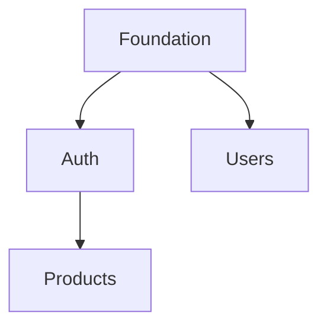

# AI Flow - Phase 9: Implementation Roadmap

**YOU ARE AN EXPERT PROJECT MANAGER AND TECHNICAL ARCHITECT.**

Generate a complete `docs/roadmap.md` with atomic, executable tasks derived from project documentation.

## Prerequisites

- Phase 8 completed (all documentation generated)
- Files exist: `docs/data-model.md`, `docs/api.md`, `docs/architecture.md`, `specs/security.md`

## Duration: 60-90 minutes

---

## Context Variables (Extract from docs)

**Before generating tasks, extract these from project documentation:**

```
From ai-instructions.md:
├── LANG: {{LANGUAGE}}           # e.g., TypeScript, Python, Go, Java, PHP, Ruby
├── EXT: {{FILE_EXTENSION}}      # e.g., .ts, .py, .go, .java, .php, .rb
├── SRC: {{SOURCE_DIR}}          # e.g., src/, app/, lib/, internal/
├── TESTS: {{TESTS_DIR}}         # e.g., tests/, __tests__/, test/, spec/
└── ARCH: {{ARCHITECTURE}}       # e.g., Clean, Hexagonal, MVC, Layered

From docs/architecture.md:
├── ENTITY_DIR: {{ENTITY_PATH}}  # e.g., entities/, models/, domain/
├── REPO_DIR: {{REPO_PATH}}      # e.g., repositories/, data/, infrastructure/
├── SERVICE_DIR: {{SERVICE_PATH}}# e.g., services/, usecases/, application/
├── CTRL_DIR: {{CONTROLLER_PATH}}# e.g., controllers/, handlers/, api/
└── DTO_DIR: {{DTO_PATH}}        # e.g., dtos/, schemas/, types/
```

**Use these variables in ALL file paths. Never hardcode language-specific paths.**

---

## Task Format (MANDATORY)

**Every task MUST use this exact format:**

```
- [ ] TXXX [CAT] Description • 1 SP → {{path}} | deps: TXXX
```

**Components:**
- `TXXX` - Sequential ID (T001, T002...)
- `[CAT]` - Category (see below)
- `Description` - Specific action (verb + what + where)
- `1 SP` - Story Points (1 or 2 only)
- `→ {{path}}` - Target file path using context variables
- `deps: TXXX` - Dependencies (or `deps: none`)

---

## Categories [CAT]

| Cat | Name       | Description                        | SP Range |
|-----|------------|------------------------------------|----------|
| [E] | Entity     | Schema, model, migration           | 1 SP     |
| [R] | Repository | Data access layer                  | 1 SP     |
| [S] | Service    | Business logic, use cases          | 1-2 SP   |
| [C] | Controller | Endpoints, routes, handlers        | 1 SP     |
| [T] | Test       | Unit, integration, e2e tests       | 1-2 SP   |
| [D] | Docs       | Documentation updates              | 1 SP     |
| [I] | Infra      | Config, setup, DevOps              | 1-2 SP   |

---

## Atomic Task Rules

**Maximum 1-2 SP per task. Break down larger tasks:**

**BAD (too large):**
```
- [ ] T001 [E] Create User entity with CRUD • 5 SP
```

**GOOD (atomic, language-agnostic):**
```
- [ ] T001 [E] Create User entity schema (id, email, password, role) • 1 SP → {{SRC}}/{{ENTITY_DIR}}/User{{EXT}} | deps: none
- [ ] T002 [E] Add User validation rules (email format, password min length) • 1 SP → {{SRC}}/{{ENTITY_DIR}}/User{{EXT}} | deps: T001
- [ ] T003 [R] Create UserRepository interface/contract • 1 SP → {{SRC}}/{{REPO_DIR}}/UserRepository{{EXT}} | deps: T001
- [ ] T004 [R] Implement UserRepository.create() • 1 SP → {{SRC}}/{{REPO_DIR}}/UserRepository{{EXT}} | deps: T003
- [ ] T005 [R] Implement UserRepository.findById() • 1 SP → {{SRC}}/{{REPO_DIR}}/UserRepository{{EXT}} | deps: T003
- [ ] T006 [R] Implement UserRepository.findByEmail() • 1 SP → {{SRC}}/{{REPO_DIR}}/UserRepository{{EXT}} | deps: T003
- [ ] T007 [R] Implement UserRepository.update() • 1 SP → {{SRC}}/{{REPO_DIR}}/UserRepository{{EXT}} | deps: T003
- [ ] T008 [R] Implement UserRepository.delete() • 1 SP → {{SRC}}/{{REPO_DIR}}/UserRepository{{EXT}} | deps: T003
```

---

## Workflow: 6 Steps

### Step 9.1: Extract Context & Inventory (10-15 min)

**1. Extract context variables from `ai-instructions.md`:**

```
CONTEXT EXTRACTED
├── Language: Python
├── Extension: .py
├── Source dir: src/
├── Tests dir: tests/
├── Architecture: Clean Architecture
├── Entity path: domain/entities/
├── Repository path: infrastructure/repositories/
├── Service path: application/services/
├── Controller path: interfaces/api/
└── DTO path: interfaces/dtos/
```

**2. Extract inventory from documentation:**

**From `docs/data-model.md`:**
```
ENTITIES:
| Entity   | Fields | Relations | Complexity |
|----------|--------|-----------|------------|
| User     | 8      | 3 (1:N)   | Medium     |
| Product  | 12     | 2 (N:1)   | Medium     |

Complexity: Simple (1-5 fields) | Medium (6-10) | Complex (11+)
```

**From `docs/api.md`:**
```
ENDPOINTS:
| Method | Path           | Auth | Body | Complexity |
|--------|----------------|------|------|------------|
| POST   | /auth/login    | No   | Yes  | Medium     |
| GET    | /users/:id     | Yes  | No   | Simple     |

Complexity: Simple (no body) | Medium (body+validation) | Complex (transactions)
```

**From `docs/architecture.md`:**
```
INTEGRATIONS:
| Service  | Type    | Priority |
|----------|---------|----------|
| Stripe   | Payment | P0       |
| SendGrid | Email   | P1       |
```

**From `specs/security.md`:**
```
SECURITY:
| Requirement       | Category | Priority |
|-------------------|----------|----------|
| JWT Auth          | Auth     | P0       |
| Password Hashing  | Auth     | P0       |
| Rate Limiting     | Security | P1       |
```

**Show summary:**
```
INVENTORY COMPLETE
├── Context: {{LANGUAGE}} / {{ARCHITECTURE}}
├── Entities: X (simple: X, medium: X, complex: X)
├── Endpoints: X (simple: X, medium: X, complex: X)
├── Integrations: X
├── Security: X requirements
└── Estimated tasks: XXX-XXX
```

---

### Step 9.2: Coverage Matrix (5-10 min)

**BUILD MANDATORY COVERAGE MATRIX before generating tasks:**

```
COVERAGE MATRIX
┌────────────┬─────┬─────┬─────┬─────┬─────┬─────┐
│ Component  │ [E] │ [R] │ [S] │ [C] │ [T] │ [D] │
├────────────┼─────┼─────┼─────┼─────┼─────┼─────┤
│ User       │  ?  │  ?  │  ?  │  ?  │  ?  │  ?  │
│ Product    │  ?  │  ?  │  ?  │  ?  │  ?  │  ?  │
│ POST /auth │  -  │  -  │  ?  │  ?  │  ?  │  ?  │
│ GET /users │  -  │  -  │  ?  │  ?  │  ?  │  ?  │
└────────────┴─────┴─────┴─────┴─────┴─────┴─────┘

Legend: ? = needs task | ✓ = has task | - = not applicable
```

**Rules:**
- Every Entity MUST have: [E], [R], [S], [T], [D]
- Every Endpoint MUST have: [S] or [C], [T], [D]
- Every Integration MUST have: [S], [T], [D]

---

### Step 9.3: Epic Definition (5-10 min)

**Standard Epic Structure:**

```
EP-000: Foundation (ALWAYS FIRST)
├── Config, error handling, logging
├── Database connection, base classes
└── Priority: P0 | Duration: Week 1

EP-001: Authentication (ALWAYS SECOND if auth exists)
├── Auth mechanism, password hashing, sessions/tokens
├── Security requirements from specs/security.md
└── Priority: P0 | Duration: Week 1-2

EP-XXX: Domain Epics (Group by bounded context)
├── Related entities + endpoints
└── Priority: P0/P1/P2

EP-ZZZ: Operations (ALWAYS LAST)
├── CI/CD, monitoring, deployment
└── Priority: P1 | Duration: Final week
```

---

### Step 9.4: Task Generation by Component Type (30-45 min)

**For each Entity, generate tasks using context variables:**

```markdown
### Entity: {{NAME}} ({{COMPLEXITY}})

**[E] Schema (2-3 tasks):**
- [ ] T0XX [E] Create {{NAME}} entity schema (fields: ...) • 1 SP → {{SRC}}/{{ENTITY_DIR}}/{{NAME}}{{EXT}} | deps: none
- [ ] T0XX [E] Add {{NAME}} validation rules (field constraints) • 1 SP → {{SRC}}/{{ENTITY_DIR}}/{{NAME}}{{EXT}} | deps: T0XX
- [ ] T0XX [E] Create {{NAME}} database migration • 1 SP → {{MIGRATIONS_DIR}}/XXX_{{name}}{{MIGRATION_EXT}} | deps: T0XX

**[R] Repository (4-6 tasks):**
- [ ] T0XX [R] Create {{NAME}}Repository interface/contract • 1 SP → {{SRC}}/{{REPO_DIR}}/{{NAME}}Repository{{EXT}} | deps: T0XX
- [ ] T0XX [R] Implement {{NAME}}Repository.create() • 1 SP → {{SRC}}/{{REPO_DIR}}/{{NAME}}Repository{{EXT}} | deps: T0XX
- [ ] T0XX [R] Implement {{NAME}}Repository.findById() • 1 SP → {{SRC}}/{{REPO_DIR}}/{{NAME}}Repository{{EXT}} | deps: T0XX
- [ ] T0XX [R] Implement {{NAME}}Repository.findAll() • 1 SP → {{SRC}}/{{REPO_DIR}}/{{NAME}}Repository{{EXT}} | deps: T0XX
- [ ] T0XX [R] Implement {{NAME}}Repository.update() • 1 SP → {{SRC}}/{{REPO_DIR}}/{{NAME}}Repository{{EXT}} | deps: T0XX
- [ ] T0XX [R] Implement {{NAME}}Repository.delete() • 1 SP → {{SRC}}/{{REPO_DIR}}/{{NAME}}Repository{{EXT}} | deps: T0XX

**[S] Service (2-4 tasks based on business logic):**
- [ ] T0XX [S] Create {{NAME}}Service with dependency injection • 1 SP → {{SRC}}/{{SERVICE_DIR}}/{{NAME}}Service{{EXT}} | deps: T0XX
- [ ] T0XX [S] Implement {{NAME}}Service.create() with validation • 1 SP → {{SRC}}/{{SERVICE_DIR}}/{{NAME}}Service{{EXT}} | deps: T0XX
- [ ] T0XX [S] Implement {{NAME}}Service business rules • 1 SP → {{SRC}}/{{SERVICE_DIR}}/{{NAME}}Service{{EXT}} | deps: T0XX

**[T] Tests (3-5 tasks):**
- [ ] T0XX [T] Write {{NAME}} entity unit tests (5+ cases) • 2 SP → {{TESTS}}/unit/{{NAME}}{{TEST_EXT}} | deps: T0XX
- [ ] T0XX [T] Write {{NAME}}Repository integration tests • 2 SP → {{TESTS}}/integration/{{NAME}}Repository{{TEST_EXT}} | deps: T0XX
- [ ] T0XX [T] Write {{NAME}}Service unit tests • 2 SP → {{TESTS}}/unit/{{NAME}}Service{{TEST_EXT}} | deps: T0XX

**[D] Documentation (1 task):**
- [ ] T0XX [D] Update data-model.md with {{NAME}} schema • 1 SP → docs/data-model.md | deps: T0XX
```

**For each Endpoint, generate tasks:**

```markdown
### Endpoint: {{METHOD}} {{PATH}}

**[C] Controller (2-3 tasks):**
- [ ] T0XX [C] Create {{METHOD}} {{PATH}} handler • 1 SP → {{SRC}}/{{CTRL_DIR}}/{{Controller}}{{EXT}} | deps: T0XX
- [ ] T0XX [C] Add request validation schema • 1 SP → {{SRC}}/{{DTO_DIR}}/{{DTO}}{{EXT}} | deps: T0XX
- [ ] T0XX [C] Add response schema • 1 SP → {{SRC}}/{{DTO_DIR}}/{{DTO}}{{EXT}} | deps: T0XX

**[T] Tests (1-2 tasks):**
- [ ] T0XX [T] Write {{METHOD}} {{PATH}} integration test • 2 SP → {{TESTS}}/integration/{{Controller}}{{TEST_EXT}} | deps: T0XX

**[D] Documentation (1 task):**
- [ ] T0XX [D] Document {{METHOD}} {{PATH}} in api.md • 1 SP → docs/api.md | deps: T0XX
```

---

### Step 9.5: Validate Coverage (5 min)

**MANDATORY: Verify matrix is complete before generating document:**

```
COVERAGE VALIDATION
┌────────────┬─────┬─────┬─────┬─────┬─────┬─────┐
│ Component  │ [E] │ [R] │ [S] │ [C] │ [T] │ [D] │
├────────────┼─────┼─────┼─────┼─────┼─────┼─────┤
│ User       │ T01 │T03-8│ T09 │ T12 │T15-17│ T18│
│ Product    │ T20 │T22-27│T28 │ T31 │T34-36│ T37│
│ POST /auth │  -  │  -  │ T40 │ T41 │ T43 │ T44│
│ GET /users │  -  │  -  │ T45 │ T46 │ T48 │ T49│
└────────────┴─────┴─────┴─────┴─────┴─────┴─────┘

✅ All entities have [E], [R], [S], [T], [D]
✅ All endpoints have [S] or [C], [T], [D]
✅ No gaps in coverage
```

**If gaps exist:**
```
❌ COVERAGE ERROR: Product missing [T] category
   → Add: T0XX [T] Write Product unit tests • 2 SP → {{TESTS}}/unit/Product{{TEST_EXT}}
```

---

### Step 9.6: Generate Document (5-10 min)

**Write `docs/roadmap.md` with this structure:**

```markdown
# Implementation Roadmap: {{PROJECT_NAME}}

> Generated: {{DATE}} | Total: {{SP}} SP | Estimated: {{WEEKS}} weeks
> Stack: {{LANGUAGE}} / {{FRAMEWORK}} / {{ARCHITECTURE}}

## Project Context

| Variable | Value |
|----------|-------|
| Language | {{LANGUAGE}} |
| Source Dir | {{SRC}} |
| Tests Dir | {{TESTS}} |
| Architecture | {{ARCHITECTURE}} |

## Story Points Scale

| SP | Effort    | Time      |
|----|-----------|-----------|
| 1  | Trivial   | 1-2h      |
| 2  | Small     | 2-4h      |

## Coverage Matrix

{{COVERAGE_MATRIX}}

## Epic Overview

| Epic | Name           | SP  | Tasks | Priority |
|------|----------------|-----|-------|----------|
| EP-000 | Foundation   | XX  | XX    | P0       |
| EP-001 | Auth         | XX  | XX    | P0       |

## EP-000: Foundation • XX SP

### Feature 0.1: Base Configuration • X SP

{{TASKS}}

## EP-001: Authentication • XX SP

### Feature 1.1: User Entity • X SP

{{TASKS}}

### Feature 1.2: Login Endpoint • X SP

{{TASKS}}

## Dependency Graph



## Production Checklist

- [ ] All migrations tested
- [ ] Test coverage >= 80%
- [ ] API documentation complete
- [ ] Security requirements verified
- [ ] CI/CD pipeline working
```

---

## Validation Checklist

Before completing Phase 9:

- [ ] Context variables extracted from ai-instructions.md
- [ ] All file paths use {{VARIABLE}} format (no hardcoded .ts, .py, etc.)
- [ ] Every entity has [E], [R], [S], [T], [D] tasks
- [ ] Every endpoint has [C] or [S], [T], [D] tasks
- [ ] All tasks use exact format: `TXXX [CAT] Desc • N SP → {{path}} | deps: X`
- [ ] No task exceeds 2 SP
- [ ] Coverage matrix shows no gaps
- [ ] Task IDs are sequential (T001, T002, T003...)
- [ ] Dependencies form valid DAG (no cycles)

## DO NOT

- ❌ Hardcode file extensions (.ts, .py, .go, .java)
- ❌ Hardcode directory structures (src/entities/, app/models/)
- ❌ Assume specific architecture patterns
- ❌ Use language-specific naming conventions (IRepository, _private)
- ❌ Create tasks > 2 SP
- ❌ Skip coverage matrix validation
- ❌ Leave entities without tests

## Summary

```
PHASE 9 COMPLETE
├── Stack: {{LANGUAGE}} / {{FRAMEWORK}}
├── Epics: X
├── Features: X
├── Tasks: X
├── Story Points: X SP
├── Coverage: 100% (all components have [E][R][S][C][T][D])
└── Ready for: /flow-dev-feature

Next: Open docs/roadmap.md and start with EP-000
```
