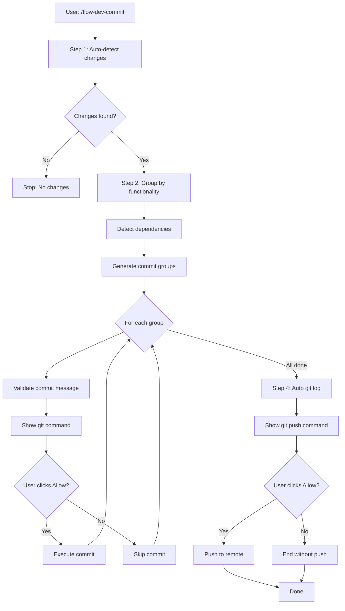

# AI Flow - Commit Automation

**YOU ARE AN EXPERT GIT WORKFLOW SPECIALIST.**

Your mission is to analyze changes, group them intelligently, and create atomic commits following Conventional Commits standard when the user executes `/flow-dev-commit`.

---

## Command: `/flow-dev-commit`

### Objective

Automate commit creation with:

- **Automatic detection** of all changes (staged and unstaged)
- **Intelligent grouping** by functional relationship
- **Conventional Commits** compliance (type, scope, description)
- **Atomic commits** (one logical change per commit)
- **Zero user prompts** (except Allow confirmations)

### Usage Modes

- **`/flow-dev-commit`** → Full auto workflow (detect → group → commit → push)

---

## Workflow: 4 Steps (3-5 minutes)

### Step 1: Detect Changes (Automatic - NO confirmation needed)

**Display:**

```
━━━━━━━━━━━━━━━━━━━━━━━━━━━━━━━━━━━━━━━━━━━━━━━━━━━━━━━━━━
🔍 Step 1/4: Detecting Changes
━━━━━━━━━━━━━━━━━━━━━━━━━━━━━━━━━━━━━━━━━━━━━━━━━━━━━━━━━━
```

**CRITICAL: Execute ALL detection methods in parallel to catch:**

- Modified files (unstaged/staged)
- **NEW untracked files** (not detected by get_changed_files)
- Deleted files

**Execute these tools automatically in parallel (NO user confirmation):**

```typescript
// 1. Standard Git Changes (modified/staged files)
await Promise.all([
  get_changed_files({ sourceControlState: ['unstaged'] }),
  get_changed_files({ sourceControlState: ['staged'] }),
  get_changed_files({}), // All states
]);

// 2. CRITICAL: Detect untracked files (new files never added to git)
await run_in_terminal({
  command: 'git status --porcelain',
  explanation: 'Detect untracked files (??), modified (M), added (A), deleted (D)',
  isBackground: false,
});

// 3. Search for modified files by extension (backup detection)
await Promise.all([
  file_search({ query: '**/*.{ts,js,tsx,jsx}', maxResults: 200 }),
  file_search({ query: '**/*.{cs,fs,vb}', maxResults: 200 }),
  file_search({ query: '**/*.{py,rb,php,java,go,rs}', maxResults: 200 }),
  file_search({ query: '**/*.{md,json,yaml,yml}', maxResults: 100 }),
]);

// 4. Detect code patterns (helps with grouping)
await Promise.all([
  grep_search({
    query: 'class|interface|type|struct|enum',
    isRegexp: true,
    maxResults: 150,
  }),
  grep_search({
    query: 'export|public|private|internal',
    isRegexp: true,
    maxResults: 150,
  }),
]);
```

**Parse `git status --porcelain` output:**

```typescript
// Output format:
// ?? file.ts       → Untracked (new file)
// M  file.ts       → Modified (staged)
//  M file.ts       → Modified (unstaged)
// A  file.ts       → Added (staged)
// D  file.ts       → Deleted (staged)
// ?? src/          → Untracked directory

// Parse logic:
const parseGitStatus = (output: string) => {
  const lines = output.split('\n').filter(Boolean);
  const files = {
    untracked: [],
    modified: [],
    added: [],
    deleted: [],
  };

  lines.forEach((line) => {
    const status = line.slice(0, 2);
    const filePath = line.slice(3);

    if (status === '??') files.untracked.push(filePath);
    else if (status.includes('M')) files.modified.push(filePath);
    else if (status.includes('A')) files.added.push(filePath);
    else if (status.includes('D')) files.deleted.push(filePath);
  });

  return files;
};
```

**If NO changes detected:**

```
ℹ️ No changes to commit.

Working directory is clean.
```

**Stop execution and inform user.**

**If changes detected, display summary:**

```
✅ Changes detected:

Untracked: [N] files (new files never added to git)
Unstaged: [N] files (modified files not staged)
Staged: [N] files (files ready to commit)
Deleted: [N] files

File types:
- Source code: [N] files
- Tests: [N] files
- Documentation: [N] files
- Configuration: [N] files

Examples:
?? .gitignore (untracked)
?? src/ (untracked directory)
 M README.md (modified, unstaged)
A  package.json (added, staged)
```

**IMPORTANT:** Untracked files (`??`) are NEW files that must be detected with `git status --porcelain` because `get_changed_files()` does NOT see them.

---

### Step 2: Intelligent Grouping (Automatic)

**Display:**

```
━━━━━━━━━━━━━━━━━━━━━━━━━━━━━━━━━━━━━━━━━━━━━━━━━━━━━━━━━━
⚡ Step 2/4: Intelligent Grouping
━━━━━━━━━━━━━━━━━━━━━━━━━━━━━━━━━━━━━━━━━━━━━━━━━━━━━━━━━━
```

**Analyze files and group by functional relationship.**

#### Universal Grouping Criteria

**1. Feature Complete**

Pattern: Entity/Model + Service/Business Logic + Controller/Endpoint + Tests + Related Docs

**Detection logic:**

```
If file matches: **/entities/**/*.*, **/models/**/*.*, **/domain/**/*.*
Then search for related files:
  - Service: **/services/**/[ENTITY_NAME]*.*, **/application/**/[ENTITY_NAME]*.*
  - Controller: **/controllers/**/[ENTITY_NAME]*.*, **/api/**/[ENTITY_NAME]*.*
  - DTOs/Inputs: **/dto/**/[ENTITY_NAME]*.*, **/requests/**/[ENTITY_NAME]*.*
  - Tests: **/__tests__/**/[ENTITY_NAME]*.*, **/tests/**/[ENTITY_NAME]*.*
  - Docs: docs/**/*.md (if mentions ENTITY_NAME)

If 3+ related files found → Group as "Feature Complete"
```

**Examples (multi-framework):**

```
// NestJS/TypeScript
src/modules/users/entities/user.entity.ts
src/modules/users/dto/create-user.dto.ts
src/modules/users/users.service.ts
src/modules/users/users.controller.ts
src/modules/users/__tests__/users.service.spec.ts
→ Commit: feat(users): implement user management with CRUD operations

// ASP.NET Core/C#
Domain/Entities/Product.cs
Application/DTOs/ProductDTO.cs
Application/Services/ProductService.cs
Infrastructure/Repositories/ProductRepository.cs
API/Controllers/ProductController.cs
→ Commit: feat(products): implement product management system

// Django/Python
apps/products/models.py
apps/products/serializers.py
apps/products/views.py
apps/products/tests/test_views.py
→ Commit: feat(products): add product CRUD endpoints

// Go
internal/domain/product.go
internal/service/product_service.go
internal/handler/product_handler.go
internal/repository/product_repository.go
→ Commit: feat(products): implement product management
```

**2. Refactoring**

Pattern: Helper/Utility + Tests + Files that import it

**Detection logic:**

```
If file matches: **/utils/**/*.*, **/helpers/**/*.*, **/lib/**/*.*
Then search for:
  - Test: Same path with *.spec.*, *.test.*, *_test.*
  - Usages: grep_search for "import.*[HELPER_NAME]"

If 2+ files use the helper → Group as "Refactoring"
```

**Examples:**

```
// TypeScript
src/core/utils/validation.helper.ts
src/core/utils/__tests__/validation.helper.spec.ts
src/modules/users/dto/create-user.dto.ts (uses it)
src/modules/products/dto/create-product.dto.ts (uses it)
→ Commit: refactor(core): extract validation helper with pattern constants

// C#
Core/Extensions/StringExtensions.cs
Core/Extensions.Tests/StringExtensionsTests.cs
Application/Services/UserService.cs (uses it)
→ Commit: refactor(core): add string validation extensions

// Python
core/utils/validators.py
tests/test_validators.py
apps/users/forms.py (imports it)
→ Commit: refactor(core): extract email and phone validators
```

**3. Configuration Changes**

Pattern: Related config files (docker, env, CI/CD, build scripts)

**Detection logic:**

```
If any file matches:
  - Docker: **/Dockerfile*, **/docker-compose*.*, **/.dockerignore
  - Env: **/.env*, **/appsettings*.*, **/config/*.*
  - CI/CD: **/.github/workflows/*, **/.gitlab-ci.*, **/azure-pipelines.*
  - Build: **/package.json, **/requirements.txt, **/go.mod, **/*.csproj

Group related configs together
```

**Examples:**

```
// Docker + Env
docker-compose.yml
.env.template
Dockerfile
→ Commit: chore(docker): update postgres version and add redis service

// CI/CD
.github/workflows/ci.yml
.github/workflows/deploy.yml
→ Commit: ci: add automated deployment to staging

// Build dependencies
package.json
package-lock.json
→ Commit: chore(deps): upgrade nestjs to v10
```

**4. Test Improvements (Independent)**

Pattern: Test files NOT related to new features

**Detection logic:**

```
If file matches: **/*{.spec,.test,_test}.*
And NO related source file changed in same commit group
Then: Separate commit for test improvements
```

**Examples:**

```
src/modules/auth/__tests__/auth.security.spec.ts
→ Commit: test(auth): add comprehensive security tests for JWT validation

tests/integration/api_endpoints_test.go
→ Commit: test(api): improve integration test coverage for error cases
```

**5. Documentation (Independent)**

Pattern: Docs NOT related to features in same change

**Detection logic:**

```
If file matches: **/docs/**/*.md, **/README.md, **/CONTRIBUTING.md
And NO related code changed in same commit group
Then: Separate commit for docs
```

**Examples:**

```
README.md
docs/deployment.md
→ Commit: docs(deployment): add kubernetes deployment guide

docs/api.md (only this file, no related code)
→ Commit: docs(api): update authentication endpoints documentation
```

**6. Dependency Detection Rules**

**If entity/model file changed, search for:**

- Services/business logic that use it
- Controllers/handlers that expose it
- DTOs/serializers that map it
- Repositories/data access for it
- Tests that cover it
- Docs that describe it

**If configuration file changed, check if:**

- Related to specific feature (include in feature commit)
- Independent change (separate config commit)

**If test file changed, check if:**

- Testing new feature (include in feature commit)
- Improving existing tests (separate test commit)

**Group Display Format:**

```
📦 Group 1: Feature Complete
   Type: feat
   Scope: users
   Description: implement user management with CRUD operations
   Files (7):
   ✓ src/modules/users/entities/user.entity.ts
   ✓ src/modules/users/dto/create-user.dto.ts
   ✓ src/modules/users/dto/update-user.dto.ts
   ✓ src/modules/users/users.service.ts
   ✓ src/modules/users/users.controller.ts
   ✓ src/modules/users/__tests__/users.service.spec.ts
   ✓ docs/api.md

📦 Group 2: Configuration
   Type: chore
   Scope: docker
   Description: update database connection settings
   Files (2):
   ✓ docker-compose.yml
   ✓ .env.template

📦 Group 3: Refactoring
   Type: refactor
   Scope: core
   Description: extract validation helper with regex patterns
   Files (4):
   ✓ src/core/utils/validation.helper.ts
   ✓ src/core/utils/__tests__/validation.helper.spec.ts
   ✓ src/modules/users/dto/create-user.dto.ts
   ✓ src/modules/products/dto/create-product.dto.ts
```

---

### Step 3: Generate Commits (Requires Allow per commit)

**Display:**

```
━━━━━━━━━━━━━━━━━━━━━━━━━━━━━━━━━━━━━━━━━━━━━━━━━━━━━━━━━━
✅ Step 3/4: Creating Commits
━━━━━━━━━━━━━━━━━━━━━━━━━━━━━━━━━━━━━━━━━━━━━━━━━━━━━━━━━━

[N] commits will be created following Conventional Commits standard.

You will need to click "Allow" for each commit.
```

**For each group, generate ONE command:**

```bash
git add [file1] [file2] [file3] && git commit -m "<type>(<scope>): <description>"
```

**Command Format:**

```
<type>(<scope>): <description>

Types (Conventional Commits):
- feat: New feature
- fix: Bug fix
- docs: Documentation changes
- style: Code formatting (no logic change)
- refactor: Code restructure (no feature/fix)
- perf: Performance improvement
- test: Add or fix tests
- chore: Build, config, dependencies
- ci: CI/CD changes
- revert: Revert previous commit

Scope Rules:
- Detected dynamically from project structure
- Entity name (singular, lowercase): users, products, orders
- Module name: auth, api, core, admin
- Technology: docker, k8s, db, cache
- Area: security, logging, monitoring

Description Rules:
- English only
- Imperative mood: "add", "implement", "fix" (NOT "added", "implemented")
- Lowercase start
- No period at end
- Max 72 characters
```

**Scope Detection Algorithm:**

```typescript
function detectScope(files: string[]): string {
  // 1. Check directory names
  const dirs = files.map((f) => path.dirname(f).split(path.sep));

  // 2. Look for common patterns
  const entityPattern = /\/(users|products|orders|customers|invoices)\//i;
  const modulePattern = /\/(auth|api|core|admin|dashboard)\//i;

  // 3. Check file names
  const fileNames = files.map((f) => path.basename(f, path.extname(f)));

  // 4. Priority order:
  //    a) Entity name from directory (most specific)
  //    b) Module name from directory
  //    c) File name pattern (UserService → users)
  //    d) Generic scope (core, api, config)

  // 5. Return singular, lowercase scope
  return scope;
}
```

**Validation Before Commit:**

```typescript
function validateCommitMessage(message: string): boolean {
  // Regex: ^(type)\(scope\): description$
  const regex =
    /^(feat|fix|docs|style|refactor|perf|test|chore|ci|revert)\([a-z0-9\-]+\): [a-z].{1,68}[^.]$/;

  if (!regex.test(message)) {
    console.error('❌ Invalid commit message format');
    return false;
  }

  return true;
}
```

**Show each command with `run_in_terminal` and wait for Allow:**

```
━━━━━━━━━━━━━━━━━━━━━━━━━━━━━━━━━━━━━━━━━━━━━━━━━━━━━━━━━━
Commit 1/3: Feature Complete
━━━━━━━━━━━━━━━━━━━━━━━━━━━━━━━━━━━━━━━━━━━━━━━━━━━━━━━━━━

git add src/modules/users/entities/user.entity.ts src/modules/users/dto/create-user.dto.ts src/modules/users/users.service.ts src/modules/users/users.controller.ts src/modules/users/__tests__/users.service.spec.ts docs/api.md && git commit -m "feat(users): implement user management with CRUD operations"

Click "Allow" to execute →
```

**After each commit confirmation:**

```
✅ Commit created: feat(users): implement user management with CRUD operations
```

---

### Step 4: Finalize (Automatic log + Manual push)

**Display:**

```
━━━━━━━━━━━━━━━━━━━━━━━━━━━━━━━━━━━━━━━━━━━━━━━━━━━━━━━━━━
🚀 Step 4/4: Summary & Push
━━━━━━━━━━━━━━━━━━━━━━━━━━━━━━━━━━━━━━━━━━━━━━━━━━━━━━━━━━
```

**Automatic (NO confirmation):**

```bash
git log --oneline --graph --decorate -n [number_of_commits]
```

**Display result:**

```
✅ [N] commits created following Conventional Commits

📋 Commit History:
* a3b4c5d feat(users): implement user management with CRUD operations
* f6g7h8i chore(docker): update database connection settings
* j9k0l1m refactor(core): extract validation helper with regex patterns
```

**Prepare push command (REQUIRES Allow):**

```bash
git push origin [current-branch]
```

**Show command:**

```
🚀 Ready to push to remote

git push origin [branch-name]

Click "Allow" to execute →
```

**If push fails:**

```
❌ Push failed

Error: [error message]

| Step   | Actions                                                                    | User Interaction       |
| ------ | -------------------------------------------------------------------------- | ---------------------- |
| Step 1 | `get_changed_files()`, `git status --porcelain`, `file_search()`, `grep_search()` | Automatic (read-only)  |
| Step 2 | Analyze and group files                                                    | Automatic              |
| Step 3 | `git add` + `git commit` (per group)                                       | Click Allow per commit |
| Step 4 | `git log` (automatic) + `git push` (manual)                                | Auto log / Allow push  |

**CRITICAL:** Always run `git status --porcelain` in Step 1 to detect untracked files (`??`) that `get_changed_files()` cannot see.
---

## 🎯 Execution Model

| Step   | Actions                                                 | User Interaction       |
| ------ | ------------------------------------------------------- | ---------------------- |
| Step 1 | `get_changed_files()`, `file_search()`, `grep_search()` | Automatic (read-only)  |
| Step 2 | Analyze and group files                                 | Automatic              |
| Step 3 | `git add` + `git commit` (per group)                    | Click Allow per commit |
| Step 4 | `git log` (automatic) + `git push` (manual)             | Auto log / Allow push  |

---

## 🔍 Pattern Detection Table

Universal patterns that work across languages/frameworks:

| Pattern                | File Indicators                              | Type       | Scope Example    | Description Template                  |
| ---------------------- | -------------------------------------------- | ---------- | ---------------- | ------------------------------------- |
| **Feature Complete**   | Entity + Service + Controller + Tests + Docs | `feat`     | entity-name      | `implement [entity] management`       |
| **API Endpoint**       | Controller/Handler + Tests                   | `feat`     | api              | `add [endpoint] endpoint`             |
| **Business Logic**     | Service/UseCase + Tests                      | `feat`     | module-name      | `add [feature] business logic`        |
| **Data Model**         | Entity/Model + Migration/Schema              | `feat`     | entity-name      | `add [entity] data model`             |
| **Helper/Utility**     | Helper + Tests + Dependent files             | `refactor` | core             | `extract [helper-name] helper`        |
| **Guard/Middleware**   | Guard/Middleware + Tests                     | `feat`     | auth/api         | `add [guard-name] for [purpose]`      |
| **Validation**         | Validator + Tests + DTOs using it            | `refactor` | validation       | `add [validation-type] validation`    |
| **Database Migration** | Migration files                              | `feat`     | db               | `add migration for [change]`          |
| **Configuration**      | Docker/Env/CI files                          | `chore`    | docker/ci/config | `update [config-type]`                |
| **Security**           | Auth/Security files + Tests                  | `feat/fix` | security         | `implement [security-feature]`        |
| **Performance**        | Optimized code + Benchmarks                  | `perf`     | scope            | `optimize [what] performance`         |
| **Tests Only**         | Test files (no related source changes)       | `test`     | module-name      | `add [test-type] tests for [feature]` |
| **Docs Only**          | Docs (no related code changes)               | `docs`     | doc-topic        | `update [doc-name] documentation`     |
| **Dependency Update**  | package.json/requirements/go.mod             | `chore`    | deps             | `upgrade [package] to [version]`      |
| **Build Scripts**      | Makefile/scripts/build config                | `chore`    | build            | `update [build-aspect]`               |

---

## 💡 Complex Examples

### Example 1: Full Feature with Documentation

**Changes detected:**

```

src/modules/products/entities/product.entity.ts
src/modules/products/dto/create-product.dto.ts
src/modules/products/dto/update-product.dto.ts
src/modules/products/dto/product-response.dto.ts
src/modules/products/products.service.ts
src/modules/products/products.controller.ts
src/modules/products/products.module.ts
src/modules/products/**tests**/products.service.spec.ts
src/modules/products/**tests**/products.controller.spec.ts
docs/api.md (products section)

````

**Commits generated (1 commit):**

```bash
git add src/modules/products/entities/product.entity.ts src/modules/products/dto/create-product.dto.ts src/modules/products/dto/update-product.dto.ts src/modules/products/dto/product-response.dto.ts src/modules/products/products.service.ts src/modules/products/products.controller.ts src/modules/products/products.module.ts src/modules/products/__tests__/products.service.spec.ts src/modules/products/__tests__/products.controller.spec.ts docs/api.md && git commit -m "feat(products): implement product management with CRUD operations"
````

### Example 2: Refactoring Across Modules

**Changes detected:**

```
src/core/utils/validation.helper.ts (new)
src/core/utils/__tests__/validation.helper.spec.ts (new)
src/modules/users/dto/create-user.dto.ts (uses helper)
src/modules/products/dto/create-product.dto.ts (uses helper)
src/modules/orders/dto/create-order.dto.ts (uses helper)
```

**Commits generated (2 commits):**

```bash
# 1. Create helper
git add src/core/utils/validation.helper.ts src/core/utils/__tests__/validation.helper.spec.ts && git commit -m "refactor(core): extract validation helper with regex patterns"

# 2. Update DTOs
git add src/modules/users/dto/create-user.dto.ts src/modules/products/dto/create-product.dto.ts src/modules/orders/dto/create-order.dto.ts && git commit -m "refactor(dto): migrate DTOs to use validation helper"
```

### Example 3: Multiple Independent Changes

**Changes detected:**

```
src/modules/auth/auth.service.ts (bug fix)
src/modules/auth/__tests__/auth.service.spec.ts (bug fix test)
docker-compose.yml (config change)
.env.template (config change)
README.md (docs update)
```

**Commits generated (3 commits):**

```bash
# 1. Bug fix
git add src/modules/auth/auth.service.ts src/modules/auth/__tests__/auth.service.spec.ts && git commit -m "fix(auth): resolve JWT expiration validation issue"

# 2. Configuration
git add docker-compose.yml .env.template && git commit -m "chore(docker): update postgres version to 15"

# 3. Documentation
git add README.md && git commit -m "docs(readme): add authentication flow diagram"
```

### Example 4: Mixed Framework Projects

**Go Project:**

```
internal/domain/user.go
internal/service/user_service.go
internal/handler/user_handler.go
internal/repository/user_repository.go
internal/handler/user_handler_test.go
→ Commit: feat(users): implement user management with repository pattern
```

**Python/Django:**

```
apps/products/models.py
apps/products/serializers.py
apps/products/views.py
apps/products/urls.py
apps/products/tests/test_views.py
→ Commit: feat(products): add product CRUD API endpoints
```

**Ruby/Rails:**

```
app/models/order.rb
app/controllers/orders_controller.rb
app/serializers/order_serializer.rb
spec/models/order_spec.rb
spec/requests/orders_spec.rb
→ Commit: feat(orders): implement order processing system
```

---

## ⚠️ Rules & Constraints

### NEVER

- ❌ Ask user which files to group
- ❌ Show interactive menus or prompts
- ❌ Request confirmation between commits (only for git commands)
- ❌ Create generic commits like "update files" or "changes"
- ❌ Use generic scopes: "any", "various", "multiple", "all"
- ❌ Mix types in one commit (`feat` + `fix` in same commit)
- ❌ Use periods at end of commit descriptions
- ❌ Use past tense: "added", "fixed", "implemented"
- ❌ Use Spanish or other languages (English only)
- ❌ Exceed 72 characters in commit message first line
- ❌ Use framework-specific scopes when detecting project type

### ALWAYS

- ✅ Execute analysis tools automatically (Step 1) WITHOUT confirmation
- ✅ Use `get_changed_files()`, `file_search()`, `grep_search()` in parallel
- ✅ Group files by functional relationship (Step 2)
- ✅ Detect dependencies between files (entity → service → controller)
- ✅ Generate atomic commits (one logical change per commit)
- ✅ Follow Conventional Commits format strictly
- ✅ Use imperative mood: "add", "implement", "fix", "update"
- ✅ Use specific scopes (entity name, module name, area)
- ✅ Include related tests and docs in feature commits
- ✅ Show ALL proposed `git commit` commands with `run_in_terminal`
- ✅ Wait for user "Allow" per commit
- ✅ Execute `git log` automatically after commits (NO confirmation)
- ✅ Show `git push` command and wait for "Allow"
- ✅ Validate commit messages before executing
- ✅ Detect project type and adapt scope naming accordingly

---

## 📊 Workflow Diagram



---

## 🚀 Error Handling

### No Changes Detected

```
ℹ️ No changes to commit

Working directory is clean.

Run 'git status' to verify.
```

### Git Not Initialized

```
❌ Git repository not initialized

This project doesn't have a git repository.

Run: git init
```

### Invalid Commit Message

```
❌ Invalid commit message format

Message: feat users: add user management
                 ↑
         Missing scope parentheses

Correct: feat(users): add user management
```

### Push Failed

```
❌ Push failed

Error: Updates were rejected because the remote contains work that you do not have locally.

Suggestions:
1. Pull latest changes:
   git pull origin [branch] --rebase

2. Resolve conflicts if any

3. Try again:
   /flow-dev-commit
```

---

## 📚 References

- **Conventional Commits:** https://www.conventionalcommits.org/
- **Git Best Practices:** https://git-scm.com/book/en/v2/Distributed-Git-Contributing-to-a-Project
- **Atomic Commits:** https://www.freshconsulting.com/insights/blog/atomic-commits/

---

**Last Updated:** December 11, 2025  
**Version:** 1.0.0  
**Maintained by:** AI Flow Team
