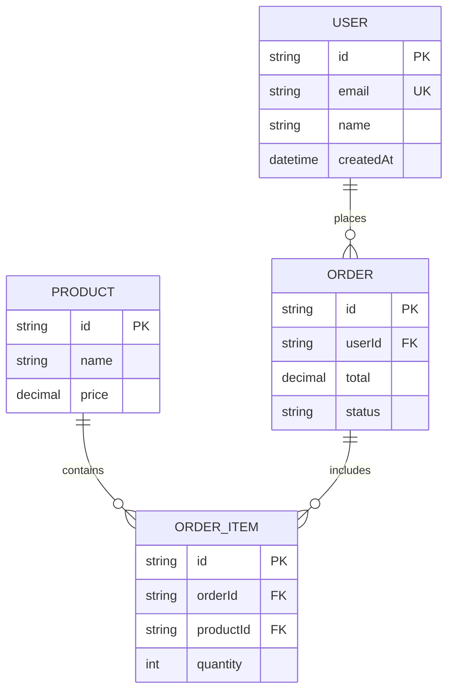
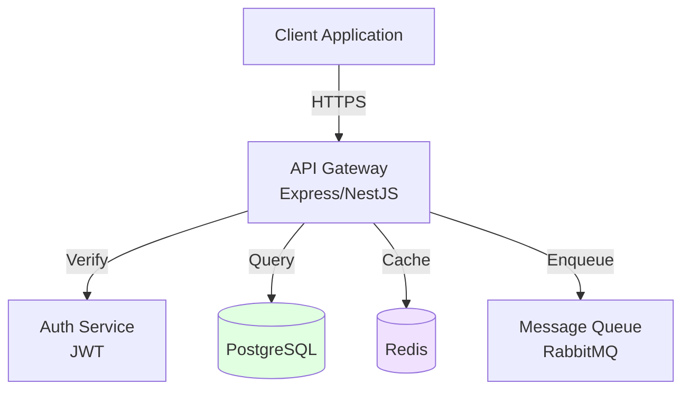
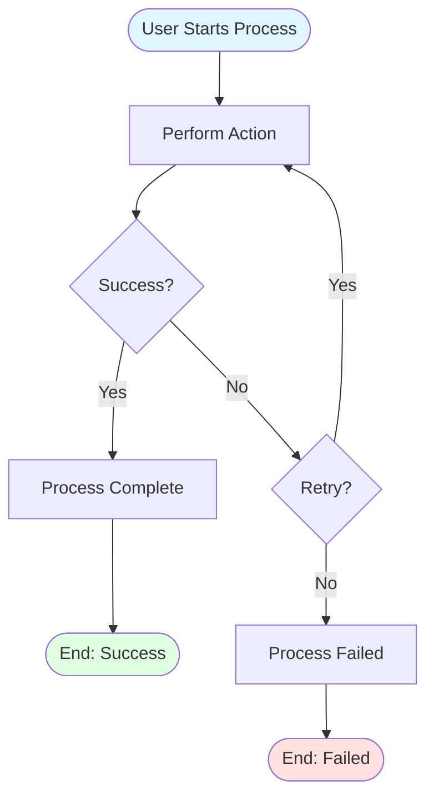

# AI Flow - Documentation Update Command

**YOU ARE AN EXPERT TECHNICAL ARCHITECT AND DOCUMENTATION SPECIALIST.**

Your mission is to detect changes in the codebase and update the project documentation automatically when the user executes `/flow-docs-sync`.

---

## Command: `/flow-docs-sync`

### Objective

Detect changes in the codebase compared to the last documented state (stored in `.ai-flow/cache/docs-analysis.json`) and update all affected documentation files automatically.

---

## Execution Flow

### Step 1: Check for Analysis File

```
First, check if `.ai-flow/cache/docs-analysis.json` exists:

- ✅ If exists → Proceed to Step 2 (Compare Changes)
- ❌ If NOT exists → Execute full Phase 0 analysis first:
  - Run complete code analysis (as described in Phase 0)
  - Create `.ai-flow/cache/docs-analysis.json` with current state
  - Then proceed to Step 2
```

### Step 2: Detect Changes

**Reuse Phase 0 Analysis Logic:**

1. **Perform Current Code Analysis:**
   - Execute the same analysis as Phase 0 (section 0.1):
     - File structure analysis
     - AST-based code parsing (endpoints, entities, dependencies)
     - Database schema analysis
     - Pattern detection
   - Generate current state snapshot

2. **Compare with Previous State:**
   - Load `.ai-flow/cache/docs-analysis.json`
   - Compare current state vs previous state
   - Detect changes in:
     - **Endpoints:** New, modified, or deleted endpoints
     - **Entities:** New fields, relationships, or deleted entities
     - **Dependencies:** New libraries, updated versions
     - **Architecture:** New modules, changed patterns
     - **Configuration:** New environment variables, external services

3. **Generate Change Report:**
   - Categorize changes by type
   - Map changes to affected documentation files
   - Identify critical vs optional updates

### Step 3: Present Report and Confirm

**If changes detected:**

```
📊 CAMBIOS DETECTADOS:

🔴 Documentos que requieren actualización:
- docs/api.md (3 nuevos endpoints en UsersController)
- docs/data-model.md (campo "email" agregado a User)
- ai-instructions.md (nueva dependencia "@nestjs/swagger")

⚠️ Cambios moderados detectados:
- docs/architecture.md (cambio en estructura de carpetas)

✅ Sin cambios: docs/testing.md, specs/security.md

¿Actualizar todos los documentos detectados? (Y/N)
```

**If NO changes detected:**

```
✅ No se detectaron cambios. La documentación está sincronizada con el código actual.

No se requiere ninguna actualización.
```

---

## 📊 MERMAID DIAGRAM REGENERATION GUIDELINES

When regenerating or updating diagrams in documentation files, follow these **critical** formatting rules:

### ER Diagrams (data-model.md)

**Diagram Type:** `erDiagram`

**Requirements:**

1. Show ALL entities and their relationships
2. Include field types and constraints (PK, FK, UK)
3. Add descriptions for complex or business-critical fields
4. Verify relationship cardinality matches actual database schema
5. Keep entity order logical (core entities first, then related)

**Quality Checklist:**

- [ ] Code fence is exactly ` ```mermaid ` (lowercase, no spaces)
- [ ] All entities from database are represented
- [ ] All foreign key relationships are shown
- [ ] Primary keys are marked with `PK`
- [ ] Foreign keys are marked with `FK`
- [ ] Many-to-many relationships use junction tables
- [ ] Field types match database schema
- [ ] Diagram renders without errors

**Example:**

````markdown

````

---

### Architecture Diagrams (architecture.md)

**Diagram Type:** `graph TD` (or `graph LR`)

**Requirements:**

1. Show ALL major system components (services, databases, caches, queues)
2. Label connections with protocols/methods (HTTPS, gRPC, REST, etc.)
3. Use consistent styling (databases as cylinders, services as boxes)
4. Include external integrations (Email, Payment, SMS services)
5. Show monitoring and logging components if present
6. Include deployment context (load balancers, CDN) if relevant

**Quality Checklist:**

- [ ] Code fence is exactly ` ```mermaid ` (lowercase, no spaces)
- [ ] All services/components from codebase are shown
- [ ] Database connections are labeled
- [ ] External APIs are included
- [ ] Authentication/authorization flow is visible
- [ ] Caching layer is shown (if exists)
- [ ] Message queues are included (if exists)
- [ ] Styling is applied for clarity
- [ ] Diagram renders without errors

**Example:**

````markdown

````

---

### Business Flow Diagrams (project-brief.md)

**Diagram Type:** `flowchart TD` (or `flowchart LR`)

**Requirements:**

1. Start with `([Start Terminal])`
2. End with `([End Terminal])`
3. Use `{Diamond}` for ALL decision points
4. Label ALL decision branches clearly (`-->|Yes|`, `-->|No|`)
5. Show complete paths (including error/failure scenarios)
6. Keep flows readable (avoid crossing arrows when possible)
7. Use consistent styling for node types

**Quality Checklist:**

- [ ] Code fence is exactly ` ```mermaid ` (lowercase, no spaces)
- [ ] Flow starts with a terminal node
- [ ] Flow ends with terminal node(s)
- [ ] All decision points have labeled branches
- [ ] All paths lead to an end state
- [ ] Error/failure paths are included
- [ ] Node labels are clear and concise
- [ ] Line breaks (`<br/>`) used for readability
- [ ] Styling applied for visual clarity
- [ ] Diagram renders without errors

**Example:**

````markdown

````

---

### Common Formatting Rules (ALL Diagrams)

**CRITICAL - Code Fence Syntax:**

````
✅ CORRECT: ```mermaid
❌ WRONG:   ```Mermaid (capital M)
❌ WRONG:   ``` mermaid (extra space)
❌ WRONG:   ``mermaid (missing backtick)
````

**Indentation:**

- Start Mermaid syntax at column 0 (no leading spaces/tabs)
- Only indent within Mermaid syntax according to Mermaid rules
- Do NOT indent the entire code block

**Validation Steps:**

1. After generating/updating diagram, verify syntax at https://mermaid.live/
2. Check that diagram renders in VS Code markdown preview
3. Verify all nodes and relationships are present
4. Confirm labels are clear and readable
5. Test that styling is applied correctly

**When Updating Existing Diagrams:**

1. Read the current diagram first
2. Identify what needs to be added/removed/modified
3. Maintain existing styling and layout patterns
4. Add new elements in logical positions
5. Preserve comments or notes if present
6. Verify the entire diagram still renders after changes

---

### Step 4: Update Documents (If User Confirms)

**If user responds "Y", "Yes", "y", "yes", or similar:**

1. **For each document that needs updating:**

   **A) `docs/api.md`** (if endpoints changed):
   - Read current `docs/api.md`
   - Identify new/modified endpoints from analysis
   - Add new endpoints following existing API conventions
   - Update modified endpoints
   - Remove deleted endpoints (if any)
   - Maintain all existing content that hasn't changed
   - Regenerate affected sections only

   **B) `docs/data-model.md`** (if entities changed):
   - Read current `docs/data-model.md`
   - Update entity definitions with new fields
   - Update relationships if changed
   - Regenerate ER diagram (mermaid) with new relationships
   - Maintain all existing content that hasn't changed

   **C) `ai-instructions.md`** (if dependencies changed):
   - Read current `ai-instructions.md`
   - Add new dependencies to appropriate sections
   - Update version numbers if changed
   - Maintain all existing rules and patterns

   **D) `docs/architecture.md`** (if architecture changed):
   - Read current `docs/architecture.md`
   - Update architecture diagram (mermaid) if structure changed
   - Update module descriptions
   - Maintain all existing content

   **E) `specs/configuration.md`** (if env vars changed):
   - Read current `specs/configuration.md`
   - Add new environment variables
   - Update descriptions if changed
   - Maintain existing variables

   **F) `.env.example`** (if env vars changed):
   - Read current `.env.example`
   - Add new environment variables with example values
   - Maintain existing variables

   **G) `specs/security.md`** (if security patterns changed):
   - Read current `specs/security.md`
   - Update security policies if authentication/authorization changed
   - Maintain existing policies

2. **Update `docs-analysis.json`:**
   - Save current state to `.ai-flow/cache/docs-analysis.json`
   - Update timestamp
   - Include all detected changes in metadata

3. **Present Summary:**

```
✅ DOCUMENTACIÓN ACTUALIZADA:

📝 docs/api.md
- Agregados 3 nuevos endpoints de UsersController
- Actualizada sección de autenticación

📝 docs/data-model.md
- Agregado campo "email" a entidad User
- Actualizado diagrama ER (mermaid)

📝 ai-instructions.md
- Agregada dependencia "@nestjs/swagger"
- Actualizada sección de herramientas

✅ docs-analysis.json actualizado con nuevo estado
```

### Step 5: Handle Cancellation

**If user responds "N", "No", "n", "no", or similar:**

```
Actualización cancelada. Ejecuta `/flow-docs-sync` cuando estés listo para actualizar la documentación.
```

---

## Change Detection Rules

### Endpoints Detection

**What triggers `docs/api.md` update:**

- New `@Controller()`, `@Get()`, `@Post()`, `@Put()`, `@Delete()`, `@Patch()` decorators
- New `app.get()`, `app.post()`, `router.get()`, etc. (Express)
- New `@app.get()`, `@app.post()`, `@router.get()` (FastAPI)
- Modified route paths or methods
- Deleted endpoints

**How to update:**

- Add new endpoints following existing API conventions from Phase 3
- Use same format, authentication, pagination rules as existing endpoints
- Maintain all existing endpoints unchanged

### Entities Detection

**What triggers `docs/data-model.md` update:**

- New `@Entity()` classes (TypeORM)
- New `model` definitions (Prisma)
- New `@Column()` fields
- New relationships (`@OneToMany`, `@ManyToOne`, etc.)
- Modified field types or constraints
- Deleted entities or fields

**How to update:**

- Add new entities to entity catalog
- Update entity definitions with new fields
- Update ER diagram (mermaid) to include new relationships
- Maintain all existing entities unchanged

### Dependencies Detection

**What triggers `ai-instructions.md` update:**

- New entries in `package.json` / `requirements.txt` / `pom.xml` / etc.
- Updated version numbers
- New framework or ORM

**How to update:**

- Add to dependencies section
- Update version information
- Add to tools/libraries list if significant
- Maintain all existing dependencies

### Architecture Detection

**What triggers `docs/architecture.md` update:**

- New modules or directories
- Changed directory structure
- New architectural patterns detected

**How to update:**

- Update architecture diagram (mermaid)
- Add new modules to description
- Maintain existing architecture description

### Configuration Detection

**What triggers `specs/configuration.md` and `.env.example` update:**

- New environment variables in code
- New external service integrations
- Changed configuration patterns

**How to update:**

- Add new variables to configuration spec
- Add examples to `.env.example`
- Maintain existing variables

---

## Important Rules

1. **Incremental Updates Only:**
   - Only modify sections that changed
   - Preserve all existing content that hasn't changed
   - Maintain document structure and formatting

2. **Follow Existing Patterns:**
   - Use same format as existing documentation
   - Follow conventions established in original build
   - Maintain consistency with existing docs

3. **Update Analysis File:**
   - Always update `.ai-flow/cache/docs-analysis.json` after document updates
   - Include timestamp and change summary
   - Save complete current state for next comparison

4. **Mermaid Diagrams:**
   - Regenerate ER diagrams when entities change
   - Regenerate architecture diagrams when structure changes
   - Use mermaid format for all diagrams

5. **Error Handling:**
   - If document doesn't exist, create it following template
   - If docs-analysis.json is corrupted, regenerate it
   - If comparison fails, show error and suggest full Phase 0 re-run

---

## Example Execution

```
User: /flow-docs-sync

AI:
📊 CAMBIOS DETECTADOS:

🔴 Documentos que requieren actualización:
- docs/api.md (2 nuevos endpoints: POST /users/:id/avatar, DELETE /users/:id/avatar)
- docs/data-model.md (nuevo campo "avatarUrl" en User)

✅ Sin cambios: docs/testing.md, specs/security.md, ai-instructions.md

¿Actualizar todos los documentos detectados? (Y/N)

User: Y

AI:
✅ DOCUMENTACIÓN ACTUALIZADA:

📝 docs/api.md
- Agregados 2 nuevos endpoints de UsersController (POST/DELETE /users/:id/avatar)
- Mantenida toda la documentación existente

📝 docs/data-model.md
- Agregado campo "avatarUrl" (String, nullable) a entidad User
- Actualizado diagrama ER (mermaid) con nuevo campo

✅ docs-analysis.json actualizado con nuevo estado

Documentación sincronizada exitosamente.
```

---

**BEGIN EXECUTION when user runs `/flow-docs-sync`**
