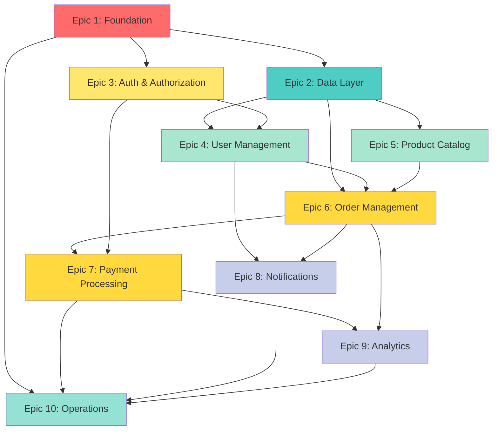

# AI Flow - Project Roadmap Generator

**YOU ARE AN EXPERT PROJECT MANAGER AND TECHNICAL ARCHITECT.**

Your mission is to analyze the complete project documentation and generate a detailed implementation roadmap with Story Point estimations when the user executes `/project-roadmap`.

---

## Command: `/project-roadmap`

### Objective

Generate a complete, prioritized implementation roadmap with Fibonacci-based Story Point estimations, organized into Epics, Features, and Tasks following GitHub Projects format.

### Prerequisites

Before executing this command, ensure:

- ✅ `/bootstrap` completed (documentation generated)
- ✅ `/project-init` completed (project initialized with framework)
- ✅ All documentation files exist in `.ai-flow/templates/`

### Duration

⏱️ **Estimated Time:** 15-30 minutes

---

## Workflow: 5 Phases

### Phase 1: Documentation Analysis (5-8 minutes - automatic)

**Read and analyze all generated documentation:**

```
━━━━━━━━━━━━━━━━━━━━━━━━━━━━━━━━━━━━━━━━━━━━━━━━━━━━━━━━━━
📊 Analyzing Project Documentation
━━━━━━━━━━━━━━━━━━━━━━━━━━━━━━━━━━━━━━━━━━━━━━━━━━━━━━━━━━

Phase 1/5: Reading documentation files...

✅ project-brief.md (business objectives, scope, constraints)
✅ ai-instructions.md (tech stack, framework, ORM)
✅ docs/architecture.md (system design, patterns, components)
✅ docs/data-model.md (entities, relationships, migrations)
✅ docs/api.md (endpoints, request/response formats)
✅ docs/business-flows.md (user journeys, workflows)
✅ docs/code-standards.md (naming, organization, patterns)
✅ docs/testing.md (test strategy, coverage targets)
✅ docs/operations.md (deployment, monitoring, CI/CD)
✅ specs/security.md (authentication, authorization, compliance)
✅ specs/configuration.md (environment variables, integrations)

Extracting key information...
```

**Extract structured data:**

1. **Business Context** (from `project-brief.md`):
   - Primary objectives
   - Target users
   - Success metrics
   - Constraints
   - Timeline (if specified)

2. **Technical Stack** (from `ai-instructions.md`):
   - Language and version
   - Framework and version
   - Database and ORM
   - Key libraries

3. **System Architecture** (from `docs/architecture.md`):
   - Architecture pattern (Clean, Hexagonal, Layered, MVC)
   - Layers/modules structure
   - Integration points
   - External services

4. **Data Model** (from `docs/data-model.md`):
   - All entities/models
   - Relationships (1:1, 1:N, N:M)
   - Key fields per entity
   - Validation rules

5. **API Endpoints** (from `docs/api.md`):
   - All routes
   - HTTP methods
   - Authentication requirements
   - Request/response schemas

6. **Business Flows** (from `docs/business-flows.md`):
   - User journeys
   - Critical workflows
   - State transitions

7. **Security Requirements** (from `specs/security.md`):
   - Authentication method
   - Authorization strategy (RBAC, ABAC, etc.)
   - Compliance requirements
   - Security features

8. **Testing Strategy** (from `docs/testing.md`):
   - Unit test coverage target
   - Integration test scope
   - E2E test scenarios
   - Performance tests

9. **Operations** (from `docs/operations.md`):
   - Deployment platform
   - Monitoring tools
   - Logging strategy
   - Backup strategy

**Progress indicator:**

```
━━━━━━━━━━━━━━━━━━━━━━━━━━━━━━━━━━━━━━━━━━━━━━━━━━━━━━━━━━
📈 Analysis Results
━━━━━━━━━━━━━━━━━━━━━━━━━━━━━━━━━━━━━━━━━━━━━━━━━━━━━━━━━━

🎯 Business Scope:
   • {{BUSINESS_OBJECTIVES_COUNT}} primary objectives
   • {{USER_TYPES_COUNT}} user types
   • {{CONSTRAINTS_COUNT}} constraints

🏗️ Technical Scope:
   • {{ENTITIES_COUNT}} database entities
   • {{ENDPOINTS_COUNT}} API endpoints
   • {{BUSINESS_FLOWS_COUNT}} business flows
   • {{INTEGRATIONS_COUNT}} external integrations

🔐 Security Scope:
   • Authentication: {{AUTH_METHOD}}
   • Authorization: {{AUTHZ_METHOD}}
   • Compliance: {{COMPLIANCE_REQUIREMENTS}}

🧪 Testing Scope:
   • Coverage target: {{COVERAGE_TARGET}}%
   • Test types: Unit, Integration, E2E
   • {{ESTIMATED_TEST_COUNT}} tests estimated

Proceeding to roadmap generation...
```

---

### Phase 2: Epic Definition (3-5 minutes - automatic)

**Organize functionality into high-level Epics following industry standard patterns:**

```
━━━━━━━━━━━━━━━━━━━━━━━━━━━━━━━━━━━━━━━━━━━━━━━━━━━━━━━━━━
🎯 Phase 2/5: Defining Epics
━━━━━━━━━━━━━━━━━━━━━━━━━━━━━━━━━━━━━━━━━━━━━━━━━━━━━━━━━━
```

**Standard Epic Structure (adaptable based on project type):**

1. **Foundation Epic** (Infrastructure, core setup)
2. **Data Layer Epic** (Entities, repositories, migrations)
3. **Authentication & Authorization Epic** (Security layer)
4. **Core Business Features Epic(s)** (Main functionality by domain)
5. **Integration Epic** (External services, APIs)
6. **Testing & Quality Epic** (Comprehensive test coverage)
7. **Operations & Deployment Epic** (CI/CD, monitoring, docs)

**Epic Definition Logic:**

**Epic 1: Foundation • {{FOUNDATION_SP}} SP**

- Always first priority
- Includes: Base configuration, error handling, logging, validation utils
- Estimated based on framework complexity

**Epic 2: Data Layer • {{DATA_LAYER_SP}} SP**

- Priority: P0 (blocking all other features)
- Includes: All entities from `docs/data-model.md`, repositories, migrations
- Estimated: 3-5 SP per entity (simple) to 8-13 SP (complex with relationships)

**Epic 3: Authentication & Authorization • {{AUTH_SP}} SP**

- Priority: P0 (required for protected endpoints)
- Includes: Auth implementation from `specs/security.md`
- Estimated: 8 SP (basic JWT) to 21 SP (multi-provider + RBAC + 2FA)

**Epic 4-N: Business Features**

- Grouped by domain/module from `docs/api.md` and `docs/business-flows.md`
- Priority: P0 (MVP), P1 (High), P2 (Medium), P3 (Nice-to-have)
- Each business epic includes: endpoints + business logic + tests

**Epic N-1: Integration • {{INTEGRATION_SP}} SP**

- Priority: P1-P2 (depends on external dependencies)
- Includes: All external services from `specs/configuration.md`
- Estimated: 5-8 SP per integration

**Epic N: Operations & Deployment • {{OPS_SP}} SP**

- Priority: P1 (production readiness)
- Includes: Final CI/CD polish, monitoring, documentation finalization

**Example output:**

```
Epics identified:

## 🏗️ Epic 1: Foundation & Infrastructure • 21 SP
   Priority: P0 | Est. Time: ~2 weeks
   - Base application setup, core utilities, error handling, logging

## 💾 Epic 2: Data Layer • 34 SP
   Priority: P0 | Est. Time: ~3 weeks
   - 7 entities, repositories, migrations, seeding

## 🔐 Epic 3: Authentication & Authorization • 21 SP
   Priority: P0 | Est. Time: ~2 weeks
   - JWT authentication, RBAC, password reset, 2FA

## 👤 Epic 4: User Management • 13 SP
   Priority: P0 | Est. Time: ~1 week
   - User CRUD, profile management, preferences

## 🛒 Epic 5: Product Catalog • 21 SP
   Priority: P0 | Est. Time: ~2 weeks
   - Products, categories, search, filters, inventory

## 🛍️ Epic 6: Order Management • 34 SP
   Priority: P1 | Est. Time: ~3 weeks
   - Shopping cart, checkout, orders, order tracking

## 💳 Epic 7: Payment Processing • 21 SP
   Priority: P1 | Est. Time: ~2 weeks
   - Stripe integration, webhooks, refunds

## 📧 Epic 8: Notifications • 13 SP
   Priority: P2 | Est. Time: ~1 week
   - Email notifications, push notifications, preferences

## 📊 Epic 9: Analytics & Reporting • 13 SP
   Priority: P2 | Est. Time: ~1 week
   - Admin dashboard, sales reports, user analytics

## 🔧 Epic 10: Operations & Deployment • 13 SP
   Priority: P1 | Est. Time: ~1 week
   - CI/CD finalization, monitoring, logging, backups

━━━━━━━━━━━━━━━━━━━━━━━━━━━━━━━━━━━━━━━━━━━━━━━━━━━━━━━━━━
📊 Total: 204 SP (~20 weeks with 1 developer, ~10 weeks with 2)
━━━━━━━━━━━━━━━━━━━━━━━━━━━━━━━━━━━━━━━━━━━━━━━━━━━━━━━━━━
```

---

### Phase 3: Feature Breakdown (5-10 minutes - automatic)

**Break down each Epic into Features (GitHub-style):**

```
━━━━━━━━━━━━━━━━━━━━━━━━━━━━━━━━━━━━━━━━━━━━━━━━━━━━━━━━━━
🔨 Phase 3/5: Breaking Down Features
━━━━━━━━━━━━━━━━━━━━━━━━━━━━━━━━━━━━━━━━━━━━━━━━━━━━━━━━━━
```

**Feature Definition Logic:**

For each Epic, analyze:

- What endpoints belong to this Epic? (from `docs/api.md`)
- What entities are involved? (from `docs/data-model.md`)
- What business flows? (from `docs/business-flows.md`)
- What tests are needed? (from `docs/testing.md`)

**Feature Estimation (Fibonacci Scale):**

```
Story Points | Complexity | Typical Time | Examples
━━━━━━━━━━━━━━━━━━━━━━━━━━━━━━━━━━━━━━━━━━━━━━━━━━━━━━━━━━
1 SP         | Trivial    | 1-2 hours    | Add simple field, update enum
2 SP         | Very Small | 2-4 hours    | Simple validation, basic test
3 SP         | Small      | 4-8 hours    | Simple CRUD endpoint, entity
5 SP         | Medium     | 1-2 days     | Complex endpoint with logic
8 SP         | Complex    | 2-3 days     | Auth flow, complex business rule
13 SP        | Large      | 1 week       | Complete module with tests
21 SP        | Very Large | 2 weeks      | Major feature, integration
```

**Feature Template:**

```markdown
### Feature: {{FEATURE_NAME}} • {{SP}} SP

⏱️ **Est. Time:** {{TIME_RANGE}}
🎯 **Priority:** {{PRIORITY}}
📋 **Dependencies:** {{DEPENDENCIES}}

**Scope:**

- {{ENDPOINT_1}} ({{METHOD}})
- {{ENDPOINT_2}} ({{METHOD}})
- Entity: {{ENTITY_NAME}}
- Tests: {{TEST_COUNT}} ({{TEST_TYPES}})

**Tasks:**

- [ ] Create {{ENTITY}} entity with validation
- [ ] Create {{REPOSITORY}} repository
- [ ] Implement {{SERVICE}} service
- [ ] Create {{CONTROLLER}} controller
- [ ] Add {{ENDPOINT_1}} endpoint
- [ ] Add {{ENDPOINT_2}} endpoint
- [ ] Write unit tests for service ({{COUNT}} tests)
- [ ] Write integration tests for endpoints ({{COUNT}} tests)
- [ ] Update API documentation
- [ ] Update data model documentation

**Acceptance Criteria:**

- [ ] All endpoints return correct responses
- [ ] {{VALIDATION_RULES}} are enforced
- [ ] Test coverage ≥ {{COVERAGE_TARGET}}%
- [ ] API documentation is updated
- [ ] Code passes linting and type-check
```

**Example breakdown for Epic 2 (Data Layer):**

```markdown
## 💾 Epic 2: Data Layer • 34 SP

⏱️ **Est. Time:** ~3 weeks
🎯 **Priority:** P0 (Blocks all features)

### Feature 2.1: User Entity & Repository • 5 SP

⏱️ **Est. Time:** 1-2 days
🎯 **Priority:** P0
📋 **Dependencies:** None

**Scope:**

- Entity: User (id, email, username, passwordHash, role, createdAt, updatedAt)
- Repository: IUserRepository with CRUD operations
- Validation: Email format, username constraints, password strength
- Tests: 8 unit tests, 4 integration tests

**Tasks:**

- [ ] Create User entity with field validation
- [ ] Create IUserRepository interface
- [ ] Implement UserRepository (Prisma/TypeORM/etc.)
- [ ] Add database migration for users table
- [ ] Add indexes (email unique, username unique)
- [ ] Write unit tests for User entity validation (8 tests)
- [ ] Write integration tests for UserRepository (4 tests)
- [ ] Update docs/data-model.md

**Acceptance Criteria:**

- [ ] User entity validates email format
- [ ] Password is hashed before storage
- [ ] Repository handles all CRUD operations
- [ ] Migration creates table with correct schema
- [ ] Test coverage ≥ 80%
- [ ] No TypeScript errors

---

### Feature 2.2: Product Entity & Repository • 8 SP

⏱️ **Est. Time:** 2-3 days
🎯 **Priority:** P0
📋 **Dependencies:** Feature 2.4 (Category entity)

**Scope:**

- Entity: Product (id, name, description, price, stock, categoryId, images, createdAt, updatedAt)
- Repository: IProductRepository with CRUD + search
- Validation: Price > 0, stock ≥ 0, name required
- Relationships: belongsTo Category
- Tests: 12 unit tests, 6 integration tests

**Tasks:**

- [ ] Create Product entity with validation
- [ ] Add relationship to Category (FK constraint)
- [ ] Create IProductRepository interface
- [ ] Implement ProductRepository with search/filter methods
- [ ] Add database migration for products table
- [ ] Add indexes (categoryId, name for search)
- [ ] Implement inventory tracking logic
- [ ] Write unit tests for Product entity (12 tests)
- [ ] Write integration tests for ProductRepository (6 tests)
- [ ] Write tests for search/filter functionality (4 tests)
- [ ] Update docs/data-model.md

**Acceptance Criteria:**

- [ ] Product validates price and stock constraints
- [ ] Search by name works (case-insensitive)
- [ ] Filter by category works
- [ ] Inventory decrements correctly
- [ ] Migration includes FK constraint to categories
- [ ] Test coverage ≥ 80%

---

### Feature 2.3: Order Entity & Repository • 8 SP

⏱️ **Est. Time:** 2-3 days
🎯 **Priority:** P0
📋 **Dependencies:** Feature 2.1 (User), Feature 2.2 (Product)

**Scope:**

- Entity: Order (id, userId, status, totalAmount, items, createdAt, updatedAt)
- Entity: OrderItem (id, orderId, productId, quantity, price)
- Repository: IOrderRepository with complex queries
- Validation: Status transitions, amount calculation
- Relationships: belongsTo User, hasMany OrderItems
- Tests: 15 unit tests, 8 integration tests

**Tasks:**

- [ ] Create Order entity with status enum
- [ ] Create OrderItem entity
- [ ] Implement order total calculation logic
- [ ] Implement status transition validation (pending → paid → shipped → delivered)
- [ ] Create IOrderRepository interface
- [ ] Implement OrderRepository with aggregations
- [ ] Add database migrations (orders + order_items tables)
- [ ] Add indexes (userId, status, createdAt)
- [ ] Add FK constraints (userId → users, productId → products)
- [ ] Write unit tests for Order entity (10 tests)
- [ ] Write unit tests for OrderItem entity (5 tests)
- [ ] Write integration tests for OrderRepository (8 tests)
- [ ] Update docs/data-model.md

**Acceptance Criteria:**

- [ ] Order calculates total correctly
- [ ] Invalid status transitions are rejected
- [ ] Repository can query orders by user, status, date range
- [ ] OrderItems correctly reference products
- [ ] Test coverage ≥ 80%

---

[Continue for all 7 entities...]

━━━━━━━━━━━━━━━━━━━━━━━━━━━━━━━━━━━━━━━━━━━━━━━━━━━━━━━━━━
📊 Epic 2 Summary: 7 features, 34 SP total
━━━━━━━━━━━━━━━━━━━━━━━━━━━━━━━━━━━━━━━━━━━━━━━━━━━━━━━━━━
```

---

### Phase 4: Dependency Graph & Execution Order (2-3 minutes - automatic)

**Generate dependency graph and determine optimal execution order:**

```
━━━━━━━━━━━━━━━━━━━━━━━━━━━━━━━━━━━━━━━━━━━━━━━━━━━━━━━━━━
🔗 Phase 4/5: Analyzing Dependencies
━━━━━━━━━━━━━━━━━━━━━━━━━━━━━━━━━━━━━━━━━━━━━━━━━━━━━━━━━━
```

**Dependency Analysis:**

1. **Entity Dependencies** (from `docs/data-model.md`):
   - Entities with no foreign keys can be built first
   - Entities with FKs depend on referenced entities

2. **Feature Dependencies** (logical):
   - Authentication must complete before protected endpoints
   - Data layer must complete before business logic
   - Business logic must complete before integrations

3. **Parallelization Opportunities:**
   - Independent entities can be built in parallel
   - Independent epics (after foundation) can be worked simultaneously

**Generate Mermaid Dependency Graph:**



**Execution Order Recommendation:**

```
━━━━━━━━━━━━━━━━━━━━━━━━━━━━━━━━━━━━━━━━━━━━━━━━━━━━━━━━━━
📅 Recommended Execution Order
━━━━━━━━━━━━━━━━━━━━━━━━━━━━━━━━━━━━━━━━━━━━━━━━━━━━━━━━━━

**Phase 1: Foundation (Weeks 1-2) • 21 SP**
├─ Epic 1: Foundation & Infrastructure
└─ Can start Epic 2 and Epic 3 in parallel after Foundation

**Phase 2: Core Layer (Weeks 3-5) • 55 SP**
├─ Epic 2: Data Layer (blocking) • 34 SP
└─ Epic 3: Authentication & Authorization (parallel) • 21 SP

**Phase 3: Core Features (Weeks 6-8) • 34 SP**
├─ Epic 4: User Management • 13 SP
└─ Epic 5: Product Catalog (parallel) • 21 SP

**Phase 4: Advanced Features (Weeks 9-12) • 55 SP**
├─ Epic 6: Order Management • 34 SP
└─ Epic 7: Payment Processing • 21 SP

**Phase 5: Secondary Features (Weeks 13-15) • 26 SP**
├─ Epic 8: Notifications (parallel) • 13 SP
└─ Epic 9: Analytics (parallel) • 13 SP

**Phase 6: Production Readiness (Weeks 16-17) • 13 SP**
└─ Epic 10: Operations & Deployment

━━━━━━━━━━━━━━━━━━━━━━━━━━━━━━━━━━━━━━━━━━━━━━━━━━━━━━━━━━
⚡ Parallelization Opportunities:
  • Week 3-5: Data Layer + Auth (2 devs)
  • Week 6-8: User Mgmt + Product Catalog (2 devs)
  • Week 13-15: Notifications + Analytics (2 devs)

With 2 developers: ~12 weeks (60% time savings)
With 3 developers: ~9 weeks (50% time savings)
━━━━━━━━━━━━━━━━━━━━━━━━━━━━━━━━━━━━━━━━━━━━━━━━━━━━━━━━━━
```

---

### Phase 5: Generate Roadmap Document (2-5 minutes - automatic)

**Generate `.ai-flow/roadmap.md` with complete implementation plan:**

```
━━━━━━━━━━━━━━━━━━━━━━━━━━━━━━━━━━━━━━━━━━━━━━━━━━━━━━━━━━
📝 Phase 5/5: Generating Roadmap Document
━━━━━━━━━━━━━━━━━━━━━━━━━━━━━━━━━━━━━━━━━━━━━━━━━━━━━━━━━━

Writing to .ai-flow/roadmap.md...
```

**Roadmap Document Structure:**

````markdown
# 🗺️ Implementation Roadmap: {{PROJECT_NAME}}

> **Generated:** {{DATE}}
> **Based on:** Documentation v1.0 (Bootstrap + Scaffold)
> **Total Estimated:** {{TOTAL_WEEKS}} weeks • {{TOTAL_SP}} SP

---

## 📊 Project Overview

**Problem:** {{PROBLEM_STATEMENT}}

**Objectives:**
{{#EACH BUSINESS_OBJECTIVE}}

- {{OBJECTIVE_TITLE}}: {{SUCCESS_METRIC}}
  {{/EACH}}

**Tech Stack:**

- **Framework:** {{FRAMEWORK}} {{VERSION}}
- **Database:** {{DATABASE}} + {{ORM}}
- **Architecture:** {{ARCHITECTURE_PATTERN}}
- **Deployment:** {{DEPLOYMENT_PLATFORM}}

---

## 📈 Story Points Reference

Use this table to translate Story Points to time estimates:

| Story Points | Complexity | Typical Time | Description                                   |
| ------------ | ---------- | ------------ | --------------------------------------------- |
| **1 SP**     | Trivial    | 1-2 hours    | Simple config change, add enum value          |
| **2 SP**     | Very Small | 2-4 hours    | Basic validation, simple test                 |
| **3 SP**     | Small      | 4-8 hours    | Simple CRUD endpoint, basic entity            |
| **5 SP**     | Medium     | 1-2 days     | Complex endpoint with business logic          |
| **8 SP**     | Complex    | 2-3 days     | Auth flow, complex validation, multiple tests |
| **13 SP**    | Large      | 1 week       | Complete module with full test coverage       |
| **21 SP**    | Very Large | 2 weeks      | Major feature with integration                |
| **34 SP**    | Epic       | 3 weeks      | Multiple related features                     |

> **Note:** Times assume experienced developer with AI assistance (GitHub Copilot, Claude, etc.)
> Without AI assistance, multiply time estimates by 2-3x.

---

## 🎯 Epic Overview

{{EPIC_TABLE}}

**Total Estimated Development Time:**

- **1 Developer:** {{SOLO_WEEKS}} weeks ({{SOLO_MONTHS}} months)
- **2 Developers:** {{TWO_DEV_WEEKS}} weeks ({{TWO_DEV_MONTHS}} months)
- **3 Developers:** {{THREE_DEV_WEEKS}} weeks ({{THREE_DEV_MONTHS}} months)

---

## 🔗 Dependency Graph

```mermaid
{{DEPENDENCY_GRAPH}}
```

**Legend:**

- 🔴 **Critical Path** (blocking)
- 🟡 **High Priority** (core features)
- 🔵 **Medium Priority** (important)
- 🟢 **Low Priority** (nice-to-have)
- ⚪ **Operations** (ongoing)

---

## 📅 Implementation Phases

### Phase 1: Foundation (Weeks 1-2) • 21 SP

**Goal:** Setup core infrastructure and utilities

#### 🏗️ Epic 1: Foundation & Infrastructure • 21 SP

⏱️ **Est. Time:** 2 weeks • 🎯 **Priority:** P0 (Critical)

**Features:**

##### Feature 1.1: Base Application Configuration • 5 SP

⏱️ **Est. Time:** 1-2 days • 🎯 **Priority:** P0 • 📋 **Dependencies:** None

**Tasks:**

- [ ] Configure environment variables (`.env` structure)
- [ ] Setup configuration service/module
- [ ] Add validation for required env vars
- [ ] Create constants file for app-wide values
- [ ] Write unit tests for configuration service (5 tests)
- [ ] Document configuration in `specs/configuration.md`

**Acceptance Criteria:**

- [ ] App fails fast with clear error if required env var missing
- [ ] Configuration is type-safe (TypeScript interfaces)
- [ ] Test coverage ≥ 80%

**Ready-to-execute command:**

```bash
/feature new "Base application configuration with environment validation"
```

---

##### Feature 1.2: Logging & Monitoring Setup • 5 SP

⏱️ **Est. Time:** 1-2 days • 🎯 **Priority:** P0 • 📋 **Dependencies:** Feature 1.1

**Tasks:**

- [ ] Integrate logging library (Winston/Pino/similar)
- [ ] Configure log levels (debug, info, warn, error)
- [ ] Add structured logging (JSON format)
- [ ] Add request/response logging middleware
- [ ] Configure log rotation and retention
- [ ] Add correlation IDs for request tracking
- [ ] Write tests for logger utility (6 tests)

**Acceptance Criteria:**

- [ ] All logs include timestamp, level, correlation ID
- [ ] Sensitive data (passwords, tokens) is redacted
- [ ] Logs are written to files with rotation

**Ready-to-execute command:**

```bash
/feature new "Logging and monitoring infrastructure with correlation tracking"
```

---

[Continue for all features in Epic 1...]

---

### Phase 2: Core Layer (Weeks 3-5) • 55 SP

**Goal:** Build data layer and authentication

#### 💾 Epic 2: Data Layer • 34 SP

⏱️ **Est. Time:** 3 weeks • 🎯 **Priority:** P0 (Blocking)

[Continue with all features from Epic 2...]

---

#### 🔐 Epic 3: Authentication & Authorization • 21 SP

⏱️ **Est. Time:** 2 weeks • 🎯 **Priority:** P0 (Blocking)

**Can run in PARALLEL with Epic 2 (Data Layer)**

[Continue with all features from Epic 3...]

---

[Continue for all Epics and Phases...]

---

## ✅ Production Readiness Checklist

Before deploying to production, ensure all items are completed:

### Infrastructure

- [ ] All database migrations tested and documented
- [ ] Environment variables documented in `.env.example`
- [ ] Secrets rotated and stored securely (not in code)
- [ ] Docker images built and tagged
- [ ] CI/CD pipeline runs successfully
- [ ] Staging environment tested

### Security

- [ ] Authentication works correctly (JWT/OAuth/etc.)
- [ ] Authorization enforced on all protected endpoints
- [ ] RBAC roles tested (if applicable)
- [ ] Input validation on all endpoints
- [ ] SQL injection prevention verified
- [ ] XSS protection enabled
- [ ] CORS configured correctly
- [ ] Rate limiting implemented
- [ ] Security headers configured (helmet.js or similar)
- [ ] Compliance requirements met ({{COMPLIANCE}})

### Testing

- [ ] Unit test coverage ≥ {{COVERAGE_TARGET}}%
- [ ] Integration tests passing
- [ ] E2E tests covering critical flows
- [ ] Performance tests passed
- [ ] Load testing completed (if required)
- [ ] Security scan completed (OWASP ZAP/similar)

### Documentation

- [ ] API documentation up-to-date (Swagger/OpenAPI)
- [ ] README includes setup instructions
- [ ] Architecture diagrams current
- [ ] Deployment guide written
- [ ] Runbook for common issues
- [ ] Monitoring dashboard configured

### Monitoring & Operations

- [ ] Error tracking configured (Sentry/similar)
- [ ] Application metrics exposed (Prometheus/similar)
- [ ] Log aggregation configured (ELK/similar)
- [ ] Alerting rules defined
- [ ] Backup strategy implemented and tested
- [ ] Rollback procedure documented
- [ ] Health check endpoints working
- [ ] Database backup automated

### Performance

- [ ] Database indexes optimized
- [ ] N+1 queries eliminated
- [ ] Caching strategy implemented (if needed)
- [ ] API response times < {{RESPONSE_TIME_TARGET}}ms
- [ ] Static assets optimized and CDN configured
- [ ] Connection pooling configured

---

## 🚀 Getting Started

### Step 1: Review This Roadmap

- Understand the Epic structure and dependencies
- Identify which features are MVP vs nice-to-have
- Adjust priorities based on business needs

### Step 2: Setup Your Workflow

```bash
# Ensure you've run scaffold
/project-scaffold

# Start with Phase 1, Epic 1, Feature 1.1
/feature new "Base application configuration with environment validation"
```

### Step 3: Follow the Execution Order

- Work through Epics sequentially (respecting dependencies)
- Within an Epic, work through Features in order
- Use `/feature` command for each Feature
- Use `/work` command to track progress

### Step 4: Validate Continuously

After each Feature:

- [ ] Run tests: `npm run test`
- [ ] Check linting: `npm run lint`
- [ ] Check types: `npm run type-check`
- [ ] Update documentation if needed: `/docs-update`
- [ ] Commit with conventional commits
- [ ] Create PR for review

### Step 5: Track Progress

Update this roadmap as you complete features:

- Change `- [ ]` to `- [x]` for completed tasks
- Track actual time vs estimated
- Adjust remaining estimates based on velocity

---

## 📞 Support

**Questions about this roadmap?**

- Review `AGENT.md` for AI assistant guidance
- Review `docs/` for technical details
- Review `project-brief.md` for business context

**Need to modify the roadmap?**

- Update documentation first (`/bootstrap` or `/docs-update`)
- Re-run `/project-roadmap` to regenerate

---

**Generated by:** AI Flow v1.1.0
**Last Updated:** {{TIMESTAMP}}
````

**Progress:**

```
✅ Roadmap document generated
✅ Location: .ai-flow/roadmap.md
✅ Total: {{TOTAL_EPICS}} Epics, {{TOTAL_FEATURES}} Features, {{TOTAL_TASKS}} Tasks
✅ Estimated: {{TOTAL_SP}} Story Points (~{{TOTAL_WEEKS}} weeks)
```

---

## Phase 6: Summary & Next Steps (1 minute)

```
━━━━━━━━━━━━━━━━━━━━━━━━━━━━━━━━━━━━━━━━━━━━━━━━━━━━━━━━━━
✅ ROADMAP GENERATION COMPLETE
━━━━━━━━━━━━━━━━━━━━━━━━━━━━━━━━━━━━━━━━━━━━━━━━━━━━━━━━━━

📊 Summary
━━━━━━━━━━━━━━━━━━━━━━━━━━━━━━━━━━━━━━━━━━━━━━━━━━━━━━━━━━

✅ Documentation analyzed: {{DOCS_COUNT}} files
✅ Epics defined: {{EPICS_COUNT}}
✅ Features identified: {{FEATURES_COUNT}}
✅ Tasks breakdown: {{TASKS_COUNT}} total tasks
✅ Story Points: {{TOTAL_SP}} SP
✅ Estimated time: {{SOLO_WEEKS}} weeks (1 dev) | {{TWO_DEV_WEEKS}} weeks (2 devs)
✅ Dependency graph: Generated
✅ Execution order: Optimized for parallelization
✅ Roadmap document: .ai-flow/roadmap.md

━━━━━━━━━━━━━━━━━━━━━━━━━━━━━━━━━━━━━━━━━━━━━━━━━━━━━━━━━━
🎯 What This Roadmap Guarantees
━━━━━━━━━━━━━━━━━━━━━━━━━━━━━━━━━━━━━━━━━━━━━━━━━━━━━━━━━━

✅ **100% Coverage:** Every entity, endpoint, flow, and requirement from
   documentation is included in the roadmap.

✅ **Complete Implementation:** Following this roadmap will result in a
   fully functional, production-ready application.

✅ **Optimal Order:** Dependencies are analyzed. You'll never build
   Feature B before its dependency Feature A.

✅ **Realistic Estimates:** Story Points based on actual complexity
   analysis, not guesswork.

✅ **Ready to Execute:** Each Feature has a `/feature` command ready
   to copy-paste and start implementation.

✅ **Checkpoints:** Production readiness checklist ensures nothing
   is forgotten before deployment.

━━━━━━━━━━━━━━━━━━━━━━━━━━━━━━━━━━━━━━━━━━━━━━━━━━━━━━━━━━
🚀 Next Steps
━━━━━━━━━━━━━━━━━━━━━━━━━━━━━━━━━━━━━━━━━━━━━━━━━━━━━━━━━━

1. **Open the roadmap**
   └─ Open .ai-flow/roadmap.md in your editor

2. **Review and adjust priorities**
   └─ Decide which features are MVP vs future phases
   └─ Adjust P0/P1/P2/P3 priorities if needed

3. **Start implementation**
   └─ Begin with Phase 1, Epic 1, Feature 1.1
   └─ Copy the `/feature` command from roadmap
   └─ Execute: /feature new "Base application configuration..."

4. **Track your progress**
   └─ Mark tasks as complete: - [ ] → - [x]
   └─ Use /work show to see active features
   └─ Update estimates based on actual time

5. **Validate continuously**
   └─ Run tests after each feature
   └─ Use /review for code quality checks
   └─ Update docs with /docs-update when needed

━━━━━━━━━━━━━━━━━━━━━━━━━━━━━━━━━━━━━━━━━━━━━━━━━━━━━━━━━━
💡 Pro Tips
━━━━━━━━━━━━━━━━━━━━━━━━━━━━━━━━━━━━━━━━━━━━━━━━━━━━━━━━━━

• **Parallelization:** If you have 2+ devs, check the roadmap for
  Epics marked "Can run in PARALLEL"

• **Story Points:** Your team's velocity will stabilize after 2-3
  features. Adjust remaining estimates accordingly.

• **MVP Strategy:** Filter roadmap for P0 features only for fastest
  time-to-market.

• **Re-generate:** If documentation changes significantly, re-run
  /project-roadmap to update the plan.

━━━━━━━━━━━━━━━━━━━━━━━━━━━━━━━━━━━━━━━━━━━━━━━━━━━━━━━━━━

Ready to start building? 🚀

Open .ai-flow/roadmap.md and let's ship this! 💪
```

---

## Important Notes

### Story Point Calibration

The Story Point estimates are based on:

1. **Complexity factors:**
   - Number of entities involved
   - Business logic complexity
   - Integration complexity
   - Testing requirements
   - Security requirements

2. **Historical data:**
   - Simple CRUD: 3-5 SP
   - Auth systems: 13-21 SP
   - Payment integrations: 13-21 SP
   - Complex business flows: 8-13 SP

3. **AI-assisted development:**
   - Estimates assume use of AI tools (Copilot, Claude, etc.)
   - Without AI: multiply by 2-3x

### Roadmap Adaptability

The generated roadmap is a starting point. Teams should:

- Adjust priorities based on business needs
- Re-estimate after velocity stabilizes (2-3 sprints)
- Re-generate if documentation changes significantly
- Break down large features (21+ SP) into smaller chunks

### Coverage Guarantee

The roadmap generation process ensures:

1. **Every entity** from `docs/data-model.md` has a Feature
2. **Every endpoint** from `docs/api.md` has a Feature
3. **Every business flow** from `docs/business-flows.md` is covered
4. **All security requirements** from `specs/security.md` are included
5. **All integrations** from `specs/configuration.md` are planned
6. **Testing strategy** from `docs/testing.md` is embedded in every Feature
7. **Operations requirements** from `docs/operations.md` are in Epic N

### Validation Logic

Before generating roadmap, validate:

```
⚠️  Validation Errors

Missing documentation:
- [ ] docs/api.md not found
- [ ] docs/business-flows.md not found

Incomplete documentation:
- [ ] No entities defined in docs/data-model.md
- [ ] No endpoints defined in docs/api.md

Please fix documentation and re-run /project-roadmap
```

---

## Final Step: Commit Roadmap & Start Implementation

```
━━━━━━━━━━━━━━━━━━━━━━━━━━━━━━━━━━━━━━━━━━━━━━━━━━━━━━━━━━
✅ ROADMAP GENERATION COMPLETE
━━━━━━━━━━━━━━━━━━━━━━━━━━━━━━━━━━━━━━━━━━━━━━━━━━━━━━━━━━

📊 Summary:
• Total Epics: {{TOTAL_EPICS}}
• Total Features: {{TOTAL_FEATURES}}
• Total Tasks: {{TOTAL_TASKS}}
• Total Story Points: {{TOTAL_SP}}
• Estimated Duration: {{WEEKS}} weeks

📄 Roadmap saved to: .ai-flow/roadmap.md

━━━━━━━━━━━━━━━━━━━━━━━━━━━━━━━━━━━━━━━━━━━━━━━━━━━━━━━━━━

Ready to commit the roadmap?

A) ✅ Yes, create commit now
B) No, I'll review first

Your choice (A): __
```

**If choice A (recommended):**

```bash
# Stage roadmap file
git add .ai-flow/roadmap.md

# Create commit
git commit -m "docs: add implementation roadmap with Story Points

Generated by AI Flow /project-roadmap command:
- {{TOTAL_EPICS}} epics, {{TOTAL_FEATURES}} features, {{TOTAL_TASKS}} tasks
- Total estimation: {{TOTAL_SP}} Story Points (~{{WEEKS}} weeks)
- Prioritized by business value
- Ready for execution with /feature command"
```

```
✅ Roadmap committed

Commit hash: {{COMMIT_HASH}}

━━━━━━━━━━━━━━━━━━━━━━━━━━━━━━━━━━━━━━━━━━━━━━━━━━━━━━━━━━
🎯 Next Step: Start Implementation
━━━━━━━━━━━━━━━━━━━━━━━━━━━━━━━━━━━━━━━━━━━━━━━━━━━━━━━━━━

Your roadmap is ready! Let's start building.

**First Priority Feature:**
📌 {{FIRST_FEATURE_NAME}} ({{FIRST_FEATURE_SP}} SP)
   • Epic: {{FIRST_EPIC_NAME}}
   • Tasks: {{FIRST_FEATURE_TASKS}}
   • Description: {{FIRST_FEATURE_DESC}}

Ready to implement this feature?

A) ✅ Yes, run /feature "{{FIRST_FEATURE_NAME}}" now (recommended)
B) No, I'll choose a different feature

Your choice (A): __
```

**If choice A:** Execute `/feature "{{FIRST_FEATURE_NAME}}"` automatically

**If choice B:** Show feature selection:
```
**Available Features (Priority Order):**

1. {{FEATURE_1_NAME}} ({{SP_1}} SP) - {{EPIC_1}}
2. {{FEATURE_2_NAME}} ({{SP_2}} SP) - {{EPIC_2}}
3. {{FEATURE_3_NAME}} ({{SP_3}} SP) - {{EPIC_3}}
4. {{FEATURE_4_NAME}} ({{SP_4}} SP) - {{EPIC_4}}
5. {{FEATURE_5_NAME}} ({{SP_5}} SP) - {{EPIC_5}}

**To start any feature, run:**
/feature "[Feature Name]"

Example: /feature "{{FEATURE_1_NAME}}"

━━━━━━━━━━━━━━━━━━━━━━━━━━━━━━━━━━━━━━━━━━━━━━━━━━━━━━━━━━
```

---

**End of /project-roadmap workflow**

**Time:** 15-30 minutes total
**Output:** Complete implementation roadmap with Story Points
**Next:** Start executing features with `/feature` command
