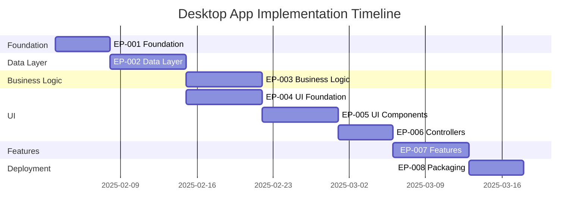
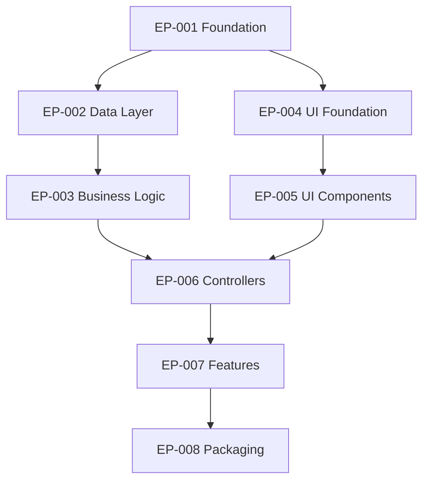

## PHASE 9: Implementation Roadmap (5-10 min)

> **Order for this phase:** OPTIONAL. Executed after Phase 8 or on demand.

### Objective

Translate all desktop application specifications into a prioritized, actionable implementation plan (Roadmap) with clear milestones and atomic tasks.

---

## Context Variables (Extract from docs)

```
From ai-instructions.md:
├── LANG: Java
├── EXT: .java
├── SRC: src/main/java or src/
├── TESTS: src/test/java or test/
├── RESOURCES: src/main/resources or resources/
└── ARCH: MVC / MVP / MVVM

From docs/ARCHITECTURE.md:
├── MODEL_DIR: model/ or domain/
├── VIEW_DIR: view/ or ui/
├── CONTROLLER_DIR: controller/ or presenter/
├── SERVICE_DIR: service/
├── DAO_DIR: dao/ or repository/
├── UTIL_DIR: util/
└── PKG_BASE: com.company.app
```

---

## Task Format (MANDATORY)

```
- [ ] TXXX [CAT] Description • 1 SP → {{path}} | deps: TXXX
```

**Components:**

- `TXXX` - Sequential ID (T001, T002...)
- `[CAT]` - Category (see below)
- `Description` - Specific action
- `1 SP` - Story Points (1 or 2 only)
- `→ {{path}}` - Target file path
- `deps: TXXX` - Dependencies

---

## Categories [CAT]

| Cat | Name       | Description                     | SP Range |
| --- | ---------- | ------------------------------- | -------- |
| [M] | Model      | Entities, data classes          | 1 SP     |
| [V] | View       | UI components, windows, dialogs | 1-2 SP   |
| [C] | Controller | Event handlers, presenters      | 1-2 SP   |
| [S] | Service    | Business logic, services        | 1-2 SP   |
| [D] | DAO        | Data access, repositories       | 1 SP     |
| [T] | Test       | Unit, integration, UI tests     | 1-2 SP   |
| [U] | UI/UX      | Layouts, styling, resources     | 1 SP     |
| [I] | Infra      | Build, packaging, deployment    | 1-2 SP   |
| [X] | Docs       | Documentation updates           | 1 SP     |

---

## Atomic Task Rules

**Maximum 1-2 SP per task:**

**BAD:**

```
- [ ] T001 [V] Create Main Window with all components • 5 SP
```

**GOOD:**

```
- [ ] T001 [V] Create MainWindow class skeleton • 1 SP → {{SRC}}/{{VIEW_DIR}}/MainWindow{{EXT}} | deps: none
- [ ] T002 [U] Add MainWindow layout (BorderLayout) • 1 SP → {{SRC}}/{{VIEW_DIR}}/MainWindow{{EXT}} | deps: T001
- [ ] T003 [U] Add MainWindow menu bar (File, Edit, Help) • 1 SP → {{SRC}}/{{VIEW_DIR}}/MainWindow{{EXT}} | deps: T002
- [ ] T004 [U] Add MainWindow toolbar (New, Open, Save) • 1 SP → {{SRC}}/{{VIEW_DIR}}/MainWindow{{EXT}} | deps: T002
- [ ] T005 [U] Add MainWindow status bar • 1 SP → {{SRC}}/{{VIEW_DIR}}/MainWindow{{EXT}} | deps: T002
```

---

## Workflow: 6 Steps

### Step 9.1: Extract Context & Inventory

**1. Extract context variables:**

```
CONTEXT EXTRACTED
├── Language: Java 17
├── Extension: .java
├── Source dir: src/main/java/
├── Tests dir: src/test/java/
├── Resources: src/main/resources/
├── Architecture: MVC
├── Model path: model/
├── View path: view/
├── Controller path: controller/
├── Service path: service/
└── DAO path: dao/
```

**2. Extract inventory from documentation:**

**From Phase 1 (project-brief.md):**

```
WINDOWS:
| Window           | Type   | Complexity |
|------------------|--------|------------|
| MainWindow       | Frame  | Complex    |
| SettingsDialog   | Dialog | Medium     |
| AboutDialog      | Dialog | Simple     |
```

**From Phase 2 (docs/ARCHITECTURE.md):**

```
MODELS:
| Model    | Fields | Relations | Complexity |
|----------|--------|-----------|------------|
| User     | 5      | None      | Simple     |
| Project  | 8      | 1:N       | Medium     |
| Task     | 6      | N:1       | Medium     |
```

**From Phase 4:**

```
DATA ACCESS:
| Entity  | CRUD | Search | Complexity |
|---------|------|--------|------------|
| User    | Yes  | Email  | Simple     |
| Project | Yes  | Name   | Medium     |
| Task    | Yes  | Status | Medium     |
```

**Show summary:**

```
INVENTORY COMPLETE
├── UI Framework: Swing / JavaFX / SWT
├── Windows: 3 (simple: 1, medium: 1, complex: 1)
├── Models: 3 (simple: 1, medium: 2)
├── Data Access: 3 entities with CRUD
├── Build: Maven / Gradle / Ant
└── Estimated tasks: 150-200
```

---

### Step 9.2: Epic Definition

**Standard Epic Structure for Desktop:**

```
EP-001: Foundation (ALWAYS FIRST)
├── Build setup (Maven/Gradle/Ant)
├── Main class, application launcher
├── Logging, error handling
├── Database connection (if applicable)
└── Priority: P0 | Duration: Week 1

EP-002: Data Layer
├── Entity classes (models)
├── DAO/Repository interfaces
├── Database schema (if applicable)
├── Unit tests for data layer
└── Priority: P0 | Duration: Week 1-2

EP-003: Business Logic
├── Service classes
├── Business rules, validation
├── Unit tests for services
└── Priority: P0 | Duration: Week 2-3

EP-004: UI Foundation
├── Main window skeleton
├── Layout management
├── Menu bar, toolbar, status bar
├── Application theme/LAF
└── Priority: P0 | Duration: Week 2-3

EP-005: UI Components
├── Forms, dialogs
├── Tables, lists, trees
├── Custom components
├── UI event handling
└── Priority: P1 | Duration: Week 3-4

EP-006: Controllers/Presenters
├── UI controllers
├── Event handlers
├── Data binding (MVVM)
├── UI tests
└── Priority: P1 | Duration: Week 4

EP-007: Features
├── Specific features (search, export, etc.)
├── Integration with services
├── Feature tests
└── Priority: P1 | Duration: Week 5

EP-008: Packaging & Deployment
├── Executable JAR
├── Native packaging (jpackage)
├── Installers
├── Code signing
└── Priority: P2 | Duration: Week 6
```

---

### Step 9.3: Task Generation

**Example for EP-001 (Foundation):**

```markdown
## Epic 1: Foundation • 15 SP

**Goal:** Set up build system, main class, and basic infrastructure.

**Estimated Duration:** 3-5 days

### Tasks

#### Build Setup (3 SP)

- [ ] T001 [I] Create pom.xml with Java 17 config • 1 SP → pom.xml | deps: none
- [ ] T002 [I] Add UI framework dependency (Swing/JavaFX/SWT) • 1 SP → pom.xml | deps: T001
- [ ] T003 [I] Add database dependency (H2/Derby) if needed • 1 SP → pom.xml | deps: T001

#### Application Launcher (4 SP)

- [ ] T004 [C] Create Main class with main() method • 1 SP → {{SRC}}/{{PKG_BASE}}/Main{{EXT}} | deps: T002
- [ ] T005 [C] Initialize UI thread (SwingUtilities/Platform.runLater) • 1 SP → {{SRC}}/{{PKG_BASE}}/Main{{EXT}} | deps: T004
- [ ] T006 [C] Set Look and Feel (FlatLaf/Modena) • 1 SP → {{SRC}}/{{PKG_BASE}}/Main{{EXT}} | deps: T004
- [ ] T007 [T] Add Main class unit test • 1 SP → {{TESTS}}/{{PKG_BASE}}/MainTest{{EXT}} | deps: T004

#### Infrastructure (4 SP)

- [ ] T008 [S] Create Logger utility class • 1 SP → {{SRC}}/{{PKG_BASE}}/{{UTIL_DIR}}/Logger{{EXT}} | deps: none
- [ ] T009 [S] Create ConfigManager for properties • 1 SP → {{SRC}}/{{PKG_BASE}}/{{UTIL_DIR}}/ConfigManager{{EXT}} | deps: none
- [ ] T010 [S] Create global exception handler • 1 SP → {{SRC}}/{{PKG_BASE}}/{{UTIL_DIR}}/ExceptionHandler{{EXT}} | deps: T008
- [ ] T011 [T] Add utility tests • 1 SP → {{TESTS}}/{{PKG_BASE}}/util/ | deps: T008,T009,T010

#### Database Setup (4 SP, if applicable)

- [ ] T012 [D] Create DatabaseManager class • 1 SP → {{SRC}}/{{PKG_BASE}}/{{DAO_DIR}}/DatabaseManager{{EXT}} | deps: T003
- [ ] T013 [D] Implement connection pooling • 1 SP → {{SRC}}/{{PKG_BASE}}/{{DAO_DIR}}/DatabaseManager{{EXT}} | deps: T012
- [ ] T014 [D] Create schema.sql (DDL) • 1 SP → {{RESOURCES}}/schema.sql | deps: none
- [ ] T015 [T] Add DatabaseManager tests • 1 SP → {{TESTS}}/{{PKG_BASE}}/dao/DatabaseManagerTest{{EXT}} | deps: T012
```

---

### Step 9.4: Generate planning/roadmap.md

**File structure:**

````markdown
# Implementation Roadmap

**Project:** [Project Name]
**Type:** Desktop Application (Java)
**UI Framework:** [Swing / JavaFX / SWT]
**Generated:** 2025-02-03

---

## Overview

**Total Epics:** 8
**Total Tasks:** ~180
**Estimated Duration:** 6 weeks
**Team Size:** 1-2 developers

---

## Priority Legend

- **P0:** Critical - Must have (MVP blocker)
- **P1:** High - Should have (MVP preferred)
- **P2:** Medium - Nice to have (Post-MVP)
- **P3:** Low - Future enhancement

---

## Roadmap Timeline


````

---

## Epic 1: Foundation • 15 SP

[Tasks from Step 9.3]

## Epic 2: Data Layer • 25 SP

[Generated tasks for models, DAOs, database]

## Epic 3: Business Logic • 20 SP

[Generated tasks for services]

## Epic 4: UI Foundation • 20 SP

[Generated tasks for main window, layouts]

## Epic 5: UI Components • 30 SP

[Generated tasks for forms, dialogs]

## Epic 6: Controllers/Presenters • 25 SP

[Generated tasks for event handlers]

## Epic 7: Features • 35 SP

[Generated tasks for specific features]

## Epic 8: Packaging & Deployment • 10 SP

[Generated tasks for packaging, installers]

---

## Story Points Summary

| Epic      | Tasks   | SP      | Priority | Duration    |
| --------- | ------- | ------- | -------- | ----------- |
| EP-001    | 15      | 15      | P0       | Week 1      |
| EP-002    | 25      | 25      | P0       | Week 1-2    |
| EP-003    | 20      | 20      | P0       | Week 2-3    |
| EP-004    | 20      | 20      | P0       | Week 2-3    |
| EP-005    | 30      | 30      | P1       | Week 3-4    |
| EP-006    | 25      | 25      | P1       | Week 4      |
| EP-007    | 35      | 35      | P1       | Week 5      |
| EP-008    | 10      | 10      | P2       | Week 6      |
| **TOTAL** | **180** | **180** |          | **6 weeks** |

---

## Task Dependencies Graph



---

## Next Steps

1. **Start with EP-001 (Foundation)**
2. Run `/flow-work EP-001` to begin implementation
3. Complete tasks sequentially: T001 → T002 → ...
4. Run tests after each task
5. Commit frequently with descriptive messages

---

**Last Updated:** 2025-02-03

```

---

### Phase 9 Output

```

✅ Implementation Roadmap generated!

Created: planning/roadmap.md

Summary:

- 8 Epics defined
- ~180 atomic tasks generated
- 6 weeks estimated duration
- Dependencies mapped
- Gantt timeline included

Next steps:

1. Review planning/roadmap.md
2. Optionally run Phase 10 for User Stories
3. Start implementation with /flow-work EP-001

Type "continue" for Phase 10, or "done" to finish.

```

---

**Next Phase:** Phase 10 - User Stories Generation (optional)

Read: `.ai-flow/prompts/desktop/flow-build-phase-10.md`

---

**Last Updated:** 2025-02-03
**Version:** 1.0.0
```
