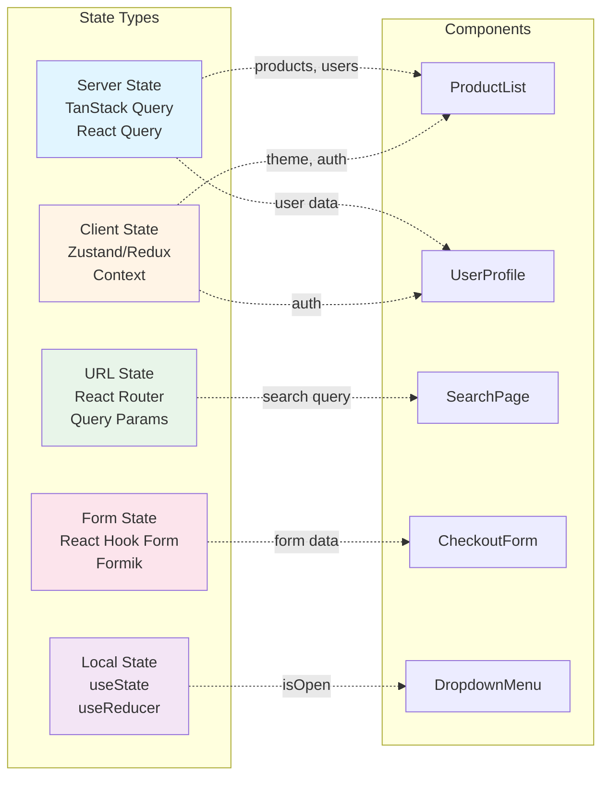
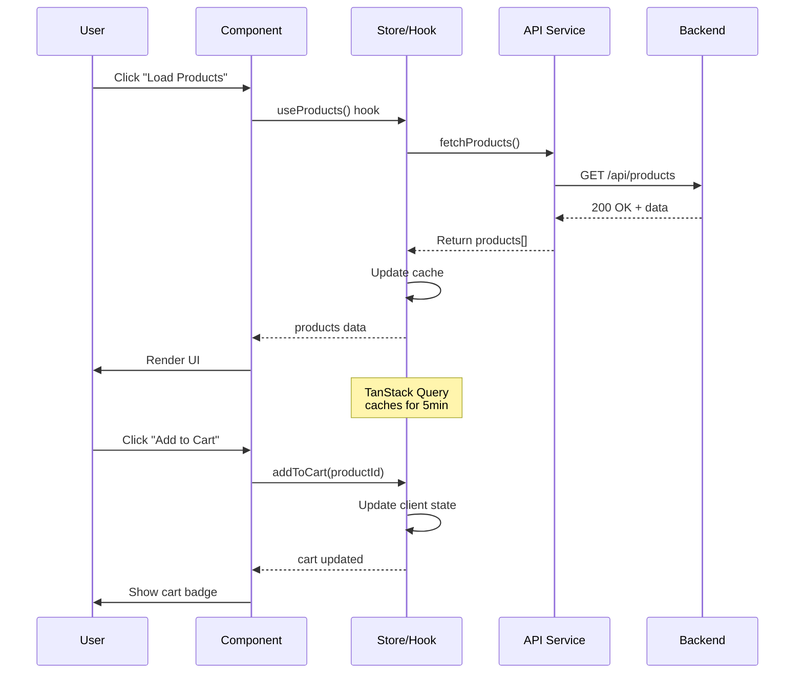
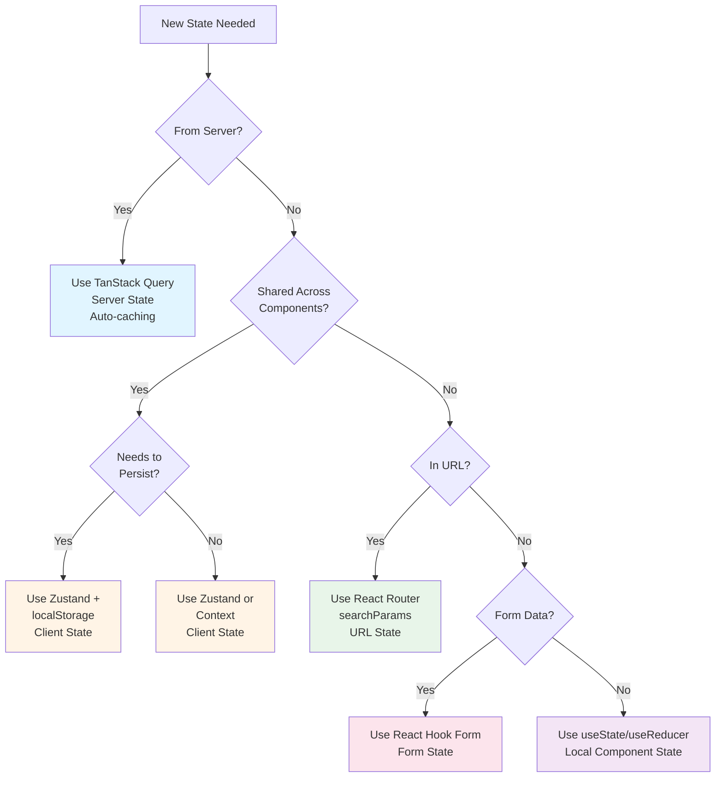

# Phase 3: State Management

**Duration:** 15-20 minutes
**Questions:** ~10 questions
**Output:** docs/state-management.md, parts of ai-instructions.md

---

## 🎯 Objective

Define how your application will manage state across four categories:

1. **Server State** - Remote data from APIs
2. **Client State** - Local UI state
3. **URL State** - Query params and routes
4. **Form State** - Form data and validation

---

## 📋 Questions

### Question 3.1: Server State Management

**How will you fetch and cache data from APIs?**

#### React Options

A) ⭐ **TanStack Query (React Query)** (Recommended)
   - Features: Auto caching, background refetching, optimistic updates
   - Best for: REST APIs, GraphQL (via custom fetcher)
   - Bundle: ~12KB (gzipped)

B) 🔥 **SWR (Vercel)**
   - Features: Stale-while-revalidate, automatic deduplication
   - Best for: REST APIs, simple data fetching
   - Bundle: ~5KB (gzipped)

C) **Apollo Client**
   - Features: GraphQL-specific, normalized cache, subscriptions
   - Best for: GraphQL APIs only
   - Bundle: ~33KB (gzipped)

D) **urql**
   - Features: Lightweight GraphQL client, extensible
   - Best for: GraphQL, smaller bundle than Apollo
   - Bundle: ~16KB (gzipped)

E) **Redux Toolkit + RTK Query**
   - Features: Integrated with Redux, powerful caching
   - Best for: Complex apps already using Redux
   - Bundle: ~15KB (gzipped, with Redux)

F) **Plain fetch + Custom Hooks**
   - Features: Full control, no dependencies
   - Best for: Very simple apps
   - Bundle: 0KB (native)

#### Vue Options

A) ⭐ **TanStack Query (Vue Query)** (Recommended)
   - Same as React version, Vue adapter

B) **Pinia + Custom Composables**
   - Features: Reactive state management
   - Best for: Vue 3 apps with complex state

C) **Villus (GraphQL)**
   - Features: Lightweight GraphQL client for Vue
   - Best for: Vue + GraphQL

#### Angular Options

A) ⭐ **TanStack Query (Angular Query)**
   - Same as React version, Angular adapter

B) **NgRx + Custom Effects**
   - Features: Redux pattern for Angular
   - Best for: Enterprise Angular apps

C) **Apollo Angular**
   - Features: GraphQL client for Angular
   - Best for: Angular + GraphQL

**Your answer:**

---

### Question 3.2: Client State Management

**How will you manage local UI state?** (modals, themes, UI flags)

#### React Options

A) ⭐ **Zustand** (Recommended for most)
   - Features: Minimal boilerplate, hooks-based, simple API
   - Best for: Small to medium apps, simple global state
   - Bundle: ~1KB (gzipped)

B) 🔥 **Redux Toolkit**
   - Features: Redux with less boilerplate, DevTools, middleware
   - Best for: Large apps, complex state logic, time-travel debugging
   - Bundle: ~14KB (gzipped)

C) **Jotai**
   - Features: Atomic state management, bottom-up approach
   - Best for: Fine-grained reactivity, derived state
   - Bundle: ~3KB (gzipped)

D) **Recoil**
   - Features: Facebook's state library, atom-based
   - Best for: Complex dependency graphs
   - Bundle: ~21KB (gzipped)

E) **Context API + useReducer**
   - Features: Built-in React, no dependencies
   - Best for: Simple apps, small global state
   - Bundle: 0KB (native)

F) **XState**
   - Features: State machines, predictable state transitions
   - Best for: Complex workflows, multi-step forms
   - Bundle: ~18KB (gzipped)

#### Vue Options

A) ⭐ **Pinia** (Recommended)
   - Features: Official Vue state library, TypeScript support
   - Best for: Vue 3 apps
   - Bundle: ~1.5KB (gzipped)

B) **Vuex**
   - Features: Traditional Vue state management
   - Best for: Vue 2 apps, migration from Vue 2
   - Bundle: ~2KB (gzipped)

C) **Composition API (Built-in)**
   - Features: `reactive()`, `ref()`, composables
   - Best for: Simple apps
   - Bundle: 0KB (native)

#### Angular Options

A) ⭐ **NgRx** (Recommended for large apps)
   - Features: Redux pattern, RxJS integration
   - Best for: Enterprise Angular apps
   - Bundle: ~18KB (gzipped)

B) **Akita**
   - Features: Simplified state management, RxJS-based
   - Best for: Medium Angular apps
   - Bundle: ~12KB (gzipped)

C) **Elf**
   - Features: Reactive state management, modular
   - Best for: Flexible architecture
   - Bundle: ~8KB (gzipped)

D) **Services + RxJS (Built-in)**
   - Features: Angular services with BehaviorSubject
   - Best for: Simple apps
   - Bundle: 0KB (native)

#### Svelte Options

A) ⭐ **Svelte Stores** (Recommended)
   - Features: Built-in, writable/readable/derived stores
   - Best for: All Svelte apps
   - Bundle: 0KB (built-in)

B) **XState + Svelte**
   - Features: State machines for complex flows
   - Best for: Complex workflows

#### Solid Options

A) ⭐ **Solid Store** (Recommended)
   - Features: Built-in, reactive store
   - Best for: All Solid apps
   - Bundle: 0KB (built-in)

**Your answer:**

---

### Question 3.3: State Persistence

**Do you need to persist state to localStorage/sessionStorage?**

A) ⭐ **No Persistence**
   - State reset on page reload
   - Best for: Most apps

B) **Selective Persistence**
   - Persist specific state (e.g., theme, user preferences)
   - Example: Zustand persist middleware, Pinia persist plugin
   - Best for: User preferences, shopping cart

C) **Full Persistence**
   - Persist entire state tree
   - Best for: Offline-first apps, complex forms

**Your answer:**

**If persistence selected, what should be persisted?**

---

### Question 3.4: Form State Management

**How will you handle forms?**

#### React Options

A) ⭐ **React Hook Form** (Recommended)
   - Features: Uncontrolled forms, minimal re-renders, validation
   - Best for: Performance-critical forms, complex validation
   - Bundle: ~9KB (gzipped)

B) **Formik**
   - Features: Controlled forms, popular, mature
   - Best for: Traditional React forms
   - Bundle: ~15KB (gzipped)

C) **TanStack Form**
   - Features: Framework-agnostic, type-safe
   - Best for: Advanced form logic
   - Bundle: ~12KB (gzipped)

D) **Controlled Components (Built-in)**
   - Features: Manual useState management
   - Best for: Simple forms (1-3 fields)
   - Bundle: 0KB (native)

#### Vue Options

A) ⭐ **VeeValidate** (Recommended)
   - Features: Composition API, Yup/Zod integration
   - Best for: Vue 3 forms with validation
   - Bundle: ~7KB (gzipped)

B) **FormKit**
   - Features: All-in-one forms + UI components
   - Best for: Rapid form development
   - Bundle: ~25KB (gzipped)

C) **v-model (Built-in)**
   - Features: Two-way binding
   - Best for: Simple forms
   - Bundle: 0KB (native)

#### Angular Options

A) ⭐ **Reactive Forms** (Recommended)
   - Features: Built-in, powerful validation
   - Best for: Complex Angular forms
   - Bundle: 0KB (built-in)

B) **Template-Driven Forms**
   - Features: Built-in, simpler API
   - Best for: Simple Angular forms
   - Bundle: 0KB (built-in)

#### Svelte/Solid Options

A) **Two-way binding (Built-in)**
   - Features: Simple bind:value syntax
   - Best for: Most forms
   - Bundle: 0KB (built-in)

B) **Felte (Svelte) / Modular Forms (Solid)**
   - Features: Advanced form libraries
   - Best for: Complex validation

**Your answer:**

---

### Question 3.5: Form Validation

**What validation strategy will you use?**

A) ⭐ **Schema Validation (Zod/Yup)**
   - Features: Type-safe, reusable schemas
   - Best for: Complex validation, type safety
   - Example: Zod for TypeScript projects

B) **Built-in HTML5 Validation**
   - Features: Native browser validation
   - Best for: Simple forms
   - Example: `required`, `pattern`, `min`, `max`

C) **Custom Validation Functions**
   - Features: Full control, no dependencies
   - Best for: Unique validation rules

D) **Backend Validation Only**
   - Features: Server-side validation
   - Best for: Security-critical forms
   - Note: Still need client-side for UX

E) **Combined (Client + Server)**
   - Features: Client for UX, server for security
   - Best for: Most production apps

**Your answer:**

---

### Question 3.6: Optimistic Updates

**Will you use optimistic UI updates?**

Optimistic updates = Update UI before server confirms success

A) ⭐ **Yes, for common actions**
   - Example: Like button, delete item, mark complete
   - Best for: Interactive apps, real-time feel
   - Requires: Rollback logic on error

B) **No, wait for server confirmation**
   - Best for: Critical actions (payments, deletions)
   - Safer but slower UX

C) **Selective (case-by-case)**
   - Optimistic for safe actions, wait for critical ones

**Your answer:**

---

### Question 3.7: Real-Time Updates

**Do you need real-time data updates?**

A) ⭐ **No Real-Time**
   - Data fetched on demand or on interval
   - Best for: Most apps

B) **Polling (Short Intervals)**
   - Refetch data every X seconds
   - Best for: Near real-time, simple implementation
   - Example: Every 10-30 seconds

C) **WebSockets**
   - Bi-directional, persistent connection
   - Best for: Chat, live dashboards, collaboration
   - Technologies: Socket.io, native WebSockets

D) **Server-Sent Events (SSE)**
   - Unidirectional, server pushes updates
   - Best for: Live notifications, feeds
   - Technologies: EventSource API

E) **GraphQL Subscriptions**
   - Real-time GraphQL queries
   - Best for: GraphQL apps with live data

**Your answer:**

---

### Question 3.8: State Normalization

**Will you normalize relational data?**

Normalization = Flatten nested data into lookup tables (like a database)

**Example:**
```javascript
// ❌ Nested (Not normalized)
{
  posts: [
    { id: 1, title: 'Post 1', author: { id: 10, name: 'Alice' } },
    { id: 2, title: 'Post 2', author: { id: 10, name: 'Alice' } }
  ]
}

// ✅ Normalized
{
  posts: { 1: { id: 1, title: 'Post 1', authorId: 10 }, 2: { ... } },
  authors: { 10: { id: 10, name: 'Alice' } }
}
```

A) ⭐ **Yes, normalize relational data**
   - Best for: Complex data models, many-to-many relationships
   - Tools: normalizr, Redux Toolkit (createEntityAdapter)

B) **No, keep data nested**
   - Best for: Simple data structures, tree-like data
   - Easier to reason about

**Your answer:**

---

### Question 3.9: Global vs Local State

**What's your default strategy for state placement?**

A) ⭐ **Local by default, global when shared** (Recommended)
   - Start with component state (useState/reactive)
   - Lift to global only when multiple components need it
   - Best for: Most apps, avoid over-engineering

B) **Global by default**
   - Most state in global store
   - Best for: Complex apps with heavy state sharing

C) **URL-driven state**
   - Prefer URL params over global state
   - Best for: Multi-page apps, shareable state

**Your answer:**

---

### Question 3.10: Error Handling Strategy

**How will you handle API errors and failed requests?**

A) ⭐ **Toast Notifications**
   - Show temporary error message
   - Best for: Non-critical errors
   - Libraries: react-hot-toast, vue-toastification

B) **Inline Error Messages**
   - Display errors next to forms/components
   - Best for: Form validation, input errors

C) **Error Boundary (Global)**
   - Catch all errors, show fallback UI
   - Best for: Unhandled errors, app crashes
   - React: Error Boundaries, Vue: errorHandler

D) **Modal Dialogs**
   - Show error in modal
   - Best for: Critical errors requiring user action

E) **Retry Mechanism**
   - Auto-retry failed requests
   - Best for: Network errors, transient failures
   - TanStack Query has built-in retry

F) **Combined Approach**
   - Different strategies for different error types

**Your answer:**

---

#### 🎨 MERMAID STATE MANAGEMENT DIAGRAM FORMATS - CRITICAL

**Use these exact formats** for state management diagrams mentioned in documentation:

---

##### 1️⃣ State Categories & Store Organization

Use `graph LR` to show different state types and their tools:

````markdown

````

**Use for:** Deciding where to store state, showing state architecture, documenting state tools

---

##### 2️⃣ Data Flow Sequence (API to UI)

Use `sequenceDiagram` to show step-by-step data flow:

````markdown

````

**Use for:** Showing request/response cycles, async operations, state updates, caching behavior

---

##### 3️⃣ State Location Decision Tree

Use `graph TD` to help developers choose where to store state:

````markdown

````

**Use for:** Decision-making guide, onboarding new developers, documenting state strategy

---

**Best Practices for State Management Diagrams:**

1. **Use Sequence Diagrams for Time-Based Flows:**
   - Show async operations step-by-step
   - Include caching behavior
   - Document timing (e.g., "caches for 5min")

2. **Use Graph Diagrams for Relationships:**
   - State categories and their connections
   - Decision trees for choosing state location
   - Component-to-store relationships

3. **Color Code by State Type:**
   - Server State: `#e1f5ff` (light blue)
   - Client State: `#fff4e6` (light orange)
   - URL State: `#e8f5e9` (light green)
   - Form State: `#fce4ec` (light pink)
   - Local State: `#f3e5f5` (light purple)

4. **Include Tool Names:** Always specify actual tools (TanStack Query, Zustand, React Hook Form, etc.)

5. **Show Data Flow Direction:** Use solid arrows for data flow, dotted for state updates

**Common Formatting Rules:**
- Code fence: ` ```mermaid ` (lowercase, no spaces, three backticks)
- Use `sequenceDiagram` for API calls and async flows
- Use `graph TD` for decision trees
- Use `graph LR` for category relationships
- Preview at https://mermaid.live/ before saving

---

## 📊 Phase 3 Summary

```
━━━━━━━━━━━━━━━━━━━━━━━━━━━━━━━━━━━━━━━━━━━━━━━━━━━━━━━━━━
📋 PHASE 3 SUMMARY: STATE MANAGEMENT
━━━━━━━━━━━━━━━━━━━━━━━━━━━━━━━━━━━━━━━━━━━━━━━━━━━━━━━━━━

Server State: [Answer from 3.1]
Client State: [Answer from 3.2]
State Persistence: [Answer from 3.3]
Form Management: [Answer from 3.4]
Form Validation: [Answer from 3.5]
Optimistic Updates: [Answer from 3.6]
Real-Time Updates: [Answer from 3.7]
State Normalization: [Answer from 3.8]
State Placement: [Answer from 3.9]
Error Handling: [Answer from 3.10]
API Error Handling: [Answer from 3.11]
Retry Strategy: [Answer from 3.12]

Is this correct? (Y/n)
```

---

## 📝 Document Generation

Generate `docs/state-management.md` using the template:

Replace these placeholders:

- `{{STATE_MANAGEMENT}}` → Client state solution (e.g., "Zustand")
- `{{DATA_FETCHING}}` → Server state solution (e.g., "TanStack Query")
- `{{FORM_LIBRARY}}` → Form library (e.g., "React Hook Form")
- `{{FORM_VALIDATION}}` → Validation strategy (e.g., "Zod")
- `{{STATE_PERSISTENCE}}` → Persistence approach
- `{{OPTIMISTIC_UPDATES}}` → Yes/No
- `{{REAL_TIME_STRATEGY}}` → Real-time approach
- `{{STATE_NORMALIZATION}}` → Yes/No
- `{{ERROR_HANDLING_STRATEGY}}` → Error handling approach

Also update `ai-instructions.md`:

```markdown
## State Management

- **Server State:** {{DATA_FETCHING}}
- **Client State:** {{STATE_MANAGEMENT}}
- **Forms:** {{FORM_LIBRARY}} with {{FORM_VALIDATION}}
- **Real-Time:** {{REAL_TIME_STRATEGY}}

### Rules

- ✅ ALWAYS use {{DATA_FETCHING}} for server data
- ✅ ALWAYS validate forms with {{FORM_VALIDATION}}
- ❌ NEVER store derived data in state
- ❌ NEVER mutate state directly (use immutable updates)
{{#IF_OPTIMISTIC_UPDATES}}
- ✅ ALWAYS implement rollback for optimistic updates
{{/IF_OPTIMISTIC_UPDATES}}
```

---

## 🚀 Next Steps

```
✅ Phase 3 Complete!

Documents Generated:
  - docs/state-management.md
  - ai-instructions.md (updated)

Next: Phase 4 - Styling & Design

Read: .ai-flow/prompts/frontend/bootstrap-phase4-styling.md
```

---

**Last Updated:** 2025-01-XX

**Version:** 1.2.0
