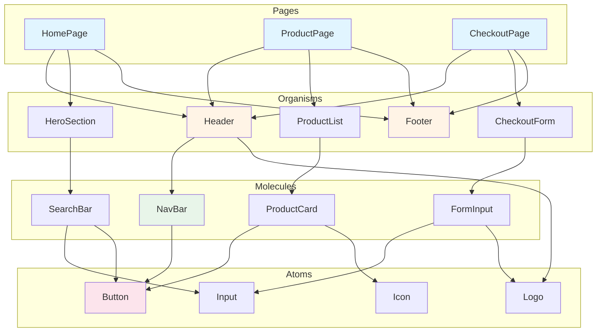
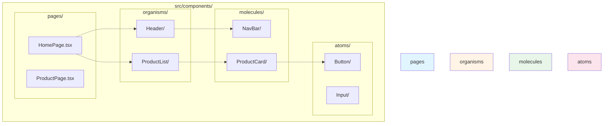

# Phase 2: Component Architecture

> **Duration:** 15-20 minutes
> **Purpose:** Define UI framework, component patterns, and frontend architecture

---

## 📋 Context

You are in **Phase 2 of 7** of the frontend build process.

**What we're defining:**
- UI Framework selection (React/Vue/Angular/Svelte/Solid)
- Component architecture pattern
- Component library and tooling
- File organization strategy

**Documents to generate:**
- `docs/components.md` - Component architecture guide
- `docs/architecture.md` - Frontend system architecture
- Updates to `ai-instructions.md` - Tech stack section

---

## 🎯 Instructions

Ask questions **one at a time**, wait for user response before next question.

**Progress indicator:** Show "Question X/12" for each question.

**Recommendations:** Mark with ⭐ (recommended), 🔥 (popular), ⚡ (modern), 🏆 (enterprise)

---

## Question 2.1: UI Framework

**Question:** Which UI framework will you use?

**Context:** This is the foundation of your frontend. Choose based on team expertise, ecosystem, and project requirements.

**Options:**

A) ⭐ **React 18+** (Recommended - Largest ecosystem)
   - Functional components + hooks
   - Virtual DOM, component-based architecture
   - Massive ecosystem (Next.js, Remix for SSR)
   - Best for: Teams with React experience, large apps
   - Meta-frameworks: Next.js 14+, Remix 2+, Vite

B) 🔥 **Vue 3** (Popular - Progressive framework)
   - Composition API + reactivity system
   - Single-file components (.vue)
   - Excellent documentation
   - Best for: Rapid development, gradual adoption
   - Meta-framework: Nuxt 3

C) 🏆 **Angular 17+** (Enterprise - Batteries included)
   - TypeScript-first, opinionated
   - Dependency injection, RxJS
   - Complete framework (router, HTTP, forms included)
   - Best for: Large teams, enterprise apps
   - Meta-framework: Analog (experimental)

D) ⚡ **Svelte 4 / SvelteKit** (Modern - Compiler-based)
   - No virtual DOM, compiles to vanilla JS
   - Less boilerplate, reactive by default
   - Best for: Performance-critical apps
   - Meta-framework: SvelteKit

E) 🚀 **Solid.js** (Modern - Fine-grained reactivity)
   - JSX syntax, no virtual DOM
   - Blazing fast performance
   - Best for: Performance enthusiasts
   - Meta-framework: SolidStart

**Your choice:** (A/B/C/D/E)

**Follow-up if A (React):**
- **Meta-framework:** Next.js 14+ / Remix 2 / Create React App / Vite?
- **Version:** React 18.2+ (latest stable)

**Follow-up if B (Vue):**
- **Meta-framework:** Nuxt 3 / Vite?
- **Version:** Vue 3.4+ (latest stable)

**Follow-up if C (Angular):**
- **Version:** Angular 17+ (latest stable with signals)

**Follow-up if D (Svelte):**
- **Meta-framework:** SvelteKit (recommended) / Vite?
- **Version:** Svelte 4+ (latest stable)

**Follow-up if E (Solid):**
- **Meta-framework:** SolidStart / Vite?
- **Version:** Solid 1.8+ (latest stable)

---

## Question 2.2: TypeScript

**Question:** Will you use TypeScript?

**Context:** TypeScript adds static typing, improving code quality and developer experience.

**Options:**

A) ⭐ **Yes, strict mode** (Recommended)
   - `"strict": true` in tsconfig.json
   - Maximum type safety
   - Best for: Production apps, large codebases

B) **Yes, relaxed mode**
   - Some strict options disabled
   - Gradual typing adoption
   - Best for: Migrating from JavaScript

C) **No, JavaScript only**
   - Pure JavaScript
   - Best for: Small projects, prototypes

**Your choice:** (A/B/C)

**If Yes:** TypeScript 5.3+ (latest stable)

---

## Question 2.3: Build Tool

**Question:** Which build tool will you use?

**Context:** Modern build tools provide fast development and optimized production builds.

**Options:**

A) ⭐ **Vite** (Recommended - Lightning fast)
   - Instant HMR, ESM-based
   - Optimized production builds
   - Best for: Modern apps, all frameworks

B) **Webpack 5**
   - Mature, highly configurable
   - Large ecosystem of loaders/plugins
   - Best for: Complex build requirements

C) **Turbopack** (Next.js only)
   - Rust-based, ultra-fast
   - Integrated with Next.js 13+
   - Best for: Next.js projects

D) **esbuild**
   - Extremely fast Go-based bundler
   - Minimal configuration
   - Best for: Simple builds

E) **Framework default**
   - Use whatever the meta-framework provides
   - (e.g., Next.js has built-in bundler)

**Your choice:** (A/B/C/D/E)

---

## Question 2.4: Component Architecture Pattern

**Question:** How will you organize components?

**Context:** Component organization impacts maintainability and scalability.

**Options:**

A) ⭐ **Atomic Design** (Recommended - Scalable)
   - Atoms → Molecules → Organisms → Templates → Pages
   - Clear hierarchy, highly reusable
   - Best for: Design systems, large apps
   - Example:
     ```
     components/
       atoms/ (Button, Input, Label)
       molecules/ (SearchBar, FormField)
       organisms/ (Header, UserCard, DataTable)
       templates/ (MainLayout, DashboardLayout)
     pages/ (actual routes)
     ```

B) **Feature-based** (Domain-driven)
   - Components organized by feature/domain
   - Co-located code (components + hooks + tests)
   - Best for: Feature-rich apps, microfront ends
   - Example:
     ```
     features/
       auth/ (LoginForm, RegisterForm, hooks, services)
       dashboard/ (DashboardView, widgets, hooks)
       profile/ (ProfileForm, settings, hooks)
     ```

C) **Flat structure** (Simple)
   - All components in one folder
   - Minimal hierarchy
   - Best for: Small apps, prototypes
   - Example:
     ```
     components/ (all components here)
     ```

D) **Hybrid** (Mix of Atomic + Feature-based)
   - Shared components in atomic structure
   - Feature-specific in feature folders
   - Best for: Large, complex apps
   - Example:
     ```
     components/shared/ (atomic design)
     features/ (feature-specific components)
     ```

**Your choice:** (A/B/C/D)

---

#### 🎨 MERMAID COMPONENT DIAGRAM FORMATS - CRITICAL

**Use these exact formats** for frontend component diagrams mentioned in documentation:

---

##### 1️⃣ Component Hierarchy (Atomic Design)

Use `graph TD` to show component organization from pages down to atoms:

````markdown

````

**Use for:** Showing component organization, Atomic Design hierarchy, composition patterns

---

##### 2️⃣ Component Tree with Props/Events

Use `graph LR` to show parent-child relationships and data flow:

````markdown
```mermaid
graph LR
    subgraph "Parent Component"
        P[UserDashboard]
    end

    subgraph "Child Components"
        H[UserHeader]
        PR[UserProfile]
        AF[ActivityFeed]
        S[Sidebar]
    end

    subgraph "Grandchild Components"
        A[Avatar]
        E[EditButton]
        AI[ActivityItem]
    end

    P -->|user: User| H
    P -->|user: User| PR
    P -->|activities: Activity[]| AF
    P -->|menuItems: MenuItem[]| S

    H --> A
    H --> E
    AF --> AI

    E -.->|onEdit(userId)| P
    AI -.->|onLike(activityId)| AF
    AF -.->|onUpdate()| P

    style P fill:#e1f5ff
    style H fill:#fff4e6
    style PR fill:#fff4e6
    style AF fill:#fff4e6
    style S fill:#fff4e6
```
````

**Notation:**
- Solid arrow `-->|prop: Type|` = Props passed down
- Dotted arrow `-.->|event(args)|` = Events bubbled up
- Group related components in subgraphs

**Use for:** Documenting data flow, props drilling, event handling patterns

---

##### 3️⃣ Component File Organization

Use `graph TB` to show file/folder structure:

````markdown

````

**Use for:** Showing folder structure, import relationships, file organization patterns

---

##### 4️⃣ Application Routing Structure

Use `graph TD` to show route hierarchy:

````markdown
```mermaid
graph TD
    ROOT[/ Root Layout] --> PUBLIC[Public Routes]
    ROOT --> AUTH[Protected Routes]

    PUBLIC --> HOME[/]
    PUBLIC --> LOGIN[/auth/login]
    PUBLIC --> REGISTER[/auth/register]
    PUBLIC --> RESET[/auth/reset-password]

    AUTH --> DASH[/dashboard]
    AUTH --> PROF[/profile]
    AUTH --> SETTINGS[/settings]

    DASH --> OVERVIEW[/dashboard/overview]
    DASH --> ANALYTICS[/dashboard/analytics]
    DASH --> REPORTS[/dashboard/reports]

    PROF --> VIEW[/profile/:userId]
    PROF --> EDIT[/profile/:userId/edit]

    SETTINGS --> ACCOUNT[/settings/account]
    SETTINGS --> PREFS[/settings/preferences]

    style ROOT fill:#e1f5ff
    style PUBLIC fill:#e8f5e9
    style AUTH fill:#fff4e6
```
````

**Use for:** Documenting route structure, showing protected routes, nested routing patterns

---

**Best Practices for Component Diagrams:**

1. **Color Code by Abstraction Level:**
   - Pages/Routes: `#e1f5ff` (light blue)
   - Organisms: `#fff4e6` (light orange)
   - Molecules: `#e8f5e9` (light green)
   - Atoms: `#fce4ec` (light pink)

2. **Use Subgraphs:** Group related components by type or feature
3. **Show Relationships:** Use solid arrows for composition, dotted for communication
4. **Label Props:** Include TypeScript types when helpful (`user: User`, `items: Product[]`)
5. **Keep It Readable:** Avoid overcrowding, use clear naming

**Common Formatting Rules:**
- Code fence: ` ```mermaid ` (lowercase, no spaces, three backticks)
- Start Mermaid syntax at column 0 (no indentation before code block)
- Use consistent colors across diagrams
- Preview at https://mermaid.live/ before saving

---

## Question 2.5: Component Library

**Question:** Will you use a component library?

**Context:** Component libraries provide pre-built, accessible components.

**Options:**

**For React:**
A) ⭐ **Material UI (MUI)** - Comprehensive, Material Design
B) 🔥 **Chakra UI** - Accessible, themeable, modern
C) **shadcn/ui** - Copy-paste components, full control
D) **Ant Design** - Enterprise-focused, complete
E) **Headless UI** - Unstyled, accessible primitives
F) **None** - Build custom components

**For Vue:**
A) ⭐ **Vuetify** - Material Design, comprehensive
B) **Quasar** - Full framework, multiple platforms
C) **Element Plus** - Enterprise-focused
D) **PrimeVue** - Rich component set
E) **Headless UI Vue** - Unstyled primitives
F) **None** - Build custom components

**For Angular:**
A) ⭐ **Angular Material** - Official, Material Design
B) **PrimeNG** - Rich component set
C) **NG-ZORRO** - Ant Design for Angular
D) **None** - Build custom components

**For Svelte:**
A) **Skeleton** - Full-featured UI toolkit
B) **Carbon Components Svelte** - IBM Design
C) **Svelte Material UI** - Material Design
D) **None** - Build custom components

**For Solid:**
A) **Hope UI** - Chakra-inspired for Solid
B) **Solid UI** - Minimalist component library
C) **None** - Build custom components

**Your choice:** (specify library or None)

---

## Question 2.6: State Management

**Question:** How will you manage global state?

**Context:** Choose based on app complexity and team preference.

**Options:**

**For React:**
A) ⭐ **Zustand** (Recommended - Simple, modern)
   - Minimal boilerplate, hooks-based
   - Best for: Most apps
B) **Redux Toolkit** - Predictable, DevTools
   - Best for: Complex state, time-travel debugging
C) **Jotai** - Atomic state management
   - Best for: Fine-grained state control
D) **Context API** - Built-in React
   - Best for: Simple global state (theme, auth)
E) **None** - Local state only (useState, useReducer)

**For Vue:**
A) ⭐ **Pinia** (Recommended - Official)
   - TypeScript-first, simple API
   - Best for: Most Vue 3 apps
B) **Vuex 4** - Classic Vue state management
   - Best for: Existing Vuex apps
C) **Composition API + provide/inject**
   - Built-in Vue, simple
   - Best for: Small to medium apps

**For Angular:**
A) ⭐ **NgRx** (Recommended - Redux for Angular)
   - Reactive, RxJS-based
   - Best for: Enterprise Angular apps
B) **Akita** - Simple, object-oriented
   - Best for: Easier learning curve
C) **Services + RxJS** - Angular built-in
   - Best for: Simple state needs

**For Svelte:**
A) ⭐ **Svelte Stores** (Built-in, recommended)
   - Reactive stores, simple API
   - Best for: Most Svelte apps
B) **None** - Component state only

**For Solid:**
A) ⭐ **Solid Store** (Built-in, recommended)
   - Fine-grained reactivity
   - Best for: Most Solid apps
B) **None** - Signals only

**Your choice:** (specify option)

---

## Question 2.7: Data Fetching

**Question:** How will you fetch and cache server data?

**Context:** Modern data fetching libraries handle caching, revalidation, and loading states.

**Options:**

A) ⭐ **TanStack Query (React Query)** (Recommended)
   - Works with React, Vue, Svelte, Solid
   - Automatic caching, background updates
   - Best for: REST APIs, GraphQL
   - Features: Pagination, infinite scroll, optimistic updates

B) **SWR** (Stale-While-Revalidate)
   - Lightweight, hooks-based (React)
   - Best for: Simple data fetching

C) **Apollo Client** (GraphQL only)
   - Complete GraphQL client
   - Best for: GraphQL APIs

D) **RTK Query** (Redux Toolkit)
   - Integrated with Redux
   - Best for: Redux-based apps

E) **Axios + manual caching**
   - Traditional approach
   - Best for: Simple apps

F) **Native fetch + useState**
   - No dependencies
   - Best for: Minimal apps

**Your choice:** (A/B/C/D/E/F)

---

## Question 2.8: Routing

**Question:** How will you handle routing?

**Context:** Most meta-frameworks include routing. For SPAs, you need a routing library.

**Options:**

**If using meta-framework (Next.js, Nuxt, SvelteKit, etc.):**
- ⭐ **Use built-in file-based routing** (Recommended)
  - pages/ directory = routes
  - No configuration needed

**If building SPA:**

**For React:**
A) ⭐ **React Router 6+** (Recommended)
   - Industry standard
   - Data loading, nested routes
B) **TanStack Router**
   - Type-safe, modern
   - Best for: TypeScript-heavy apps
C) **Wouter**
   - Tiny, minimalist
   - Best for: Small apps

**For Vue:**
A) ⭐ **Vue Router 4** (Official, recommended)
   - Composition API support
   - Nested routes, guards

**For Angular:**
A) ⭐ **Angular Router** (Built-in, only option)

**For Svelte:**
A) ⭐ **SvelteKit routing** (Built-in)
B) **Page.js** (for non-SvelteKit SPAs)

**For Solid:**
A) ⭐ **Solid Router** (Official)
B) **@solidjs/router**

**Your choice:** (specify router or "meta-framework built-in")

---

## Question 2.9: Form Management

**Question:** How will you handle complex forms?

**Context:** Form libraries handle validation, errors, and submission state.

**Options:**

**For React:**
A) ⭐ **React Hook Form** (Recommended)
   - Minimal re-renders, performance-focused
   - Best for: Complex forms
B) **Formik**
   - Popular, full-featured
   - Best for: Traditional form handling
C) **Native HTML forms**
   - No library
   - Best for: Simple forms

**For Vue:**
A) ⭐ **VeeValidate 4**
   - Composition API, flexible
   - Best for: Complex forms
B) **Native v-model**
   - Built-in Vue
   - Best for: Simple forms

**For Angular:**
A) ⭐ **Reactive Forms** (Built-in, recommended)
   - Strongly typed, testable
B) **Template-driven Forms**
   - Simpler, less control

**For Svelte:**
A) **Svelte Native** (bind:value)
   - Built-in two-way binding
   - Best for: Most forms
B) **Felte** - Form library for Svelte

**For Solid:**
A) **Solid Forms**
   - Form library for Solid
B) **Native** - Solid signals

**Your choice:** (specify library or native)

---

## Question 2.10: Styling Approach

**Question:** How will you style components?

**Context:** Choose based on team preference, design system needs, and performance requirements.

**Options:**

A) ⭐ **Tailwind CSS** (Recommended - Utility-first)
   - Rapid development, consistent design
   - JIT compiler, small bundle
   - Best for: Most modern apps

B) **CSS Modules** (Scoped CSS)
   - Standard CSS, locally scoped
   - Best for: Traditional CSS developers

C) **Styled Components / Emotion** (CSS-in-JS)
   - Dynamic styles, themed
   - Best for: Component libraries

D) **Sass/SCSS** (CSS preprocessor)
   - Variables, mixins, nesting
   - Best for: Traditional workflow

E) **Vanilla CSS** (Plain CSS files)
   - No dependencies
   - Best for: Simple apps

F) **UnoCSS** (Instant atomic CSS)
   - Faster than Tailwind
   - Best for: Performance enthusiasts

**Your choice:** (A/B/C/D/E/F)

**If Tailwind:** Will you use any Tailwind plugins? (typography, forms, etc.)

---

## Question 2.11: Design Tokens / Theming

**Question:** Will you use design tokens for theming?

**Context:** Design tokens centralize colors, spacing, typography for consistency.

**Options:**

A) ⭐ **Yes, CSS Variables** (Recommended)
   - Dynamic theming, runtime changes
   - Example:
     ```css
     :root {
       --color-primary: #3B82F6;
       --spacing-md: 1rem;
     }
     ```

B) **Yes, JavaScript/TypeScript tokens**
   - Exported constants
   - Type-safe

C) **Yes, Component library tokens**
   - Use library's theming system (MUI, Chakra, etc.)

D) **No, hardcoded values**
   - Direct colors/sizes in styles
   - Best for: Small apps

**Your choice:** (A/B/C/D)

**If Yes to tokens:**
- Will you support dark mode? (Yes/No)
- Will you support multiple themes? (Yes/No/Maybe later)

---

## Question 2.12: Testing Strategy

**Question:** What will you test in components?

**Context:** Testing ensures components work correctly and don't break.

**Options:**

A) ⭐ **Unit + Component + E2E** (Recommended - Comprehensive)
   - Unit: Vitest / Jest
   - Component: Testing Library (React/Vue/Svelte Testing Library)
   - E2E: Playwright / Cypress
   - Best for: Production apps

B) **Component + E2E** (Pragmatic)
   - Skip pure unit tests
   - Focus on user behavior
   - Best for: Most apps

C) **E2E only** (High-level)
   - Test critical user paths
   - Best for: Small apps, MVPs

D) **Minimal** (Unit only)
   - Test utilities and hooks only
   - Best for: Prototypes

**Your choice:** (A/B/C/D)

**Component testing framework:**
- **React:** React Testing Library (recommended)
- **Vue:** Vue Test Utils
- **Angular:** Jasmine/Karma (built-in)
- **Svelte:** Svelte Testing Library
- **Solid:** Solid Testing Library

**E2E testing framework:**
- ⭐ **Playwright** (Recommended - Modern, fast)
- **Cypress** (Popular, DX-focused)
- **None** - Skip E2E for now

---

## Question 2.13: API Integration Pattern

**Question:** How will you integrate with backend APIs?

**Context:** Define how your frontend communicates with backend services.

**Options:**

A) ⭐ **REST API with Fetch/Axios**
   - Standard REST endpoints
   - Client: Axios, Fetch API, or custom wrapper
   - Best for: Most apps, simple integration
   - Example: `GET /api/users`, `POST /api/users`

B) **GraphQL with Apollo/urql**
   - Single endpoint, flexible queries
   - Client: Apollo Client, urql, or TanStack Query GraphQL
   - Best for: Complex data requirements, mobile apps
   - Example: `query { users { id name } }`

C) **tRPC (TypeScript RPC)**
   - End-to-end type safety
   - Best for: TypeScript monorepos, type-safe APIs
   - Example: `trpc.users.getById.useQuery({ id: '1' })`

D) **gRPC-Web**
   - Protocol buffers, efficient binary format
   - Best for: High-performance, microservices
   - Example: `client.getUser({ id: '1' })`

**Your choice:** (A/B/C/D)

**If REST selected:**
- **API Client:** Axios / Fetch API / Custom wrapper
- **Base URL:** __
- **Request interceptors:** [Auth headers, error handling, logging]
- **Response interceptors:** [Error transformation, token refresh]

**If GraphQL selected:**
- **Client:** Apollo Client / urql / TanStack Query GraphQL
- **Endpoint:** __
- **Subscriptions:** [Yes/No - Real-time updates]

**API Layer Pattern:**
A) ⭐ **Service Layer** - Separate API functions
   ```
   services/
     api.ts (base client)
     users.ts (user endpoints)
     products.ts (product endpoints)
   ```

B) **Hooks/Composables Layer** - API calls in hooks
   ```
   hooks/
     useUsers.ts (API calls + state)
     useProducts.ts
   ```

C) **Both** - Services + Hooks
   ```
   services/ (API functions)
   hooks/ (React hooks/Vue composables)
   ```

**Your choice:** (A/B/C)

---

## Question 2.14: Error Boundaries / Global Error Handling

**Question:** How will you handle global errors?

**Context:** Catch and handle errors that occur during rendering, lifecycle methods, and constructors.

**Options:**

**For React:**
A) ⭐ **Error Boundaries** (Recommended)
   - Catch component tree errors
   - Show fallback UI
   - Best for: React apps
   - Example: `<ErrorBoundary><App /></ErrorBoundary>`

B) **Global Error Handler + Error Boundary**
   - Window error handler + Error Boundaries
   - Best for: Comprehensive error handling

**For Vue:**
A) ⭐ **errorHandler** (Built-in)
   - Global error handler
   - Best for: Vue apps
   - Example: `app.config.errorHandler = (err, instance, info) => { ... }`

**For Angular:**
A) ⭐ **ErrorHandler** (Built-in)
   - Global error handler service
   - Best for: Angular apps

**Error Recovery Strategy:**
A) ⭐ **Show fallback UI** - Display error message, retry button
B) **Redirect to error page** - Navigate to `/error`
C) **Log and continue** - Log error, show minimal notification
D) **Combined** - Different strategies for different error types

**Error Logging:**
- **Tool:** Sentry / LogRocket / Console only
- **What to log:** [Error message, stack trace, user context, component tree]

**Your answer:**

---

## 📝 Phase 2 Summary

After all questions, show summary:

```
=================================================
PHASE 2 SUMMARY: Component Architecture
=================================================

UI Framework:     {{UI_FRAMEWORK}} {{VERSION}}
Meta-framework:   {{META_FRAMEWORK}}
Build Tool:       {{BUILD_TOOL}}
TypeScript:       {{TYPESCRIPT}}

Component Pattern: {{COMPONENT_PATTERN}}
Component Library: {{COMPONENT_LIBRARY}}
State Management:  {{STATE_MANAGEMENT}}
Data Fetching:     {{DATA_FETCHING}}

Routing:          {{ROUTING}}
Forms:            {{FORM_LIBRARY}}
Styling:          {{STYLING_APPROACH}}
Design Tokens:    {{DESIGN_TOKENS}}
Dark Mode:        {{DARK_MODE_SUPPORT}}

Testing:
  - Component:    {{COMPONENT_TEST_LIBRARY}}
  - E2E:          {{E2E_FRAMEWORK}}

API Integration:  {{API_INTEGRATION_PATTERN}}
API Client:       {{API_CLIENT}}
Error Handling:   {{ERROR_HANDLING_STRATEGY}}

=================================================
```

**Ask for confirmation:**
"Does this look correct? (Yes to continue, No to restart phase 2)"

**If Yes:**
"✅ Phase 2 complete! Moving to Phase 3: State Management & Data Flow..."

**If No:**
"Restarting Phase 2..."

---

## 🎯 Next Steps

After Phase 2 completion, you will:
1. Update `ai-instructions.md` with tech stack
2. Generate `docs/components.md` with component patterns
3. Generate `docs/architecture.md` with system architecture
4. Continue to Phase 3: State Management & Data Flow

---

**Phase:** 2 of 7
**Estimated time:** 15-20 minutes
**Documents updated:** ai-instructions.md, docs/components.md, docs/architecture.md


