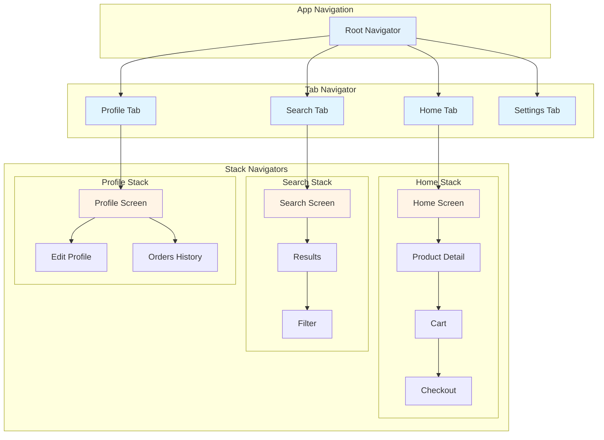
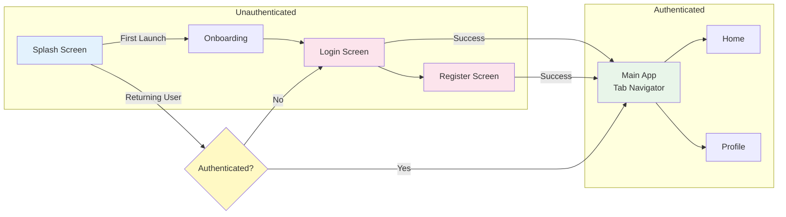
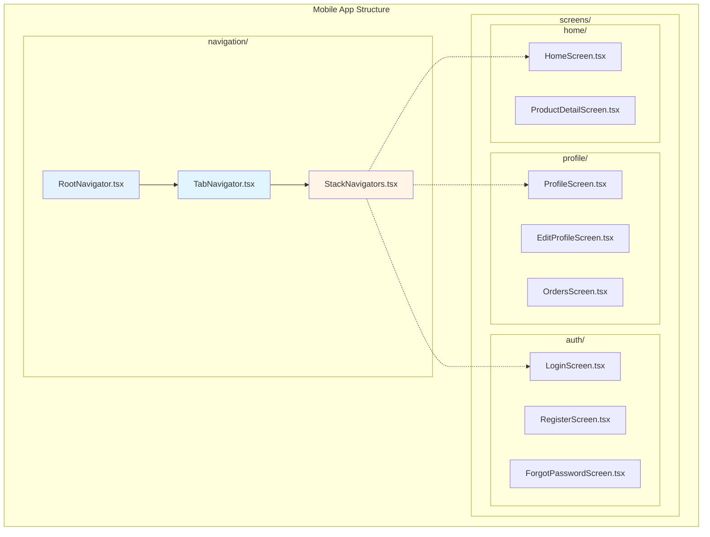

# Phase 2: Navigation & Architecture

**Duration:** 15-20 minutes
**Questions:** ~10 questions
**Output:** docs/navigation.md, docs/architecture.md, parts of ai-instructions.md

---

## 🎯 Objective

Define the **navigation structure and architecture** for your mobile app:

1. What navigation patterns will you use?
2. How will you organize screens and components?
3. What architecture pattern will you follow?
4. How will you structure your codebase?

---

## 📋 Questions

### Question 2.1: Navigation Pattern

**What navigation pattern will your app use?**

**For React Native:**
- A) ⭐ **Stack Navigation** (Recommended)
  - Hierarchical navigation (push/pop)
  - Best for: Most apps, detail screens
  - Library: React Navigation Stack

- B) 🔥 **Tab Navigation**
  - Bottom tabs or top tabs
  - Best for: Multi-section apps (Home, Search, Profile, etc.)
  - Library: React Navigation Tabs

- C) **Drawer Navigation**
  - Side menu drawer
  - Best for: Apps with many sections
  - Library: React Navigation Drawer

- D) **Combined (Tab + Stack)** (Most Common)
  - Bottom tabs with stack navigators per tab
  - Best for: Complex apps with multiple sections
  - Example: Instagram, Twitter

**For Flutter:**
- A) ⭐ **Navigator 2.0 / GoRouter** (Recommended)
  - Declarative routing
  - Best for: Modern Flutter apps

- B) **AutoRoute**
  - Code generation for routes
  - Best for: Type-safe routing

- C) **Traditional Navigator**
  - Imperative navigation
  - Best for: Simple apps

**For Native iOS:**
- A) ⭐ **UINavigationController** (Standard)
- B) **UITabBarController** (Tabs)
- C) **Coordinator Pattern** (Advanced)

**For Native Android:**
- A) ⭐ **Navigation Component** (Recommended)
- B) **Jetpack Compose Navigation** (If using Compose)

**Your answer:**

**If Combined selected, ask:**
- How many bottom tabs? (3-5 recommended)
- What are the main sections? (e.g., Home, Search, Profile, Settings)

---

### Question 2.2: Screen Organization

**How will you organize your screens?**

A) ⭐ **Feature-based** (Recommended)
   - Group by feature/domain
   - Example: `screens/auth/`, `screens/home/`, `screens/profile/`
   - Best for: Medium to large apps

B) **Flat Structure**
   - All screens in one folder
   - Example: `screens/LoginScreen.tsx`, `screens/HomeScreen.tsx`
   - Best for: Small apps (<10 screens)

C) **Domain-driven**
   - Group by business domain
   - Example: `screens/user/`, `screens/product/`, `screens/order/`
   - Best for: Large, complex apps

D) **Route-based**
   - Match folder structure to routes
   - Example: `screens/(tabs)/home/`, `screens/(tabs)/profile/`
   - Best for: File-based routing (Expo Router)

**Your answer:**

---

### Question 2.3: Component Organization

**How will you organize your components?**

A) ⭐ **Atomic Design** (Recommended)
   - atoms/, molecules/, organisms/, templates/
   - Best for: Design system consistency

B) **Feature-based Components**
   - components/ shared across features
   - features/[feature]/components/ for feature-specific
   - Best for: Feature isolation

C) **Flat Structure**
   - All components in components/
   - Best for: Small apps

D) **Type-based**
   - components/buttons/, components/cards/, components/forms/
   - Best for: Component library approach

**Your answer:**

---

### Question 2.4: Architecture Pattern

**What architecture pattern will you follow?**

A) ⭐ **Feature-based Architecture** (Recommended)
   - Each feature is self-contained
   - Example: features/auth/, features/home/
   - Best for: Most React Native/Flutter apps

B) 🔥 **Clean Architecture** (Popular)
   - Separation: Presentation / Domain / Data layers
   - Best for: Complex apps, testability

C) **MVVM (Model-View-ViewModel)**
   - Common in Flutter and Native
   - Best for: State-heavy apps

D) **MVI (Model-View-Intent)**
   - Unidirectional data flow
   - Best for: Predictable state management

E) **Simple (No strict pattern)**
   - Organize as needed
   - Best for: Small apps, MVPs

**Your answer:**

---

### Question 2.5: Folder Structure

**What folder structure will you use?**

**Example for Feature-based:**
```
src/
├── features/
│   ├── auth/
│   │   ├── screens/
│   │   ├── components/
│   │   ├── hooks/
│   │   └── store/
│   ├── home/
│   └── profile/
├── components/ (shared)
├── navigation/
├── services/
├── utils/
└── types/
```

**Example for Clean Architecture:**
```
lib/
├── presentation/
│   ├── pages/
│   ├── widgets/
│   └── providers/
├── domain/
│   ├── entities/
│   ├── repositories/
│   └── usecases/
└── data/
    ├── models/
    ├── repositories/
    └── datasources/
```

**Your preference:** (Describe or select from examples)

---

### Question 2.6: Navigation Library

**Which navigation library will you use?**

**If React Native:**
- A) ⭐ **React Navigation** (Recommended)
  - Most popular, well-maintained
  - Works with Expo and bare React Native
  - Version: 6.x

- B) **React Native Navigation** (Wix)
  - Native navigation, better performance
  - Requires native setup
  - Best for: Performance-critical apps

**If Flutter:**
- A) ⭐ **GoRouter** (Recommended)
  - Declarative, type-safe
  - Best for: Modern Flutter apps

- B) **AutoRoute**
  - Code generation
  - Best for: Complex routing

**Your answer:**

---

### Question 2.7: Deep Linking Strategy

**How will you handle deep links?**

A) ⭐ **Universal Links (iOS) + App Links (Android)** (Recommended)
   - Standard deep linking
   - Opens app directly
   - Best for: Most apps

B) **Custom URL Scheme**
   - myapp://path/to/screen
   - Simpler but less secure
   - Best for: Internal links

C) **No Deep Linking**
   - App only, no external links
   - Best for: Standalone apps

**Your answer:**

**If deep linking selected, ask:**
- What URL scheme? (e.g., `myapp://`, `https://myapp.com`)
- What screens need deep links? (e.g., product details, user profiles)

---

### Question 2.8: Navigation State Management

**How will you manage navigation state?**

A) ⭐ **Navigation Library Built-in** (Recommended)
   - React Navigation manages its own state
   - Flutter Navigator manages its own state
   - Best for: Most apps

B) **Redux / State Management Library**
   - Centralized navigation state
   - Best for: Complex navigation flows

C) **Custom State Management**
   - Your own navigation state
   - Best for: Advanced use cases

**Your answer:**

---

### Question 2.9: Screen Transitions

**What screen transition animations will you use?**

A) ⭐ **Default Transitions** (Recommended)
   - Platform-native transitions
   - iOS: Slide from right
   - Android: Slide up/fade
   - Best for: Most apps

B) **Custom Transitions**
   - Fade, scale, slide custom directions
   - Best for: Branded experience

C) **No Animations**
   - Instant transitions
   - Best for: Performance-critical apps

**Your answer:**

---

### Question 2.10: Navigation Guards / Authentication Flow

**How will you handle protected routes?**

A) ⭐ **Navigation Guards** (Recommended)
   - Check auth state before navigation
   - Redirect to login if not authenticated
   - Best for: Most apps

B) **Separate Navigation Stacks**
   - Auth stack vs App stack
   - Switch between stacks based on auth state
   - Best for: Clear separation

C) **No Protection**
   - All screens accessible
   - Handle auth in components
   - Best for: Simple apps

**Your answer:**

---

#### 🎨 MERMAID NAVIGATION DIAGRAM FORMATS - CRITICAL

**Use these exact formats** for mobile navigation diagrams:

---

##### 1️⃣ Navigation Structure (Tab + Stack Pattern)

Use `graph TD` to show navigation hierarchy:



**Use for:** Tab-based apps with nested stacks (Instagram, Twitter pattern)

---

##### 2️⃣ Authentication Flow

Use `graph LR` to show auth-protected navigation:



**Use for:** Apps with authentication/onboarding flows

---

##### 3️⃣ Deep Linking Routes

Use `graph TD` to show deep link structure:

```mermaid
graph TD
    subgraph "Deep Link Routes"
        ROOT[myapp://]
    end

    subgraph "Public Routes"
        PRODUCT[/product/:id]
        CATEGORY[/category/:slug]
        PROMO[/promo/:code]
    end

    subgraph "Protected Routes"
        ORDER[/order/:id<br/>⚠️ Auth Required]
        PROFILE_VIEW[/profile/:userId<br/>⚠️ Auth Required]
    end

    ROOT --> PRODUCT
    ROOT --> CATEGORY
    ROOT --> PROMO
    ROOT --> ORDER
    ROOT --> PROFILE_VIEW

    PRODUCT -->|Opens| PD[Product Detail Screen]
    CATEGORY -->|Opens| CL[Category List Screen]
    ORDER -->|Opens| OD[Order Detail Screen]

    style ROOT fill:#e3f2fd
    style PRODUCT fill:#e8f5e9
    style CATEGORY fill:#e8f5e9
    style PROMO fill:#e8f5e9
    style ORDER fill:#fce4ec
    style PROFILE_VIEW fill:#fce4ec
```

**Use for:** Apps with universal links/app links

---

##### 4️⃣ Screen Hierarchy (Feature-based)

Use `graph TB` to show folder/screen organization:



**Use for:** Documenting folder structure and file organization

---

**Diagram Guidelines:**
- Color code by level (Root=light blue, Tabs=blue, Stacks=orange, Screens=default)
- Use subgraphs to group related screens
- Show authentication checks with decision diamonds
- Include deep link routes with ⚠️ for protected routes
- Update screen names based on actual app structure

---

## ✅ Phase 2 Completion

After answering all questions, summarize:

```
━━━━━━━━━━━━━━━━━━━━━━━━━━━━━━━━━━━━━━━━━━━━━━━━━━━━━━━━━━
✅ Phase 2 Complete: Navigation & Architecture
━━━━━━━━━━━━━━━━━━━━━━━━━━━━━━━━━━━━━━━━━━━━━━━━━━━━━━━━━━

Selected Architecture:
- Navigation: Tab + Stack Navigation
- Library: React Navigation 6.0
- Architecture: Feature-based
- Component Organization: Atomic Design
- Folder Structure: Feature-based
- Deep Linking: Universal Links + App Links
- Auth Flow: Navigation Guards

Proceed to Phase 3 (State & Data Management)? (Y/n)
```

---

## 📝 Generated Documents

After Phase 2, generate/update:

- `docs/navigation.md` - Navigation patterns and setup guide
- `docs/architecture.md` - System architecture overview
- `ai-instructions.md` - Add navigation and architecture rules

---

**Next Phase:** Phase 3 - State & Data Management

Read: `.ai-flow/prompts/mobile/bootstrap-phase3-state.md`

---

**Last Updated:** 2025-01-XX

**Version:** 1.4.0

