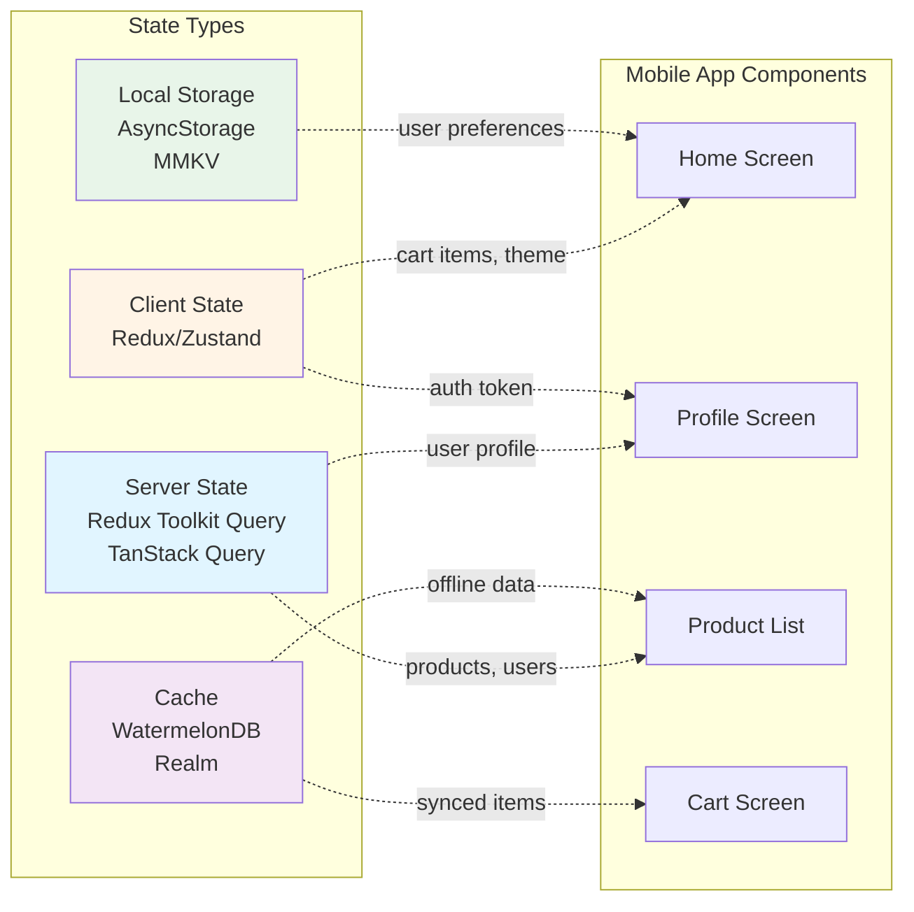
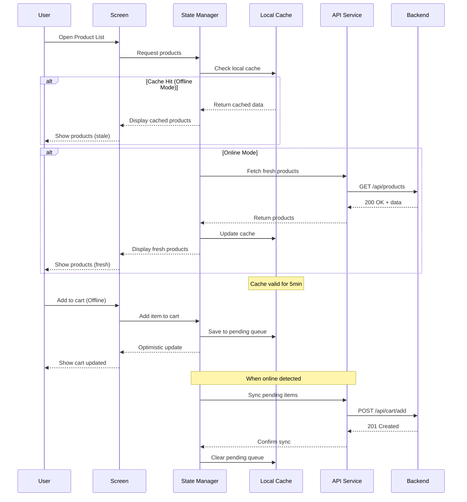
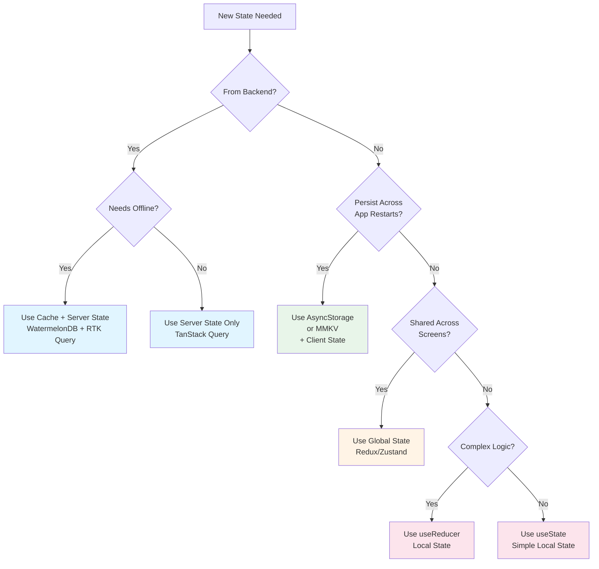
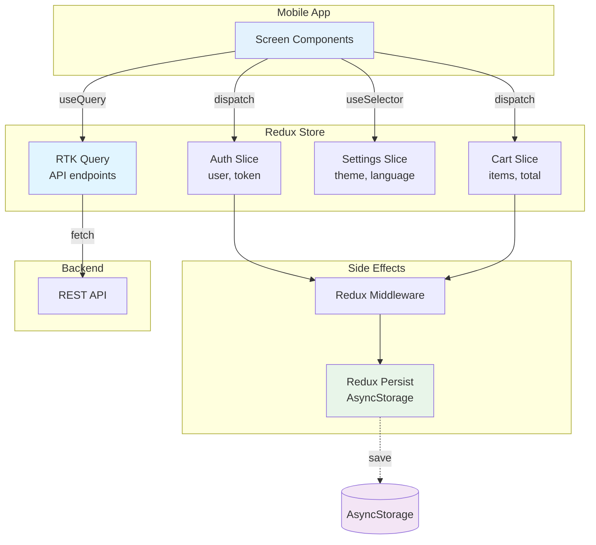

# Phase 3: State & Data Management

**Duration:** 20-25 minutes
**Questions:** ~13 questions
**Output:** docs/state-management.md, docs/offline-strategy.md, parts of ai-instructions.md

---

## 🎯 Objective

Define how your mobile app will manage state and handle data:

1. How will you manage app state?
2. How will you fetch server data?
3. What offline strategy will you use?
4. How will you synchronize data?

---

## 📋 Questions

### Question 3.1: App State Management

**How will you manage global app state?**

**If React Native:**
- A) ⭐ **Redux Toolkit** (Recommended)
  - Predictable state management
  - DevTools support
  - Best for: Complex apps, large teams

- B) 🔥 **Zustand**
  - Minimal boilerplate
  - Simple API
  - Best for: Small to medium apps

- C) **MobX**
  - Observable-based
  - Less boilerplate than Redux
  - Best for: Rapid development

- D) **Context API + useReducer**
  - Built-in React
  - No dependencies
  - Best for: Simple apps, MVPs

- E) **Jotai / Recoil**
  - Atomic state management
  - Best for: Fine-grained reactivity

**If Flutter:**
- A) ⭐ **Provider** (Recommended)
  - Simple, official recommendation
  - Best for: Most apps

- B) 🔥 **Riverpod**
  - Type-safe, compile-time errors
  - Best for: Type-safe apps

- C) **Bloc**
  - Event-driven architecture
  - Best for: Complex state logic

- D) **GetX**
  - All-in-one solution
  - Best for: Rapid development

**If Native:**
- **MVVM Pattern** with ViewModels
- **Observable Pattern** (RxSwift/RxJava)

**Your answer:**

---

### Question 3.2: HTTP Client Library

**What HTTP client library will you use to fetch data from your backend?**

**If React Native:**
- A) ⭐ **Axios** (Recommended)
  - Promise-based HTTP client
  - Interceptors, automatic JSON parsing
  - Best for: Most React Native apps

- B) **Fetch API**
  - Built-in browser API
  - No dependencies
  - Best for: Simple apps

- C) **React Query / TanStack Query**
  - Data fetching with caching
  - Automatic refetching
  - Best for: Complex data needs

**If Flutter:**
- A) ⭐ **Dio** (Recommended)
  - Powerful HTTP client
  - Interceptors, form data
  - Best for: Most Flutter apps

- B) **http package**
  - Simple HTTP client
  - Built-in Flutter package
  - Best for: Simple apps

**If Native iOS:**
- A) ⭐ **URLSession** (Built-in)
- B) **Alamofire**
  - Popular third-party library

**If Native Android:**
- A) ⭐ **OkHttp** (Recommended)
- B) **Retrofit**
  - Type-safe HTTP client

**Your answer:**

**If using REST API, ask:**
- What API base URL structure?
  - Single base URL
  - Multiple endpoints
  - Environment-based URLs (dev/staging/prod)

**If using GraphQL, ask:**
- What GraphQL client?
  - React Native: Apollo Client, urql
  - Flutter: graphql_flutter, ferry
  - What GraphQL endpoint URL?

---

### Question 3.3: Offline Strategy

**How will your app work offline?**

A) ⭐ **Read-Only Offline** (Recommended)
   - Cache data for reading
   - Show cached data when offline
   - Queue writes for when online
   - Best for: Most apps

B) **Full Offline Support**
   - Complete CRUD offline
   - Sync when online
   - Best for: Productivity apps, note-taking

C) **No Offline Support**
   - Require internet connection
   - Show error when offline
   - Best for: Real-time apps, streaming

**Your answer:**

---

### Question 3.4: Local Storage Solution

**What will you use for local data storage?**

**If React Native:**
- A) ⭐ **AsyncStorage** (Recommended)
  - Simple key-value storage
  - Best for: Small data, settings

- B) **MMKV**
  - Faster than AsyncStorage
  - Best for: Performance-critical storage

- C) **WatermelonDB**
  - SQLite-based, reactive
  - Best for: Complex relational data

- D) **Realm**
  - Object database
  - Best for: Complex data models

**If Flutter:**
- A) ⭐ **SharedPreferences** (Simple data)
- B) **Hive** (Fast, NoSQL)
- C) **Isar** (Fast, NoSQL)
- D) **SQLite (sqflite)** (Relational data)

**If Native iOS:**
- A) **UserDefaults** (Simple data)
- B) **Core Data** (Complex relational data)
- C) **Realm** (Object database)

**If Native Android:**
- A) **SharedPreferences** (Simple data)
- B) **Room** (SQLite abstraction)
- C) **DataStore** (Modern, type-safe)

**Your answer:**

---

### Question 3.5: Data Synchronization

**How will you sync data between local and server?**

A) ⭐ **Optimistic Updates + Background Sync** (Recommended)
   - Update UI immediately
   - Sync in background
   - Handle conflicts gracefully
   - Best for: Most apps

B) **Pessimistic Updates**
   - Wait for server confirmation
   - Show loading states
   - Best for: Critical data (payments, etc.)

C) **Manual Sync**
   - User-triggered sync
   - Pull-to-refresh pattern
   - Best for: Simple apps

D) **Real-time Sync**
   - WebSockets or Server-Sent Events
   - Instant updates
   - Best for: Collaborative apps, chat

**Your answer:**

---

### Question 3.6: Conflict Resolution

**How will you handle data conflicts when syncing?**

A) ⭐ **Last Write Wins** (Recommended)
   - Simple, most recent update wins
   - Best for: Most apps

B) **Server Wins**
   - Always use server version
   - Best for: Authoritative server data

C) **Merge Strategy**
   - Intelligent merging
   - Best for: Collaborative editing

D) **User Resolution**
   - Ask user to choose
   - Best for: Critical conflicts

**Your answer:**

---

### Question 3.7: Caching Strategy

**How will you cache API responses?**

A) ⭐ **Time-based Cache** (Recommended)
   - Cache for X minutes/hours
   - Refresh after expiry
   - Best for: Most data

B) **Stale-While-Revalidate**
   - Show cached data immediately
   - Fetch fresh data in background
   - Best for: Good UX

C) **Cache Forever**
   - Cache until app update
   - Best for: Static data

D) **No Caching**
   - Always fetch fresh
   - Best for: Real-time data

**Your answer:**

---

### Question 3.8: Form State Management

**How will you handle form state?**

**If React Native:**
- A) ⭐ **React Hook Form** (Recommended)
  - Minimal re-renders
  - Good performance

- B) **Formik**
  - Popular, well-documented

**If Flutter:**
- A) ⭐ **FormBuilder** (Recommended)
- B) **Built-in Form widgets**

**Your answer:**

---

### Question 3.9: Error Handling Strategy

**How will you handle API errors?**

A) ⭐ **Centralized Error Handler** (Recommended)
   - Global error handling
   - Consistent error messages
   - Best for: Most apps

B) **Per-Request Handling**
   - Handle errors in components
   - More granular control
   - Best for: Complex error scenarios

C) **Error Boundary Pattern**
   - Catch errors at component level
   - Show fallback UI
   - Best for: React Native

**Your answer:**

---

### Question 3.10: Network Error Handling (Mobile-Specific)

**How will you handle mobile-specific network errors?**

**Select all that apply:**

- [ ] **No Internet Connection**
  - Show offline message
  - Display cached data when available
  - Best for: All apps

- [ ] **Slow Network (2G/3G)**
  - Show loading indicators
  - Implement request timeouts
  - Best for: Apps with heavy data

- [ ] **Request Timeout**
  - Retry failed requests
  - Show timeout error message
  - Best for: All apps

- [ ] **Network Switching (WiFi ↔ Mobile Data)**
  - Handle connection changes gracefully
  - Retry failed requests on reconnect
  - Best for: Apps with background sync

- [ ] **Certificate Errors**
  - Handle SSL pinning failures
  - Show security warnings
  - Best for: Apps with certificate pinning

**Your answer:**

**If retry logic selected, ask:**
- What retry strategy?
  - Exponential backoff
  - Fixed interval
  - User-triggered retry

---

### Question 3.11: Loading States

**How will you handle loading states?**

A) ⭐ **Skeleton Screens** (Recommended)
   - Show content structure while loading
   - Better UX than spinners
   - Best for: Most screens

B) **Loading Spinners**
   - Simple, universal
   - Best for: Quick loads

C) **Progressive Loading**
   - Load critical data first
   - Load secondary data after
   - Best for: Complex screens

**Your answer:**

---

### Question 3.12: Data Validation

**How will you validate data?**

A) ⭐ **Client-side Validation** (Required)
   - Validate before sending to server
   - Better UX, less server load

B) **Schema Validation**
   - Use Zod, Yup, or similar
   - Type-safe validation

C) **Server Validation Only**
   - Validate on server
   - Show errors after submission
   - Not recommended (poor UX)

**Your answer:**

---

### Question 3.13: Background Data Refresh

**How will you refresh data in the background?**

A) ⭐ **Background Fetch** (Recommended)
   - Refresh when app is backgrounded
   - iOS: Background App Refresh
   - Android: WorkManager
   - Best for: Most apps

B) **Push Notifications**
   - Server pushes updates
   - App refreshes on notification
   - Best for: Real-time updates

C) **No Background Refresh**
   - Refresh only when app opens
   - Best for: Simple apps

**Your answer:**

---

#### 🎨 MERMAID STATE MANAGEMENT DIAGRAM FORMATS - CRITICAL

**Use these exact formats** for mobile state management diagrams:

---

##### 1️⃣ Mobile State Architecture (Server + Client + Local)

Use `graph LR` to show different state types:



**Use for:** Mobile apps with offline-first strategy

---

##### 2️⃣ Data Flow with Offline Support

Use `sequenceDiagram` to show complete data sync cycle:



**Use for:** Apps with offline support and data synchronization

---

##### 3️⃣ State Decision Tree (Mobile-Specific)

Use `graph TD` to help developers choose state strategy:



**Use for:** Decision-making guide for mobile state strategy

---

##### 4️⃣ Redux Architecture (Mobile Pattern)

Use `graph TB` to show Redux structure for mobile:



**Use for:** Redux-based mobile apps with persistence

---

**Diagram Guidelines:**
- Show offline/online paths clearly
- Include cache layers (AsyncStorage, MMKV, WatermelonDB)
- Use sequence diagrams for sync flows
- Color code: Server=blue, Client=orange, Local=green, Cache=purple
- Include mobile-specific considerations (slow networks, offline-first)

---

## ✅ Phase 3 Completion

After answering all questions, summarize:

```
━━━━━━━━━━━━━━━━━━━━━━━━━━━━━━━━━━━━━━━━━━━━━━━━━━━━━━━━━━
✅ Phase 3 Complete: State & Data Management
━━━━━━━━━━━━━━━━━━━━━━━━━━━━━━━━━━━━━━━━━━━━━━━━━━━━━━━━━━

Selected Stack:
- State Management: Redux Toolkit
- HTTP Client: Axios
- Offline Strategy: Read-Only Offline
- Local Storage: AsyncStorage + WatermelonDB
- Sync Strategy: Optimistic Updates + Background Sync
- Conflict Resolution: Last Write Wins
- Caching: Stale-While-Revalidate
- Network Error Handling: Centralized with retry logic

Proceed to Phase 4 (Permissions & Native Features)? (Y/n)
```

---

## 📝 Generated Documents

After Phase 3, generate/update:

- `docs/state-management.md` - State management patterns and setup
- `docs/offline-strategy.md` - Offline and sync strategy
- `ai-instructions.md` - Add state management rules

---

**Next Phase:** Phase 4 - Permissions & Native Features

Read: `.ai-bootstrap/prompts/mobile/bootstrap-phase4-permissions.md`

---

**Last Updated:** 2025-01-XX

**Version:** 1.4.0

