# Phase 6: Testing Strategy

**Duration:** 15-25 minutes
**Questions:** ~12 questions
**Output:** docs/testing.md, parts of ai-instructions.md

---

## 🎯 Objective

Define your mobile testing strategy:

1. What testing frameworks will you use?
2. What types of tests will you write?
3. How will you test on devices/emulators?
4. What coverage targets?
5. How will tests run in CI/CD?

---

## 📋 Questions

### Question 6.1: Unit Testing Framework

**What unit test framework will you use?**

**If React Native:**
- A) ⭐ **Jest** (Recommended)
  - Built-in with React Native
  - Snapshot testing
  - Best for: Most React Native apps

- B) **Vitest**
  - Faster, ESM native
  - Best for: Modern setups

**If Flutter:**
- A) ⭐ **Flutter Test** (Built-in)
  - Widget testing
  - Unit testing
  - Best for: All Flutter apps

**If Native iOS:**
- A) ⭐ **XCTest** (Built-in)
  - Unit tests
  - UI tests
  - Best for: All iOS apps

**If Native Android:**
- A) ⭐ **JUnit** (Standard)
  - Unit tests
  - Best for: All Android apps

**Your answer:**

---

### Question 6.2: Component/Screen Testing

**How will you test components and screens?**

**If React Native:**
- A) ⭐ **React Native Testing Library** (Recommended)
  - User-centric testing
  - Accessible queries
  - Best for: All React Native apps

**If Flutter:**
- A) ⭐ **Widget Testing** (Built-in)
  - Test widgets in isolation
  - Best for: All Flutter apps

**If Native iOS:**
- A) ⭐ **XCUITest** (Built-in)
  - UI testing framework
  - Best for: All iOS apps

**If Native Android:**
- A) ⭐ **Espresso** (Recommended)
  - UI testing framework
  - Best for: All Android apps

**Your answer:**

---

### Question 6.3: E2E Testing Framework

**What E2E testing tool will you use?**

**If React Native:**
- A) ⭐ **Detox** (Recommended)
  - Gray-box E2E testing
  - Works with iOS and Android
  - Best for: Most React Native apps

- B) **Maestro**
  - Declarative E2E testing
  - Cross-platform
  - Best for: Simple E2E flows

- C) **Appium**
  - WebDriver-based
  - Cross-platform
  - Best for: Complex E2E scenarios

**If Flutter:**
- A) ⭐ **Integration Test** (Built-in)
  - Flutter's integration testing
  - Best for: Most Flutter apps

- B) **Maestro**
  - Declarative E2E testing
  - Best for: Simple E2E flows

**If Native:**
- A) ⭐ **Appium** (Recommended)
  - Cross-platform
  - Works with iOS and Android
  - Best for: Native apps

**Your answer:**

---

### Question 6.4: Testing on Physical Devices

**How will you test on physical devices?**

A) ⭐ **TestFlight (iOS) + Firebase App Distribution (Android)** (Recommended)
   - Beta testing on real devices
   - Best for: Most apps

B) **TestFlight (iOS) + Google Play Internal Testing (Android)**
   - Official store channels
   - Best for: Store-focused testing

C) **Device Farm Services**
   - AWS Device Farm
   - BrowserStack App Automate
   - Sauce Labs
   - Best for: Multiple device testing

D) **Manual Testing Only**
   - Test on personal devices
   - Best for: Small teams, MVPs

**Your answer:**

---

### Question 6.5: Emulator/Simulator Strategy

**How will you use emulators/simulators?**

A) ⭐ **Local Emulators + CI Emulators** (Recommended)
   - Develop locally with iOS Simulator / Android Emulator
   - Run tests in CI with emulators
   - Best for: Most teams

B) **Local Only**
   - No CI emulator testing
   - Best for: Small teams

C) **Cloud Emulators Only**
   - Use cloud services for all testing
   - Best for: Teams without local setup

**Your answer:**

---

### Question 6.6: Testing Pyramid Distribution

**What test distribution will you target?**

A) ⭐ **Standard Pyramid** (Recommended)
   - 70% Unit tests
   - 20% Integration tests
   - 10% E2E tests
   - Best for: Most apps

B) **Heavy Unit**
   - 85% Unit tests
   - 10% Integration tests
   - 5% E2E tests
   - Best for: Logic-heavy apps

C) **Heavy Integration**
   - 50% Unit tests
   - 40% Integration tests
   - 10% E2E tests
   - Best for: UI-heavy apps

**Your answer:**

---

#### 🎨 MOBILE TESTING PYRAMID VISUALIZATION

**Use this diagram format** to visualize mobile test distribution strategy:

```mermaid
graph TB
    subgraph "Mobile Testing Pyramid"
        E2E["📱 E2E Tests (10%)<br/>Detox/Appium<br/>Slow, Expensive<br/>Full user flows on device"]
        INT["🔗 Integration Tests (20%)<br/>Component + API<br/>Medium Speed<br/>Screen rendering + navigation"]
        UNIT["⚡ Unit Tests (70%)<br/>Jest/XCTest<br/>Fast, Cheap<br/>Business logic, hooks, utilities"]
    end

    E2E --> INT
    INT --> UNIT

    style E2E fill:#fce4ec,stroke:#c2185b,stroke-width:2px
    style INT fill:#fff4e6,stroke:#f57c00,stroke-width:2px
    style UNIT fill:#e8f5e9,stroke:#388e3c,stroke-width:3px

    classDef note fill:#f5f5f5,stroke:#666,stroke-dasharray: 5 5

    note1["Run on Real Devices/Emulators<br/>Test platform-specific behavior<br/>Slow feedback (minutes)"]:::note
    note2["Test screen components<br/>Navigation flows<br/>API integration<br/>Medium feedback"]:::note
    note3["Test pure functions<br/>Redux reducers<br/>Utilities, validators<br/>Fast feedback (seconds)"]:::note

    E2E -.-> note1
    INT -.-> note2
    UNIT -.-> note3
```



**Mobile-Specific Testing Layers:**


**Platform-Specific Testing Considerations:**

```mermaid
graph LR
    subgraph "Cross-Platform Mobile Testing"
        SHARED[Shared Business Logic<br/>Unit Tests (Jest)]
        RN_SCREEN[React Native<br/>Screen Tests]
        FLUTTER_WIDGET[Flutter<br/>Widget Tests]
    end

    subgraph "Platform Tests"
        IOS_E2E[iOS E2E<br/>XCUITest/Detox]
        ANDROID_E2E[Android E2E<br/>Espresso/Detox]
    end

    SHARED --> RN_SCREEN
    SHARED --> FLUTTER_WIDGET

    RN_SCREEN --> IOS_E2E
    RN_SCREEN --> ANDROID_E2E

    FLUTTER_WIDGET --> IOS_E2E
    FLUTTER_WIDGET --> ANDROID_E2E

    style SHARED fill:#e8f5e9
    style RN_SCREEN fill:#e1f5ff
    style FLUTTER_WIDGET fill:#e1f5ff
    style IOS_E2E fill:#fce4ec
    style ANDROID_E2E fill:#fff4e6
```

**When to Use Each Diagram:**

- **Testing Pyramid**: Best for understanding test distribution strategy
- **Mobile Test Types**: Best for showing all testing layers including emulators/devices
- **Cross-Platform**: Best for React Native/Flutter apps with shared logic

**Diagram Guidelines:**
- Color code by test type (E2E=pink, Integration=orange, Unit=green)
- Show device vs emulator distinction
- Include platform-specific considerations (iOS/Android)
- Highlight speed/cost trade-offs
- Update percentages based on selected strategy (A, B, or C)

---

---

### Question 6.7: Code Coverage Targets

**What code coverage targets will you set?**

A) ⭐ **80% Overall** (Recommended)
   - 80% line coverage
   - 70% branch coverage
   - Best for: Most apps

B) **90% Overall**
   - 90% line coverage
   - 80% branch coverage
   - Best for: Critical apps

C) **70% Overall**
   - 70% line coverage
   - 60% branch coverage
   - Best for: MVPs, small apps

D) **No Coverage Target**
   - Test what's important
   - Best for: Very small projects

**Your answer:**

---

### Question 6.8: Snapshot Testing

**Will you use snapshot testing?**

**If React Native:**
- A) ⭐ **Yes - Jest Snapshots** (Recommended)
  - Catch unintended UI changes
  - Best for: Component regression testing

- B) **No Snapshot Testing**
  - Manual visual review
  - Best for: Rapidly changing UIs

**If Flutter:**
- A) ⭐ **Yes - Golden Tests** (Recommended)
  - Flutter's snapshot testing
  - Best for: Widget regression testing

**Your answer:**

---

### Question 6.9: Performance Testing

**Will you test app performance?**

A) ⭐ **Yes - Basic Performance** (Recommended)
   - App launch time
   - Screen render time
   - Memory usage
   - Best for: Most apps

B) **Yes - Comprehensive Performance**
   - FPS monitoring
   - Network performance
   - Battery usage
   - Best for: Performance-critical apps

C) **No Performance Testing**
   - Manual testing only
   - Best for: MVPs

**Your answer:**

---

### Question 6.10: Accessibility Testing

**Will you test accessibility?**

A) ⭐ **Yes - Basic Accessibility** (Recommended)
   - Screen reader support (TalkBack/VoiceOver)
   - Touch target sizes
   - Color contrast
   - Best for: Most apps

B) **Yes - Comprehensive Accessibility**
   - WCAG 2.1 AA compliance
   - Full accessibility audit
   - Best for: Public-facing apps

C) **No Accessibility Testing**
   - Not a priority
   - Best for: Internal apps

**Your answer:**

---

### Question 6.11: CI/CD Testing Strategy

**How will tests run in CI/CD?**

A) ⭐ **Run All Tests on PR** (Recommended)
   - Unit tests: Fast (<5 min)
   - Integration tests: Medium (<15 min)
   - E2E tests: Slow (<30 min)
   - Best for: Most teams

B) **Run Unit Tests on PR, E2E on Merge**
   - Faster PR feedback
   - E2E on main branch
   - Best for: Large teams

C) **Run Tests Manually**
   - No automated testing
   - Best for: Very small teams

**Your answer:**

---

### Question 6.12: Test Data Management

**How will you manage test data?**

A) ⭐ **Mock Data + Test Fixtures** (Recommended)
   - Mock API responses
   - Use fixtures for consistent data
   - Best for: Most apps

B) **Test Database**
   - Separate test database
   - Best for: Integration testing

C) **Real API (Staging)**
   - Use staging environment
   - Best for: E2E testing

**Your answer:**

---

## ✅ Phase 6 Completion

After answering all questions, summarize:

```
━━━━━━━━━━━━━━━━━━━━━━━━━━━━━━━━━━━━━━━━━━━━━━━━━━━━━━━━━━
✅ Phase 6 Complete: Testing Strategy
━━━━━━━━━━━━━━━━━━━━━━━━━━━━━━━━━━━━━━━━━━━━━━━━━━━━━━━━━━

Selected Testing Stack:
- Unit Tests: Jest (React Native Testing Library)
- E2E Tests: Detox
- Device Testing: TestFlight + Firebase App Distribution
- Coverage Target: 80% overall
- Snapshot Testing: Yes (Jest Snapshots)
- Performance Testing: Basic
- Accessibility Testing: Basic
- CI/CD: Run all tests on PR

Proceed to Phase 7 (Store Deployment)? (Y/n)
```

---

## 📝 Generated Documents

After Phase 6, generate/update:

- `docs/testing.md` - Testing strategy and setup guide
- `ai-instructions.md` - Add testing rules

---

**Next Phase:** Phase 7 - Store Deployment

Read: `.ai-flow/prompts/mobile/bootstrap-phase7-deployment.md`

---

**Last Updated:** 2025-01-XX

**Version:** 1.4.0

